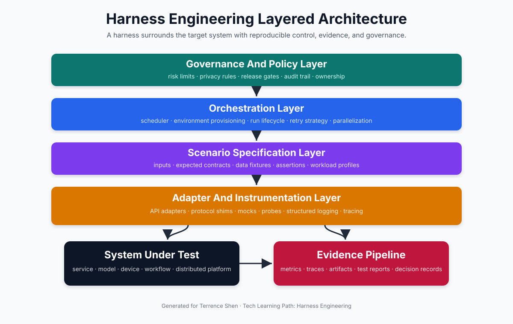
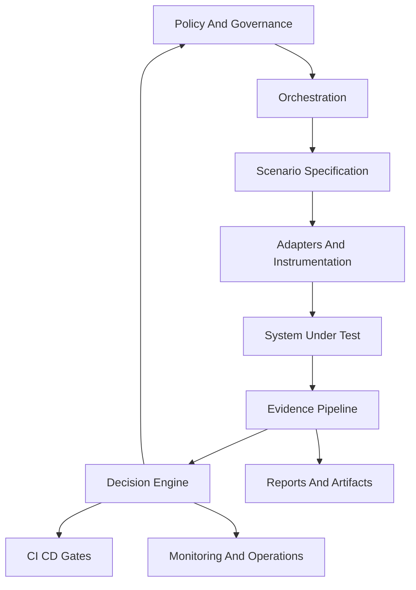
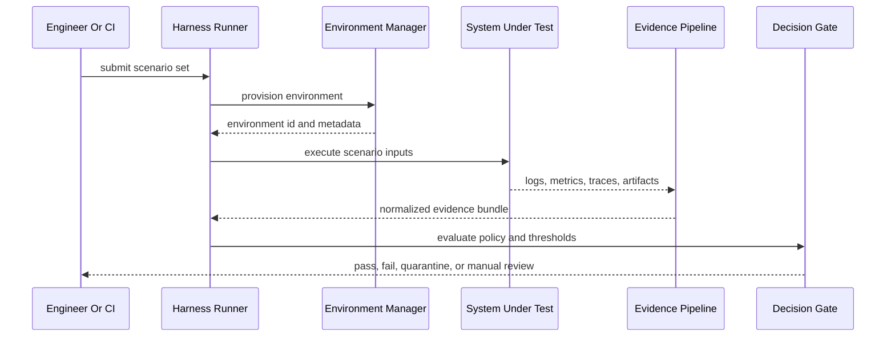
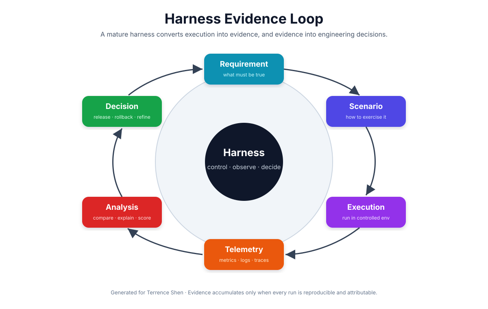
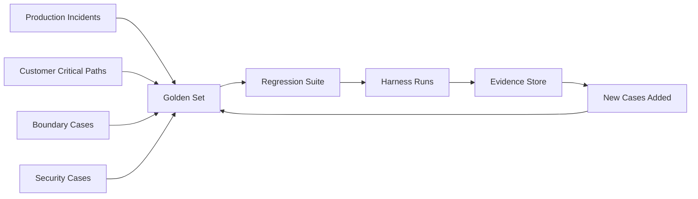
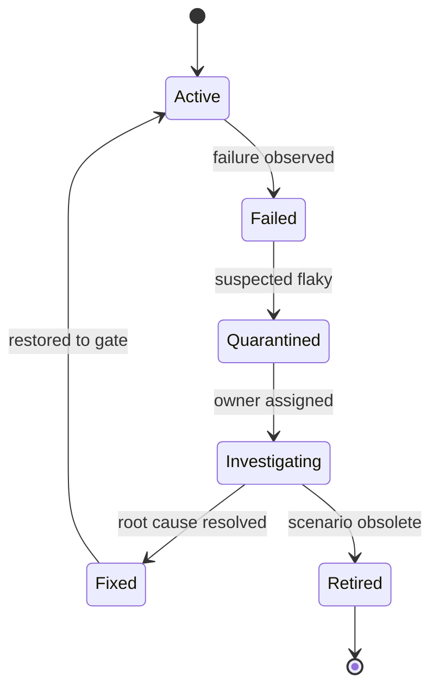
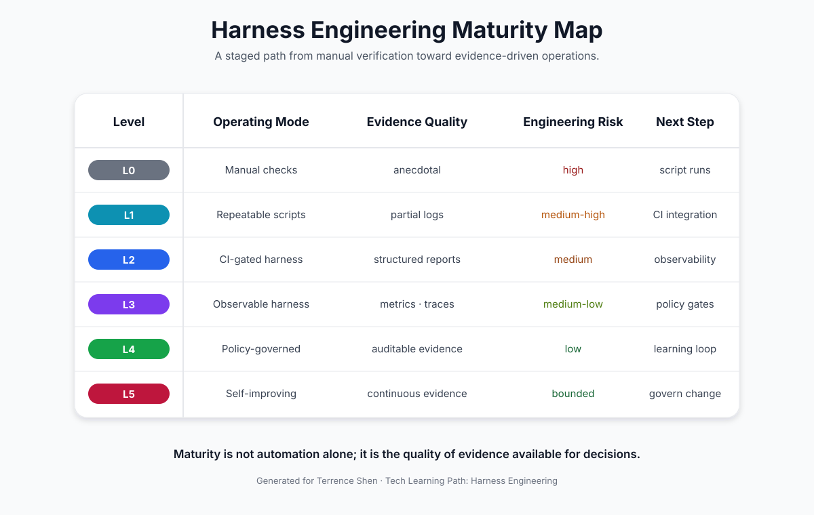
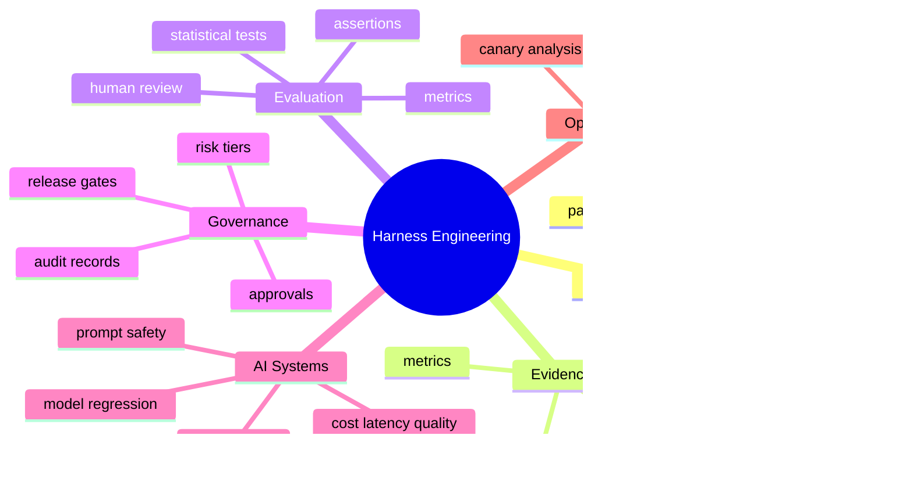

# 🧩 Harness Engineering：面向复杂系统验证、评估与运维的工程化方法论

> 本文讨论的 Harness Engineering 是一种通用工程方法论，并非特指某个商业平台。它关注如何围绕目标系统构建可复现、可观测、可治理的执行与评估边界，使复杂系统的质量判断从经验判断转化为证据驱动的工程决策。



## 🧷 目录

- [🧭 摘要：为什么需要 Harness Engineering](#-摘要为什么需要-harness-engineering)
- [🧱 概念定义：Harness 到底是什么](#-概念定义harness-到底是什么)
- [🗺️ 总体架构：围绕目标系统建立工程边界](#️-总体架构围绕目标系统建立工程边界)
- [🧪 最小可用 Harness：从一个简单 Runner 开始](#-最小可用-harness从一个简单-runner-开始)
- [🧾 Scenario Specification：把测试用例升级为场景契约](#-scenario-specification把测试用例升级为场景契约)
- [📊 证据循环：从运行结果到工程决策](#-证据循环从运行结果到工程决策)
- [🧬 Harness Engineering 与 AI 系统](#-harness-engineering-与-ai-系统)
- [🧮 成熟度模型：从手工验证到证据驱动运维](#-成熟度模型从手工验证到证据驱动运维)
- [🏁 结论：Harness Engineering 的本质是证据工程](#-结论harness-engineering-的本质是证据工程)

## 🧭 摘要：为什么需要 Harness Engineering

复杂系统的质量问题通常并不只来自单个函数、单个接口或单个模型。真实生产环境中的失败往往产生于多个因素的耦合：输入分布变化、依赖服务抖动、配置漂移、环境差异、资源争用、模型版本变化、异步任务积压、观测数据缺失，以及团队对系统边界理解不一致。

传统测试工程能够发现大量缺陷，但当系统进入分布式、异构、数据驱动、AI 驱动或高频交付阶段时，单纯依赖单元测试、接口测试或人工验收会出现明显不足。工程团队需要一种更高层的组织方式：它不仅执行测试，还要组织场景、控制环境、记录证据、解释结果、约束风险，并把这些证据接入发布、回滚、演进和运维流程。

Harness Engineering 正是在这种背景下形成的工程化视角。它将 harness 视为包围目标系统的控制结构。这个控制结构为系统提供可重复的输入、可审计的执行、可比较的结果、可追踪的证据和可执行的治理规则。换言之，harness 不是一个脚本集合，而是一个围绕目标系统建立的科学实验装置。

本文采用严肃工程视角描述 Harness Engineering 的核心概念、架构、生命周期、代码形态、数据治理方式、AI 系统适配方法、CI/CD 集成方法和成熟度模型。

## 🧱 概念定义：Harness 到底是什么

在工程语境中，harness 原本常见于 test harness，即测试夹具、测试装置或测试执行框架。它的最基本作用是把被测系统放入一个可控制的边界内，使工程人员能够稳定地注入输入、执行操作、捕获输出并判断行为是否符合预期。

然而，在现代复杂系统中，harness 的范围已经超过测试脚本本身。一个成熟的 harness 通常包括以下能力：

| 维度 | 作用 | 典型产物 |
|---|---|---|
| 输入控制 | 稳定构造输入、数据、负载和边界条件 | fixtures、scenario spec、traffic replay |
| 环境控制 | 构造可复现运行环境 | Docker Compose、Kubernetes namespace、mock service |
| 执行控制 | 统一触发、重试、超时、并发和生命周期 | runner、orchestrator、scheduler |
| 观测采集 | 捕获日志、指标、trace、artifact 和错误上下文 | structured logs、OpenTelemetry traces、HTML report |
| 判断机制 | 将输出转化为可比较结论 | assertion、metric、score、policy gate |
| 证据归档 | 保存运行证据以支持回溯 | run record、artifact store、decision record |
| 治理集成 | 将证据接入发布、回滚、审批和风险控制 | CI gate、release checklist、risk dashboard |

因此，Harness Engineering 可以被定义为：

> Harness Engineering 是围绕目标系统构建可复现执行边界、可观测证据链、自动化评估流程与治理决策接口的系统工程实践。

该定义强调四个关键词：可复现、证据链、自动化、治理。没有可复现性，结果无法比较；没有证据链，决策无法审计；没有自动化，工程规模无法扩大；没有治理接口，验证结果无法真正影响发布与运维。

## 🧠 与相邻概念的区别

Harness Engineering 容易与测试自动化、QA、DevOps、MLOps、实验平台、监控平台混淆。它们之间存在重叠，但关注点不同。

| 概念 | 核心关注 | 与 Harness Engineering 的关系 |
|---|---|---|
| 测试自动化 | 自动执行测试用例 | harness 可包含测试自动化，但范围更大 |
| QA | 质量流程与验收 | harness 为 QA 提供可追踪证据 |
| DevOps | 交付、部署与运维协同 | harness 为 DevOps 提供发布门禁和回滚证据 |
| MLOps | 模型训练、部署、监控 | harness 为模型评估、漂移检测和回归测试提供执行框架 |
| Observability | 日志、指标、trace | harness 消费观测数据并将其转化为判断依据 |
| 实验平台 | 控制实验变量并分析结果 | harness 可作为工程实验平台的底层执行装置 |

一个简单区分方法是：测试自动化回答是否执行了检查，observability 回答系统发生了什么，DevOps 回答如何交付系统，而 Harness Engineering 回答如何把执行、证据和决策组织成一个可复用的工程系统。

## 🗺️ 总体架构：围绕目标系统建立工程边界

成熟 harness 的形态通常呈现分层架构。上层定义治理规则和风险边界，中层编排执行与场景，下层通过 adapter 和 instrumentation 连接真实系统，并将观测证据回流到分析与决策层。



该架构的关键点不在于工具名称，而在于边界清晰。harness 不应该把自己伪装成目标系统的一部分，也不应该完全依赖人工解释。它必须有明确的输入、执行、观测、判断和归档责任。

## 🧪 最小可用 Harness：从一个简单 Runner 开始

一个最小 harness 可以非常小。它只需要具备三件事：接收 scenario，执行目标系统，保存结构化结果。下面的 Python 示例展示了一个教育性的最小 runner。它不依赖复杂框架，但体现了 harness 的基本思想。

```python
from __future__ import annotations

import json
import subprocess
import time
from dataclasses import dataclass, asdict
from pathlib import Path


@dataclass
class Scenario:
    id: str
    command: list[str]
    timeout_seconds: int
    expected_exit_code: int = 0


@dataclass
class RunResult:
    scenario_id: str
    passed: bool
    exit_code: int | None
    duration_ms: int
    stdout: str
    stderr: str
    error: str | None


class CommandHarness:
    def __init__(self, artifact_dir: Path) -> None:
        self.artifact_dir = artifact_dir
        self.artifact_dir.mkdir(parents=True, exist_ok=True)

    def run(self, scenario: Scenario) -> RunResult:
        started = time.monotonic()
        try:
            completed = subprocess.run(
                scenario.command,
                text=True,
                capture_output=True,
                timeout=scenario.timeout_seconds,
                check=False,
            )
            duration_ms = int((time.monotonic() - started) * 1000)
            passed = completed.returncode == scenario.expected_exit_code
            result = RunResult(
                scenario_id=scenario.id,
                passed=passed,
                exit_code=completed.returncode,
                duration_ms=duration_ms,
                stdout=completed.stdout,
                stderr=completed.stderr,
                error=None,
            )
        except Exception as exc:
            duration_ms = int((time.monotonic() - started) * 1000)
            result = RunResult(
                scenario_id=scenario.id,
                passed=False,
                exit_code=None,
                duration_ms=duration_ms,
                stdout='',
                stderr='',
                error=repr(exc),
            )

        self._write_result(result)
        return result

    def _write_result(self, result: RunResult) -> None:
        output_path = self.artifact_dir / f'{result.scenario_id}.json'
        output_path.write_text(
            json.dumps(asdict(result), ensure_ascii=False, indent=2),
            encoding='utf-8',
        )


if __name__ == '__main__':
    harness = CommandHarness(Path('artifacts'))
    scenario = Scenario(
        id='python-version-check',
        command=['python', '--version'],
        timeout_seconds=5,
    )
    print(harness.run(scenario))
```

这个例子虽然小，但已经具备 harness 的基本骨架：scenario 是输入控制，subprocess 是执行控制，timeout 是边界控制，RunResult 是证据结构，artifact_dir 是结果归档。工程实践中可以继续添加并发执行、环境构建、依赖服务、指标采集、trace 关联、策略判断和报告生成。

## 🧾 Scenario Specification：把测试用例升级为场景契约

在 Harness Engineering 中，scenario 不应只是测试名称。它应当描述输入、环境、约束、期望、观测指标和失败解释。一个场景越清晰，后续的复现、调试和审计成本就越低。

```yaml
id: asr-short-audio-baseline
category: speech-recognition
owner: evaluation-team
priority: p1

input:
  audio_path: samples/mandarin_short_001.wav
  language: zh-CN
  sample_rate: 16000

environment:
  model: qwen3-asr
  device: cuda:0
  container_image: registry.example.com/asr-gateway:2026.05.13
  seed: 42

execution:
  timeout_seconds: 30
  retries: 1
  parallelism: 1

expected:
  max_latency_ms: 3000
  max_cer: 0.08
  required_fields:
    - text
    - duration_ms
    - model_version

artifacts:
  keep:
    - request.json
    - response.json
    - trace.json
    - metrics.json
```

该 YAML 并不是某个固定标准，而是一种建议结构。关键在于场景文件需要让后续执行者知道：系统在什么条件下被执行、应当观察哪些证据、失败时保留什么材料，以及如何判断结果是否可接受。

## 🔬 执行生命周期：一次 Harness Run 如何发生

一次成熟的 harness run 通常不是简单调用一个脚本。它更像一次受控实验。执行过程需要准备环境、锁定版本、注入输入、收集证据、运行判断规则、写入报告，并把结果发送给 CI/CD 或运维系统。



该生命周期中的每个步骤都应当有可追踪标识。例如 run_id、scenario_id、commit_sha、model_version、container_digest、dataset_version、config_hash。缺少这些标识时，工程团队即使获得失败结果，也很难回答失败是否由代码变化、数据变化、环境变化或依赖变化引起。

## 📊 证据循环：从运行结果到工程决策

Harness Engineering 的核心价值不是产生更多日志，而是将原始执行结果转化为可解释证据，并进一步支持工程决策。



证据循环可以被拆解为六个阶段：需求、场景、执行、遥测、分析、决策。需求定义系统应当满足什么；场景把需求转化为可执行条件；执行产生真实行为；遥测捕获行为细节；分析将行为与预期比较；决策决定是否发布、回滚、继续观察或修改系统。

这个循环的难点在于闭环。许多系统有测试，有日志，有监控，也有发布流程，但它们之间没有形成证据闭环。Harness Engineering 要求每次执行结果都能被归因、比较和复用。只有这样，系统质量才会随着时间积累，而不是在每次发布时重新依赖临时判断。

## 🧩 Adapter Design：隔离目标系统与 Harness

adapter 是 harness 与目标系统之间的边界层。它的作用不是隐藏复杂性，而是以稳定接口隔离变化。目标系统可能是 HTTP 服务、gRPC 服务、CLI 程序、嵌入式设备、模型推理服务或多服务工作流。adapter 使 harness 不必关心底层调用细节，而只关注场景输入和证据输出。

```python
from __future__ import annotations

from dataclasses import dataclass
from typing import Protocol


@dataclass
class HarnessInput:
    scenario_id: str
    payload: dict


@dataclass
class HarnessOutput:
    scenario_id: str
    status_code: int
    body: dict
    latency_ms: int
    metadata: dict


class TargetAdapter(Protocol):
    def invoke(self, item: HarnessInput) -> HarnessOutput:
        ...


class HttpServiceAdapter:
    def __init__(self, base_url: str) -> None:
        self.base_url = base_url.rstrip('/')

    def invoke(self, item: HarnessInput) -> HarnessOutput:
        import time
        import requests

        started = time.monotonic()
        response = requests.post(
            f'{self.base_url}/v1/run',
            json=item.payload,
            timeout=30,
        )
        latency_ms = int((time.monotonic() - started) * 1000)
        return HarnessOutput(
            scenario_id=item.scenario_id,
            status_code=response.status_code,
            body=response.json(),
            latency_ms=latency_ms,
            metadata={
                'adapter': 'http-service',
                'base_url': self.base_url,
            },
        )
```

adapter 的设计原则包括：接口稳定、输出结构化、错误显式化、元数据完整、目标系统无侵入。它不应把测试判断逻辑全部塞入 adapter。adapter 负责调用与采集，policy 或 evaluator 负责判断。

## 🧮 Evaluator Design：将输出转化为结论

复杂系统的判断通常不是单个断言。尤其在 AI、搜索、推荐、语音识别、图像理解、调度系统和数据系统中，输出需要经过 metric 计算、阈值判断、统计比较和人工复核策略。

下面示例展示了一个面向 ASR 输出的简化 evaluator。它计算字符错误率 CER，并结合延迟阈值做门禁判断。

```python
from __future__ import annotations

from dataclasses import dataclass


@dataclass
class EvaluationResult:
    passed: bool
    metrics: dict[str, float]
    reasons: list[str]


def edit_distance(left: str, right: str) -> int:
    dp = [[0] * (len(right) + 1) for _ in range(len(left) + 1)]
    for i in range(len(left) + 1):
        dp[i][0] = i
    for j in range(len(right) + 1):
        dp[0][j] = j
    for i, lc in enumerate(left, start=1):
        for j, rc in enumerate(right, start=1):
            cost = 0 if lc == rc else 1
            dp[i][j] = min(
                dp[i - 1][j] + 1,
                dp[i][j - 1] + 1,
                dp[i - 1][j - 1] + cost,
            )
    return dp[-1][-1]


def character_error_rate(reference: str, hypothesis: str) -> float:
    if not reference:
        return 0.0 if not hypothesis else 1.0
    return edit_distance(reference, hypothesis) / len(reference)


def evaluate_asr_response(
    reference_text: str,
    predicted_text: str,
    latency_ms: int,
    max_cer: float,
    max_latency_ms: int,
) -> EvaluationResult:
    cer = character_error_rate(reference_text, predicted_text)
    reasons: list[str] = []

    if cer > max_cer:
        reasons.append(f'CER {cer:.4f} exceeds max_cer {max_cer:.4f}')
    if latency_ms > max_latency_ms:
        reasons.append(f'latency_ms {latency_ms} exceeds max_latency_ms {max_latency_ms}')

    return EvaluationResult(
        passed=not reasons,
        metrics={
            'cer': cer,
            'latency_ms': float(latency_ms),
        },
        reasons=reasons,
    )
```

这个例子体现了 evaluator 的基本职责：它不负责调用模型，也不负责保存 artifact；它只负责把系统输出转化为可比较、可解释、可门禁的结论。工程上，这种职责分离能够显著降低 harness 复杂度。

## 🧰 Pytest 形态：把 Harness 接入常规测试生态

许多团队已经使用 pytest、JUnit、Go test、Jest 或其他测试框架。Harness Engineering 不要求替换这些生态，而是可以把它们作为执行入口。下面示例展示如何让 pytest 执行 scenario，并将 adapter 与 evaluator 组合起来。

```python
import pytest


SCENARIOS = [
    {
        'id': 'health-check',
        'payload': {'input': 'ping'},
        'expected_status': 200,
        'max_latency_ms': 500,
    },
    {
        'id': 'large-request-boundary',
        'payload': {'input': 'x' * 4096},
        'expected_status': 200,
        'max_latency_ms': 1500,
    },
]


@pytest.mark.parametrize('scenario', SCENARIOS, ids=lambda item: item['id'])
def test_service_scenario(http_adapter, scenario):
    output = http_adapter.invoke(
        HarnessInput(
            scenario_id=scenario['id'],
            payload=scenario['payload'],
        )
    )

    assert output.status_code == scenario['expected_status']
    assert output.latency_ms <= scenario['max_latency_ms']
```

这种形态适合早期阶段。随着系统复杂度提升，团队可以逐步把 scenario 移到 YAML 或数据库中，把 artifact 写入对象存储，把 metrics 上报到时间序列系统，并把判断结果接入 CI gate。

## 🧯 故障注入：Harness 不只验证正常路径

复杂系统的可靠性问题经常出现在非正常路径。网络超时、依赖服务返回异常、磁盘空间不足、模型服务冷启动、消息队列积压、缓存击穿、权限失效，都会造成实际生产故障。Harness Engineering 应当把这些条件显式场景化。

```yaml
id: dependency-timeout-fault
category: resilience
fault:
  type: network_latency
  target: payment-service
  latency_ms: 2500
  duration_seconds: 60
expected:
  user_visible_error: false
  fallback_used: true
  max_error_rate: 0.01
  max_p95_latency_ms: 1800
```

一个故障场景应当至少说明四件事：注入什么故障、注入到哪个依赖、持续多久、系统应该如何退化。没有这些信息，所谓混沌测试容易退化为不可复现的破坏性实验。

## 📡 Observability：Harness 需要可观测性，但不能等同于监控

observability 是 harness 的重要输入。日志、指标和 trace 可以解释系统行为，但它们本身不是结论。Harness 需要将 observability 数据与 scenario、版本、环境、输入和判断结果关联起来。

```python
import json
import logging
import time
import uuid


logging.basicConfig(level=logging.INFO, format='%(message)s')


def emit_event(event_type: str, **fields):
    record = {
        'event_type': event_type,
        'timestamp_ms': int(time.time() * 1000),
        **fields,
    }
    logging.info(json.dumps(record, ensure_ascii=False))


def run_with_trace(scenario_id: str, adapter, payload: dict):
    run_id = str(uuid.uuid4())
    emit_event('run_started', run_id=run_id, scenario_id=scenario_id)
    started = time.monotonic()
    try:
        output = adapter.invoke(HarnessInput(scenario_id=scenario_id, payload=payload))
        emit_event(
            'run_finished',
            run_id=run_id,
            scenario_id=scenario_id,
            status_code=output.status_code,
            latency_ms=output.latency_ms,
            duration_ms=int((time.monotonic() - started) * 1000),
        )
        return output
    except Exception as exc:
        emit_event(
            'run_failed',
            run_id=run_id,
            scenario_id=scenario_id,
            error=repr(exc),
            duration_ms=int((time.monotonic() - started) * 1000),
        )
        raise
```

结构化日志的价值在于后续可查询、可聚合、可关联。文本日志适合人类阅读，但结构化事件适合系统分析。一个成熟 harness 应当同时生成面向人类的报告和面向机器的证据记录。

## 🧱 数据与 Artifact：证据必须能够被复查

harness 的 artifact 不应只是失败截图。它应当包括足够复查一次运行所需的材料。典型 artifact 包括：

| Artifact | 内容 | 用途 |
|---|---|---|
| request.json | 输入 payload、headers、scenario metadata | 复现调用 |
| response.json | 输出 body、状态码、错误码 | 分析行为 |
| metrics.json | latency、throughput、error rate、resource usage | 量化判断 |
| trace.json | trace id、span 关系、关键耗时 | 定位瓶颈 |
| environment.json | image digest、commit sha、config hash | 解释环境差异 |
| report.html | 面向人类的总结报告 | 评审与归档 |
| decision.md | 发布或回滚理由 | 审计与复盘 |

其中最容易被忽视的是 environment.json 和 decision.md。前者解释系统在何种条件下运行，后者解释人或策略为何作出某个工程决定。缺少这两类材料时，团队很容易知道发生了失败，却无法解释失败为何影响或不影响发布。

## 🧭 Policy Gate：从指标到发布门禁

Harness Engineering 最终必须影响工程决策。若 harness 只产生报告而不影响发布、回滚或变更策略，它仍然停留在观察工具阶段。policy gate 是将指标转化为可执行决策的组件。

```yaml
release_policy:
  name: production-release-gate
  required:
    scenario_pass_rate:
      min: 0.995
    p95_latency_ms:
      max: 800
    critical_scenarios:
      must_pass: true
    security_findings:
      max_critical: 0
      max_high: 0
  quarantine:
    flaky_scenario_rate:
      max: 0.02
  manual_review:
    model_quality_regression:
      max_relative_drop: 0.01
```

policy gate 不应追求绝对复杂，而应追求可解释。每条规则都需要有明确业务或工程含义。模糊规则会导致团队绕过门禁；过度严格的规则会导致大量误报；过度宽松的规则则无法提供风险控制。

## 🔁 CI/CD 集成：Harness 成为交付链路的一部分

将 harness 接入 CI/CD 是工程化的重要阶段。下面给出一个 GitHub Actions 示例。它在每次 pull request 时运行 harness，上传 artifact，并根据结果阻止不合格变更合入。

```yaml
name: harness-gate

on:
  pull_request:
    branches:
      - main

jobs:
  run-harness:
    runs-on: ubuntu-latest
    timeout-minutes: 30

    steps:
      - uses: actions/checkout@v4

      - uses: actions/setup-python@v5
        with:
          python-version: '3.11'

      - name: Install dependencies
        run: |
          python -m pip install --upgrade pip
          pip install -r requirements.txt

      - name: Run harness scenarios
        run: |
          python -m harness.runner \
            --scenario-dir scenarios \
            --artifact-dir artifacts \
            --policy policies/release.yml

      - name: Upload harness artifacts
        uses: actions/upload-artifact@v4
        if: always()
        with:
          name: harness-artifacts
          path: artifacts
```

CI/CD 集成的目标不是让所有场景都在每次提交中执行。更合理的做法是分层执行：pull request 阶段运行快速关键场景，main 分支运行完整回归场景，夜间任务运行压力、故障注入和长周期稳定性场景，发布前运行生产等价环境验证。

## 🧬 Harness Engineering 与 AI 系统

AI 系统使 Harness Engineering 的价值更加明显。传统软件通常有确定性逻辑，而 AI 系统具有概率性、数据依赖、模型版本依赖和环境敏感性。一个输入的输出可能不只有一个正确答案，质量判断也可能需要统计指标、人工标注或模型评审辅助。

在 LLM、ASR、OCR、推荐、搜索和多模态系统中，harness 至少需要处理以下问题：

| 问题 | 工程挑战 | Harness 处理方式 |
|---|---|---|
| 输出非确定性 | 同一输入可能得到不同输出 | 固定 seed、重复采样、统计阈值 |
| 数据漂移 | 输入分布随时间变化 | 数据集版本化、漂移监控、分桶评估 |
| 模型回归 | 新模型局部能力下降 | golden set、regression suite、case diff |
| 评估主观性 | 质量难以用单一断言判断 | 多指标融合、人工复核、rubric |
| 延迟成本权衡 | 质量提升可能增加成本 | 同时记录 quality、latency、cost |
| 安全合规 | 输出可能包含风险内容 | policy evaluator、敏感场景集、审计记录 |

下面示例展示一个 LLM 评估 scenario 的简化结构。

```yaml
id: llm-tool-call-json-validity
category: llm-evaluation
input:
  prompt: 请根据用户订单生成工具调用参数
  context:
    order_id: A20260513001
    user_level: enterprise
expected:
  response_format: json
  required_keys:
    - tool_name
    - arguments
  forbidden_content:
    - internal_secret
metrics:
  max_latency_ms: 5000
  max_cost_usd: 0.02
  json_valid: true
  schema_valid: true
sampling:
  temperature: 0
  repeat: 3
```

对于 AI 系统，harness 不应仅判断 pass 或 fail。更合适的输出是质量矩阵。例如：正确性、鲁棒性、安全性、一致性、延迟、成本、可解释性。不同场景拥有不同权重，最终决策应当依据明确的风险策略。

## 🧠 LLM Evaluator 示例：结构化输出验证

LLM 应用常见失败之一是结构化输出不符合 schema。下面代码展示一个简化 evaluator，用于判断模型输出是否为合法 JSON，并且包含必要字段。

```python
import json
from dataclasses import dataclass


@dataclass
class JsonEvaluation:
    passed: bool
    reasons: list[str]
    parsed: dict | None


def evaluate_json_contract(raw_text: str, required_keys: list[str]) -> JsonEvaluation:
    try:
        parsed = json.loads(raw_text)
    except json.JSONDecodeError as exc:
        return JsonEvaluation(
            passed=False,
            reasons=[f'invalid json: {exc}'],
            parsed=None,
        )

    if not isinstance(parsed, dict):
        return JsonEvaluation(
            passed=False,
            reasons=['json root is not an object'],
            parsed=None,
        )

    missing = [key for key in required_keys if key not in parsed]
    if missing:
        return JsonEvaluation(
            passed=False,
            reasons=[f'missing required keys: {missing}'],
            parsed=parsed,
        )

    return JsonEvaluation(passed=True, reasons=[], parsed=parsed)
```

这个 evaluator 看似简单，但在生产中极有价值。许多 LLM 应用的稳定性问题不是模型完全错误，而是输出格式偶发偏离。harness 可以把这种问题量化为 schema_valid_rate，并将其接入发布门禁。

## 🧪 Golden Set 与 Regression Suite

Golden set 是经过确认的高价值样例集合。它通常覆盖核心业务路径、历史故障、边界输入、安全风险和重要客户场景。Regression suite 则是在系统演进过程中持续运行的回归集合。二者共同构成 harness 的质量基准。



Golden set 不应无限膨胀。它需要定期治理：删除重复样例，标记过时样例，提升高风险样例权重，并将生产事故沉淀为新场景。一个健康的 golden set 应当让团队在较短时间内获得高信号质量判断。

## 🧯 Flaky 场景治理

flaky scenario 是 harness 可信度的主要敌人之一。如果一个场景偶发失败，但无法稳定复现，团队会逐渐失去对门禁的信任。flaky 的来源可能是环境不稳定、等待条件错误、时间依赖、外部服务波动、数据竞争或目标系统真实存在边缘问题。

治理 flaky 场景时不应简单忽略失败。更合理的状态机如下：



quarantine 不是删除，而是隔离。被隔离的场景不应阻塞主发布门禁，但必须继续运行并产生报告。这样既能避免误阻塞，又能保留问题线索。

## 🔐 安全、隐私与合规

Harness Engineering 经常需要处理生产样本、用户输入、模型输出、日志和错误上下文。这些材料可能包含敏感信息。因此，harness 的设计必须从一开始纳入安全与隐私约束。

| 风险 | 典型表现 | 控制措施 |
|---|---|---|
| 敏感数据泄露 | artifact 包含 token、手机号、地址 | 脱敏、字段白名单、secret scanning |
| 权限扩大 | harness 拥有过大生产权限 | 最小权限、临时凭证、环境隔离 |
| 数据污染 | 测试数据写入生产环境 | sandbox、租户隔离、只读策略 |
| 模型提示泄露 | prompt 或系统指令被写入日志 | 分级日志、redaction、访问控制 |
| 审计缺失 | 无法解释谁触发了高风险场景 | run_id、operator、approval record |

一个高质量 harness 不仅要问系统是否正确，还要问验证过程本身是否安全。尤其在 AI 系统中，评估数据、prompt、输出和人工标注都可能成为敏感资产。

## ⚙️ 环境复现：版本、配置与依赖必须被记录

可复现性是 Harness Engineering 的底层原则。工程团队需要记录运行时的关键环境信息，而不是只记录测试结果。

```python
import hashlib
import json
import platform
import subprocess
from pathlib import Path


def sha256_text(value: str) -> str:
    return hashlib.sha256(value.encode('utf-8')).hexdigest()


def collect_environment_metadata(config_path: Path) -> dict:
    config_text = config_path.read_text(encoding='utf-8')
    try:
        commit_sha = subprocess.check_output(
            ['git', 'rev-parse', 'HEAD'],
            text=True,
        ).strip()
    except Exception:
        commit_sha = 'unknown'

    return {
        'python_version': platform.python_version(),
        'platform': platform.platform(),
        'commit_sha': commit_sha,
        'config_hash': sha256_text(config_text),
    }


metadata = collect_environment_metadata(Path('config.yml'))
Path('artifacts/environment.json').write_text(
    json.dumps(metadata, indent=2),
    encoding='utf-8',
)
```

当一次 harness run 失败时，环境元数据能够帮助判断失败是否来自代码变化、配置变化、运行时变化或依赖变化。如果没有这些信息，团队容易在错误层面投入大量排查时间。

## 🧮 成熟度模型：从手工验证到证据驱动运维

Harness Engineering 的成熟度不等于自动化程度。一个团队即使拥有大量自动脚本，也可能缺乏证据质量、治理规则和复现能力。下图给出一个简化成熟度模型。



| 等级 | 状态 | 典型特征 | 主要风险 |
|---|---|---|---|
| L0 | 手工验证 | 依赖人工操作和经验判断 | 不可复现，知识分散 |
| L1 | 脚本化执行 | 有脚本但缺少统一证据结构 | 结果难比较 |
| L2 | CI 集成 | pull request 或 main 分支自动执行 | 覆盖不足，flaky 干扰 |
| L3 | 可观测 harness | 指标、日志、trace 与场景关联 | 数据多但解释不足 |
| L4 | 策略治理 | 发布门禁、审计记录、风险分级 | 规则维护成本上升 |
| L5 | 自改进闭环 | 生产反馈自动沉淀新场景 | 治理复杂，需要严格边界 |

成熟度提升的关键不是一次性建设大型平台，而是让每一级都产生实际价值。一个小而可靠的 L2 harness 通常优于一个庞大但不可解释的 L4 平台。

## 🧱 组织职责：Harness 是工程系统，不是某个人的脚本

Harness Engineering 需要明确责任边界。常见角色包括：

| 角色 | 责任 |
|---|---|
| System Owner | 定义目标系统边界、核心风险和发布要求 |
| Harness Engineer | 设计 runner、adapter、evaluator 和 artifact 结构 |
| QA Engineer | 维护场景集、验收标准和回归策略 |
| SRE | 提供环境、观测、故障注入和运维门禁 |
| Security Engineer | 设计敏感数据处理、权限和审计策略 |
| Data Or ML Engineer | 维护数据集版本、模型指标和评估基准 |

当 harness 只是某个人本地脚本时，它无法承担组织级质量治理。只有当它拥有清晰代码仓库、运行入口、artifact 结构、责任人和维护流程时，它才成为工程系统。

## 🗃️ 推荐仓库结构

一个可维护的 harness repository 可以采用如下结构：

```text
harness/
  adapters/
    http_service.py
    llm_gateway.py
    cli_program.py
  evaluators/
    latency.py
    json_contract.py
    asr_quality.py
  orchestrator/
    runner.py
    scheduler.py
    artifact_store.py
  policies/
    release.yml
    nightly.yml
  scenarios/
    smoke/
    regression/
    resilience/
    security/
  reports/
    templates/
  tests/
    unit/
    integration/
```

这种结构强调模块边界。adapters 连接目标系统，evaluators 负责判断，orchestrator 负责生命周期，policies 负责门禁，scenarios 负责场景定义，reports 负责展示，tests 负责 harness 自身质量。

## 🧰 Harness 自身也需要测试

一个常见误区是测试工具本身不需要测试。事实上，harness 一旦进入发布门禁，它本身就是关键基础设施。若 harness 误报或漏报，团队会作出错误决策。

```python
from pathlib import Path


def test_character_error_rate_exact_match():
    assert character_error_rate('工程系统', '工程系统') == 0.0


def test_character_error_rate_two_substitutions():
    assert character_error_rate('工程系统', '工程体系') == 0.5


def test_environment_metadata_contains_config_hash(tmp_path: Path):
    config = tmp_path / 'config.yml'
    config.write_text('feature: enabled', encoding='utf-8')
    metadata = collect_environment_metadata(config)
    assert 'config_hash' in metadata
    assert len(metadata['config_hash']) == 64
```

harness 自身测试至少应覆盖 evaluator、policy parser、scenario loader、artifact writer 和 adapter mock。越是影响发布决策的组件，越需要高质量测试。

## 📈 指标体系：Harness 应该衡量什么

Harness Engineering 的指标不应只关注目标系统，也应关注 harness 自身质量。

| 指标类别 | 示例指标 | 解释 |
|---|---|---|
| 系统质量 | pass rate、error rate、latency、quality score | 目标系统是否满足要求 |
| 运行质量 | run duration、retry count、timeout rate | harness 执行是否稳定 |
| 场景质量 | coverage、flaky rate、stale scenario count | 场景集是否可信 |
| 证据质量 | artifact completeness、metadata completeness | 证据是否可复查 |
| 决策质量 | gate false positive、gate false negative | 门禁是否可靠 |
| 维护质量 | scenario owner coverage、time to fix flaky | 组织维护是否健康 |

成熟团队会同时观察这些指标。只看 pass rate 容易掩盖 harness 自身退化；只看执行耗时容易牺牲覆盖质量；只看覆盖数量则可能造成低价值场景膨胀。

## 🧠 设计原则

Harness Engineering 的设计可以遵循以下原则。

### 🧩 原则一：场景优先，而不是脚本优先

脚本是执行方式，场景是知识资产。工程团队应优先沉淀场景的语义：为什么要测、输入是什么、风险是什么、期望是什么、失败后如何解释。脚本可以替换，场景知识应当长期保留。

### 🧪 原则二：证据优先，而不是控制台输出优先

控制台输出适合临时调试，不适合作为组织证据。harness 应该生成结构化 artifact，使结果可以被机器分析、被人类复查、被审计系统引用。

### 🧭 原则三：决策优先，而不是报告优先

报告本身不是终点。harness 的输出应当明确支持工程决策：允许合入、阻止发布、进入观察、触发回滚、要求人工复核或沉淀新场景。

### 🔒 原则四：隔离优先，而不是侵入优先

harness 应尽量通过 adapter、mock、probe 和环境控制连接目标系统，避免将大量验证逻辑侵入生产代码。必要的 instrumentation 应保持低耦合和可关闭。

### 🔁 原则五：持续演进，而不是一次性平台化

harness 应随着系统风险演进。早期可以是脚本化 runner，中期接入 CI 和 artifact，后期引入策略门禁、观测关联和自改进闭环。过早平台化会放大复杂度。

## 🚦 常见反模式

| 反模式 | 表现 | 后果 |
|---|---|---|
| 只写脚本不存证据 | 执行后只看控制台 | 结果不可审计 |
| 所有场景一视同仁 | smoke、regression、security 混在一起 | 反馈慢且难治理 |
| adapter 中塞满判断逻辑 | 调用层和评估层耦合 | 难以复用和替换 |
| 忽略 flaky 治理 | 偶发失败长期存在 | 团队绕过门禁 |
| 缺少环境元数据 | 不记录版本和配置 | 失败难归因 |
| 只追求覆盖数量 | 场景膨胀但信号低 | 维护成本失控 |
| 没有 owner | 场景失败无人处理 | harness 逐渐失效 |

这些反模式的共同点是：harness 被当作工具，而不是工程系统。工具可以临时使用，工程系统需要持续维护。

## 🧬 面向复杂系统的扩展能力

随着系统复杂度上升，harness 可以逐步扩展以下能力：



mindmap 的意义在于显示 harness 的扩展方向。团队不需要一次性实现所有能力，但应明确哪些能力是当前阶段最能降低风险的。

## 🧪 从生产事故沉淀场景

优秀的 harness 会从生产事故中学习。每次事故复盘后，团队都应询问：该事故能否被转化为一个或多个 scenario？若可以，scenario 应进入 regression suite，并在后续发布中持续运行。

```yaml
id: incident-2026-05-cache-stampede
source: production_incident
incident_date: 2026-05-01
risk: cache stampede under high concurrency
scenario:
  traffic_profile:
    concurrent_users: 500
    cache_miss_ratio: 0.85
    duration_seconds: 120
expected:
  max_error_rate: 0.005
  max_p99_latency_ms: 2500
  fallback_cache_enabled: true
owner: platform-team
```

这种机制使 harness 成为组织记忆。事故不再只是文档中的教训，而是进入持续执行系统的验证资产。

## 🧭 实施路线图

一个团队可以按以下路线建设 Harness Engineering 能力。

| 阶段 | 目标 | 交付物 |
|---|---|---|
| 第 1 阶段 | 识别目标系统和关键风险 | 风险清单、核心场景列表 |
| 第 2 阶段 | 建立最小 runner | CLI runner、artifact 目录、基础报告 |
| 第 3 阶段 | 抽象 adapter 和 evaluator | 稳定接口、可复用判断逻辑 |
| 第 4 阶段 | 场景文件化 | YAML scenario、golden set、owner 字段 |
| 第 5 阶段 | 接入 CI/CD | PR gate、nightly run、artifact upload |
| 第 6 阶段 | 引入观测和策略 | metrics、traces、release policy |
| 第 7 阶段 | 沉淀组织治理 | maturity dashboard、审计、事故回流 |

这条路线避免从平台建设开始。平台应当从场景、证据和决策需求中自然生长，而不是先构造一个复杂抽象再寻找用途。

## 🧠 一个判断标准：Harness 是否真正有效

判断 harness 是否有效，可以提出以下问题：

1. 某次失败能否被稳定复现？
2. 失败能否关联到具体版本、配置、数据和环境？
3. 执行结果是否有结构化 artifact？
4. 场景是否有 owner 和维护机制？
5. 结果是否影响发布、回滚或人工复核？
6. 生产事故是否能回流为新场景？
7. harness 自身是否被测试和监控？
8. 安全与隐私是否被纳入设计？

若这些问题多数答案为否，当前系统可能只有测试脚本，而尚未形成 Harness Engineering 能力。

## 🏁 结论：Harness Engineering 的本质是证据工程

Harness Engineering 的本质不是更多自动化脚本，也不是更复杂测试平台。它的本质是证据工程：用可复现的方式产生证据，用可解释的方式分析证据，用可治理的方式让证据影响工程决策。

对于现代复杂系统，尤其是 AI 系统、分布式服务、数据平台和高频交付产品，质量不可能只依赖人工经验或单点测试。系统需要一个围绕自身构建的工程边界。这个边界能够控制输入、约束环境、执行场景、采集证据、计算指标、执行门禁，并把生产反馈转化为未来的验证资产。

当 harness 成熟后，工程团队获得的不只是更高测试覆盖率，而是一种更稳定的认知能力：团队能够知道系统在什么条件下工作、在什么条件下失败、失败是否可接受、风险是否可控，以及下一次变更是否值得发布。

这正是 Harness Engineering 的长期价值。

## 📬 联系方式

Terrence Shen  
Email: slamshenxin@gmail.com  
Located in China
