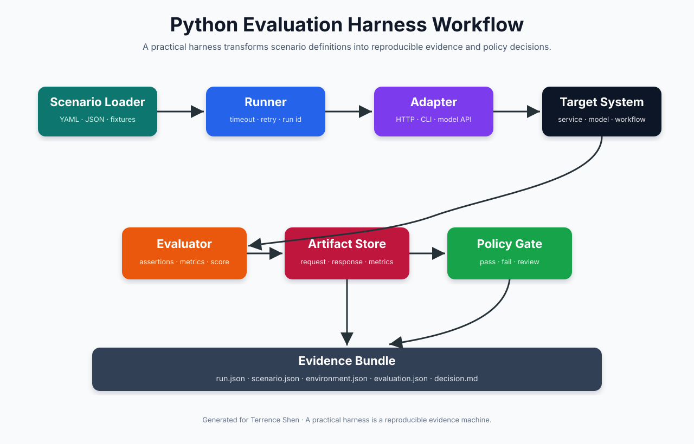
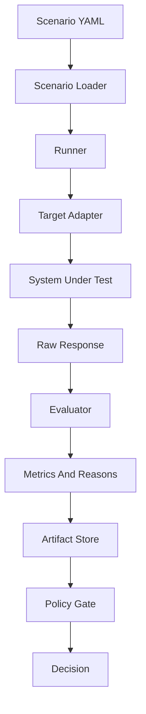
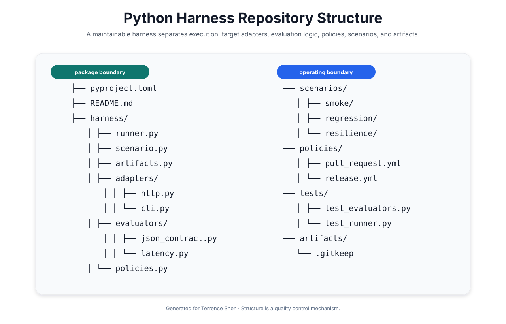
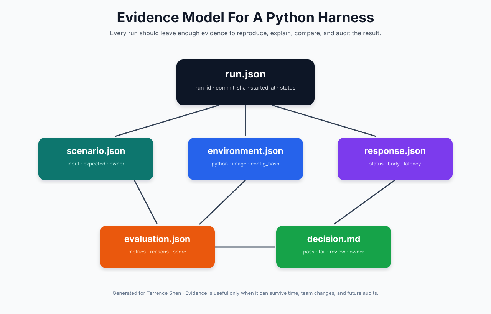
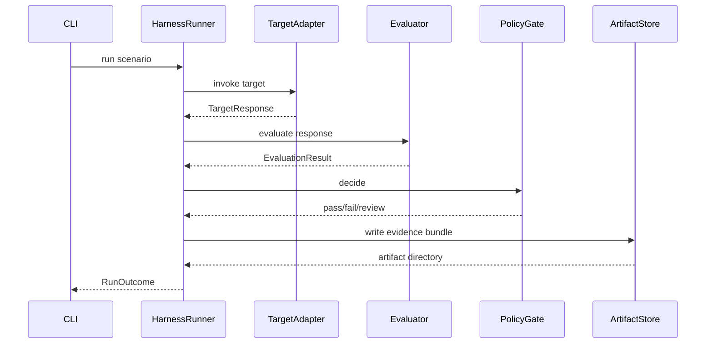
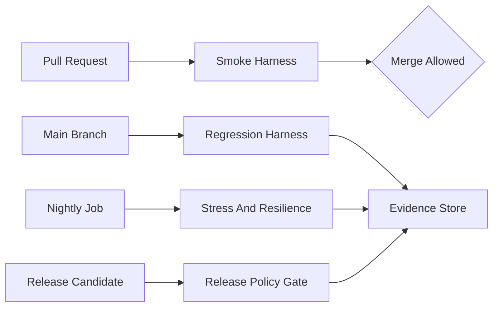
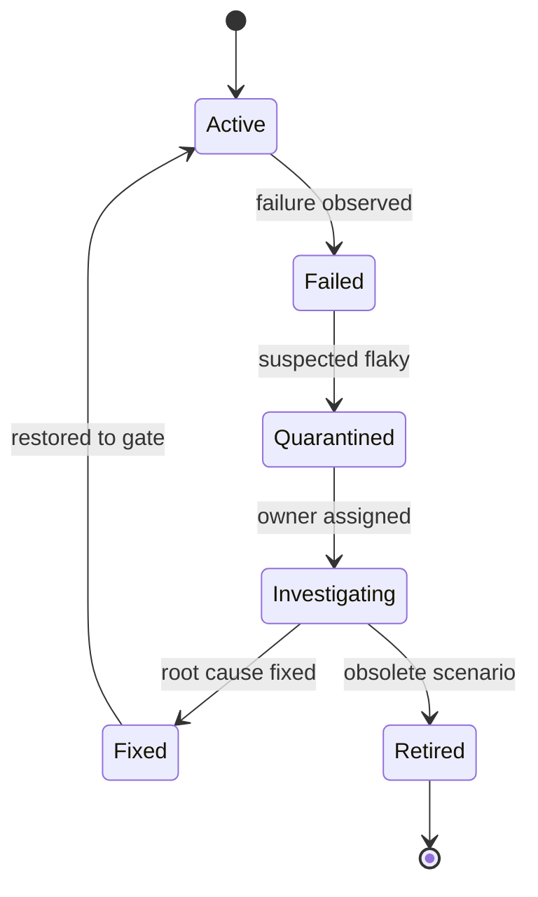

# 🧪 Harness Engineering 实战：从零实现一个可复现的 Python Evaluation Harness

> 本文是 Harness Engineering 系列的第二篇。第一篇建立了方法论框架，本文进入工程实现层，讨论如何用 Python 构建一个可复现、可观测、可扩展、可接入 CI/CD 的 Evaluation Harness。



## 🧷 目录

- [🧭 目标：实现一个最小但严肃的 Evaluation Harness](#-目标实现一个最小但严肃的-evaluation-harness)
- [🗂️ 仓库结构：先约束工程边界](#️-仓库结构先约束工程边界)
- [📦 pyproject.toml：将 Harness 作为软件包维护](#-pyprojecttoml将-harness-作为软件包维护)
- [🧾 Scenario 数据模型：把输入、期望和责任人显式化](#-scenario-数据模型把输入期望和责任人显式化)
- [🔌 Adapter：把目标系统隔离在稳定边界后面](#-adapter把目标系统隔离在稳定边界后面)
- [🧮 Evaluator：把系统输出转化为证据](#-evaluator把系统输出转化为证据)
- [🗃️ Artifact Store：证据必须能被复查](#️-artifact-store证据必须能被复查)
- [🏃 Runner：组织一次完整、可追踪的执行](#-runner组织一次完整可追踪的执行)
- [🚦 Policy Gate：把指标转化为工程决策](#-policy-gate把指标转化为工程决策)
- [🧪 测试 Harness 自身：验证工具也必须被验证](#-测试-harness-自身验证工具也必须被验证)
- [🔁 CI/CD 集成：把 Harness 变成发布链路的一部分](#-cicd-集成把-harness-变成发布链路的一部分)
- [🏁 结论：一个小型 Harness 也可以具备工程严肃性](#-结论一个小型-harness-也可以具备工程严肃性)

## 🧭 目标：实现一个最小但严肃的 Evaluation Harness

一个 evaluation harness 的目标不是运行更多脚本，而是稳定地产生可解释证据。工程团队需要能够回答以下问题：某个目标系统在指定输入下是否满足预期；一次失败能否复现；失败与哪个版本、配置、场景和运行环境有关；结果是否足以阻止发布；证据是否能在数周或数月后被复查。

因此，本文的实现目标并不是构建大型平台，而是构建一个最小但严肃的 Python harness。它应当具备以下能力：

| 能力 | 工程意义 | 本文实现方式 |
|---|---|---|
| 场景文件化 | 将测试知识从脚本中剥离出来 | YAML scenario |
| 目标系统隔离 | 避免 runner 与系统调用细节耦合 | adapter protocol |
| 指标评估 | 将原始输出转化为可判断证据 | evaluator |
| 证据归档 | 保留 request、response、metrics、environment | artifact store |
| 策略门禁 | 把指标转化为 pass/fail/review | policy gate |
| CLI 执行 | 便于本地、CI、定时任务复用 | argparse CLI |
| 自身测试 | 防止 harness 误报或漏报 | pytest |

从架构上看，本文实现的 harness 可以被理解为一条证据流水线。



这个流程看似简单，但它已经包含 Harness Engineering 的核心原则：输入可描述、执行可追踪、结果可比较、证据可归档、决策可解释。

## 🗂️ 仓库结构：先约束工程边界

一个 harness 项目应当尽早形成清晰的仓库结构。结构不是形式主义，而是控制复杂度的工程手段。若 runner、adapter、evaluator、policy 和 scenario 混在同一个脚本里，短期内可能更快，长期则会快速失去可维护性。



推荐结构如下：

```text
evaluation-harness/
  pyproject.toml
  README.md
  harness/
    __init__.py
    scenario.py
    artifacts.py
    runner.py
    policies.py
    cli.py
    adapters/
      __init__.py
      base.py
      http.py
      cli_program.py
    evaluators/
      __init__.py
      base.py
      json_contract.py
      latency.py
      composite.py
  scenarios/
    smoke/
      health-check.yml
    regression/
      json-contract.yml
    resilience/
      dependency-timeout.yml
  policies/
    pull_request.yml
    release.yml
  artifacts/
    .gitkeep
  tests/
    test_scenario.py
    test_evaluators.py
    test_runner.py
```

该结构中，`harness/` 是可测试的软件包，`scenarios/` 是场景知识库，`policies/` 是门禁规则，`artifacts/` 是运行证据输出目录，`tests/` 验证 harness 自身正确性。这样的结构使工程团队能够分别维护执行逻辑、场景资产和治理规则。

## 📦 pyproject.toml：将 Harness 作为软件包维护

即使 harness 起初很小，也应当作为软件包维护。这样可以获得依赖管理、格式化、测试、类型检查和 CLI 入口的统一能力。

```toml
[project]
name = "evaluation-harness"
version = "0.1.0"
description = "A minimal evidence-oriented Python evaluation harness"
requires-python = ">=3.11"
dependencies = [
  "pyyaml>=6.0.1",
  "requests>=2.31.0",
]

[project.optional-dependencies]
dev = [
  "pytest>=8.0.0",
  "ruff>=0.4.0",
  "mypy>=1.8.0",
]

[project.scripts]
harness = "harness.cli:main"

[tool.ruff]
line-length = 100

[tool.pytest.ini_options]
testpaths = ["tests"]
```

这里没有引入复杂框架。一个严肃 harness 的早期版本应当保持小而透明。只要结构正确，后续可以逐步加入 OpenTelemetry、数据库、对象存储、Prometheus、Allure 报告或 Web UI。

## 🧾 Scenario 数据模型：把输入、期望和责任人显式化

scenario 是 harness 的知识核心。它不是普通测试函数的名字，而是一个可执行、可复查、可治理的场景契约。一个最小 scenario 至少需要包含场景标识、目标类型、输入、期望、超时、责任人和标签。

下面是一个服务接口场景示例。

```yaml
id: json-contract-basic
name: JSON contract basic validation
category: smoke
owner: platform-team
priority: p1
tags:
  - api
  - contract

target:
  type: http
  method: POST
  url: http://localhost:8000/v1/run

input:
  payload:
    message: hello
    request_id: demo-001

expected:
  status_code: 200
  required_json_keys:
    - result
    - request_id
  max_latency_ms: 500

execution:
  timeout_seconds: 5
  retries: 0
```

对应的数据模型可以使用 dataclass 实现。对于生产系统，可以使用 Pydantic 或 JSON Schema，但早期 dataclass 足以表达边界。

```python
from __future__ import annotations

from dataclasses import dataclass, field
from pathlib import Path
from typing import Any

import yaml


@dataclass(frozen=True)
class TargetSpec:
    type: str
    url: str | None = None
    method: str = "POST"
    command: list[str] | None = None


@dataclass(frozen=True)
class ExecutionSpec:
    timeout_seconds: int = 30
    retries: int = 0


@dataclass(frozen=True)
class ExpectedSpec:
    status_code: int | None = None
    required_json_keys: list[str] = field(default_factory=list)
    max_latency_ms: int | None = None


@dataclass(frozen=True)
class Scenario:
    id: str
    name: str
    category: str
    owner: str
    priority: str
    tags: list[str]
    target: TargetSpec
    input: dict[str, Any]
    expected: ExpectedSpec
    execution: ExecutionSpec


def load_scenario(path: Path) -> Scenario:
    raw = yaml.safe_load(path.read_text(encoding="utf-8"))
    return Scenario(
        id=raw["id"],
        name=raw.get("name", raw["id"]),
        category=raw.get("category", "uncategorized"),
        owner=raw.get("owner", "unknown"),
        priority=raw.get("priority", "p2"),
        tags=list(raw.get("tags", [])),
        target=TargetSpec(**raw["target"]),
        input=dict(raw.get("input", {})),
        expected=ExpectedSpec(**raw.get("expected", {})),
        execution=ExecutionSpec(**raw.get("execution", {})),
    )


def load_scenarios(directory: Path) -> list[Scenario]:
    paths = sorted(directory.rglob("*.yml")) + sorted(directory.rglob("*.yaml"))
    return [load_scenario(path) for path in paths]
```

在这个模型中，scenario loader 只负责把文件转化为内存对象，不负责调用系统，不负责评估结果，也不负责保存 artifact。职责边界越清晰，harness 越容易扩展。

## 🔌 Adapter：把目标系统隔离在稳定边界后面

adapter 是 harness 与目标系统之间的连接层。目标系统可能是 HTTP 服务、CLI 程序、模型推理服务、数据库任务、消息队列消费者或多阶段工作流。runner 不应直接知道这些细节，否则系统调用方式一变，整个 harness 就会被迫修改。

首先定义统一协议。

```python
from __future__ import annotations

from dataclasses import dataclass
from typing import Any, Protocol

from harness.scenario import Scenario


@dataclass(frozen=True)
class TargetResponse:
    status_code: int | None
    body: Any
    stdout: str
    stderr: str
    latency_ms: int
    metadata: dict[str, Any]


class TargetAdapter(Protocol):
    def invoke(self, scenario: Scenario) -> TargetResponse:
        ...
```

HTTP adapter 可以这样实现。

```python
from __future__ import annotations

import time
from typing import Any

import requests

from harness.adapters.base import TargetResponse
from harness.scenario import Scenario


class HttpAdapter:
    def invoke(self, scenario: Scenario) -> TargetResponse:
        if scenario.target.url is None:
            raise ValueError(f"scenario {scenario.id} does not define target.url")

        payload = scenario.input.get("payload", {})
        started = time.monotonic()
        response = requests.request(
            method=scenario.target.method,
            url=scenario.target.url,
            json=payload,
            timeout=scenario.execution.timeout_seconds,
        )
        latency_ms = int((time.monotonic() - started) * 1000)

        try:
            body: Any = response.json()
        except ValueError:
            body = response.text

        return TargetResponse(
            status_code=response.status_code,
            body=body,
            stdout="",
            stderr="",
            latency_ms=latency_ms,
            metadata={
                "adapter": "http",
                "method": scenario.target.method,
                "url": scenario.target.url,
            },
        )
```

CLI adapter 可以这样实现。

```python
from __future__ import annotations

import subprocess
import time

from harness.adapters.base import TargetResponse
from harness.scenario import Scenario


class CliProgramAdapter:
    def invoke(self, scenario: Scenario) -> TargetResponse:
        if not scenario.target.command:
            raise ValueError(f"scenario {scenario.id} does not define target.command")

        started = time.monotonic()
        completed = subprocess.run(
            scenario.target.command,
            text=True,
            capture_output=True,
            timeout=scenario.execution.timeout_seconds,
            check=False,
        )
        latency_ms = int((time.monotonic() - started) * 1000)

        return TargetResponse(
            status_code=completed.returncode,
            body=None,
            stdout=completed.stdout,
            stderr=completed.stderr,
            latency_ms=latency_ms,
            metadata={
                "adapter": "cli",
                "command": scenario.target.command,
            },
        )
```

adapter 的重要原则是：调用目标系统并返回标准结果，不做复杂业务判断。判断应当属于 evaluator。若 adapter 同时负责调用、断言、记录和策略判断，harness 会快速变得不可测试。

## 🧮 Evaluator：把系统输出转化为证据

evaluator 的职责是将 `TargetResponse` 与 `ExpectedSpec` 进行比较，输出结构化评估结果。一个 evaluator 不应该只返回布尔值，因为失败原因、指标和上下文同样重要。

```python
from __future__ import annotations

from dataclasses import dataclass, field
from typing import Protocol

from harness.adapters.base import TargetResponse
from harness.scenario import Scenario


@dataclass(frozen=True)
class EvaluationResult:
    passed: bool
    metrics: dict[str, float] = field(default_factory=dict)
    reasons: list[str] = field(default_factory=list)


class Evaluator(Protocol):
    def evaluate(self, scenario: Scenario, response: TargetResponse) -> EvaluationResult:
        ...
```

延迟 evaluator 可以独立实现。

```python
from harness.adapters.base import TargetResponse
from harness.evaluators.base import EvaluationResult
from harness.scenario import Scenario


class LatencyEvaluator:
    def evaluate(self, scenario: Scenario, response: TargetResponse) -> EvaluationResult:
        max_latency = scenario.expected.max_latency_ms
        metrics = {"latency_ms": float(response.latency_ms)}

        if max_latency is None:
            return EvaluationResult(passed=True, metrics=metrics)

        if response.latency_ms <= max_latency:
            return EvaluationResult(passed=True, metrics=metrics)

        return EvaluationResult(
            passed=False,
            metrics=metrics,
            reasons=[
                f"latency_ms {response.latency_ms} exceeds max_latency_ms {max_latency}"
            ],
        )
```

JSON contract evaluator 可以检查 HTTP 状态码和必要字段。

```python
from harness.adapters.base import TargetResponse
from harness.evaluators.base import EvaluationResult
from harness.scenario import Scenario


class JsonContractEvaluator:
    def evaluate(self, scenario: Scenario, response: TargetResponse) -> EvaluationResult:
        reasons: list[str] = []
        metrics: dict[str, float] = {}

        if scenario.expected.status_code is not None:
            expected = scenario.expected.status_code
            actual = response.status_code
            metrics["status_code"] = float(actual if actual is not None else -1)
            if actual != expected:
                reasons.append(f"status_code {actual} does not equal expected {expected}")

        if scenario.expected.required_json_keys:
            if not isinstance(response.body, dict):
                reasons.append("response body is not a JSON object")
            else:
                missing = [
                    key for key in scenario.expected.required_json_keys
                    if key not in response.body
                ]
                metrics["missing_required_keys"] = float(len(missing))
                if missing:
                    reasons.append(f"missing required JSON keys: {missing}")

        return EvaluationResult(
            passed=not reasons,
            metrics=metrics,
            reasons=reasons,
        )
```

多个 evaluator 可以组合为 composite evaluator。

```python
from harness.adapters.base import TargetResponse
from harness.evaluators.base import EvaluationResult, Evaluator
from harness.scenario import Scenario


class CompositeEvaluator:
    def __init__(self, evaluators: list[Evaluator]) -> None:
        self.evaluators = evaluators

    def evaluate(self, scenario: Scenario, response: TargetResponse) -> EvaluationResult:
        all_metrics: dict[str, float] = {}
        all_reasons: list[str] = []

        for evaluator in self.evaluators:
            result = evaluator.evaluate(scenario, response)
            all_metrics.update(result.metrics)
            all_reasons.extend(result.reasons)

        return EvaluationResult(
            passed=not all_reasons,
            metrics=all_metrics,
            reasons=all_reasons,
        )
```

这种设计允许团队逐步增加 evaluator。例如 ASR 系统可以加入 CER/WER evaluator，LLM 系统可以加入 JSON schema evaluator、safety evaluator、tool-call evaluator，推荐系统可以加入 hit-rate、NDCG 或 coverage evaluator。

## 🗃️ Artifact Store：证据必须能被复查

harness 的输出不应只存在于终端。终端适合人类即时查看，不适合作为长期证据。artifact store 应当以稳定目录结构保存每次运行的关键材料。



一个建议的 artifact 结构如下：

```text
artifacts/
  2026-05-14T10-30-00Z__json-contract-basic/
    run.json
    scenario.json
    request.json
    response.json
    evaluation.json
    environment.json
    decision.md
```

artifact store 的代码可以保持直接透明。

```python
from __future__ import annotations

import json
import platform
import subprocess
import time
from dataclasses import asdict, is_dataclass
from pathlib import Path
from typing import Any

from harness.adapters.base import TargetResponse
from harness.evaluators.base import EvaluationResult
from harness.scenario import Scenario


def to_jsonable(value: Any) -> Any:
    if is_dataclass(value):
        return asdict(value)
    return value


class ArtifactStore:
    def __init__(self, root: Path) -> None:
        self.root = root
        self.root.mkdir(parents=True, exist_ok=True)

    def create_run_dir(self, run_id: str, scenario_id: str) -> Path:
        safe_scenario_id = scenario_id.replace("/", "_")
        run_dir = self.root / f"{run_id}__{safe_scenario_id}"
        run_dir.mkdir(parents=True, exist_ok=False)
        return run_dir

    def write_json(self, run_dir: Path, name: str, payload: Any) -> None:
        path = run_dir / name
        path.write_text(
            json.dumps(to_jsonable(payload), ensure_ascii=False, indent=2),
            encoding="utf-8",
        )

    def write_text(self, run_dir: Path, name: str, content: str) -> None:
        (run_dir / name).write_text(content, encoding="utf-8")

    def write_evidence_bundle(
        self,
        run_dir: Path,
        scenario: Scenario,
        response: TargetResponse,
        evaluation: EvaluationResult,
        decision: str,
    ) -> None:
        self.write_json(run_dir, "scenario.json", scenario)
        self.write_json(run_dir, "response.json", response)
        self.write_json(run_dir, "evaluation.json", evaluation)
        self.write_json(run_dir, "environment.json", collect_environment())
        self.write_text(run_dir, "decision.md", render_decision(scenario, evaluation, decision))


def collect_environment() -> dict[str, Any]:
    try:
        commit_sha = subprocess.check_output(
            ["git", "rev-parse", "HEAD"],
            text=True,
        ).strip()
    except Exception:
        commit_sha = "unknown"

    return {
        "python_version": platform.python_version(),
        "platform": platform.platform(),
        "commit_sha": commit_sha,
        "timestamp_ms": int(time.time() * 1000),
    }


def render_decision(
    scenario: Scenario,
    evaluation: EvaluationResult,
    decision: str,
) -> str:
    reasons = "\n".join(f"- {reason}" for reason in evaluation.reasons) or "- none"
    metrics = "\n".join(
        f"- {name}: {value}" for name, value in evaluation.metrics.items()
    ) or "- none"
    return f"""# Decision Record

Scenario: `{scenario.id}`  
Owner: `{scenario.owner}`  
Decision: `{decision}`

## Metrics

{metrics}

## Reasons

{reasons}
"""
```

artifact store 的设计目标是长期可读。即使未来更换数据库、对象存储或报告系统，JSON 和 Markdown artifact 仍然可以作为底层证据格式。

## 🏃 Runner：组织一次完整、可追踪的执行

runner 是 harness 的生命周期控制器。它负责为每次运行生成 run_id，调用 adapter，调用 evaluator，调用 policy gate，保存 artifact，并返回最终结果。

```python
from __future__ import annotations

import time
from dataclasses import dataclass
from pathlib import Path

from harness.adapters.base import TargetAdapter
from harness.artifacts import ArtifactStore
from harness.evaluators.base import Evaluator
from harness.policies import PolicyGate
from harness.scenario import Scenario


@dataclass(frozen=True)
class RunOutcome:
    run_id: str
    scenario_id: str
    decision: str
    passed: bool
    artifact_dir: Path
    duration_ms: int


class HarnessRunner:
    def __init__(
        self,
        adapter: TargetAdapter,
        evaluator: Evaluator,
        policy_gate: PolicyGate,
        artifact_store: ArtifactStore,
    ) -> None:
        self.adapter = adapter
        self.evaluator = evaluator
        self.policy_gate = policy_gate
        self.artifact_store = artifact_store

    def run_one(self, scenario: Scenario) -> RunOutcome:
        run_id = build_run_id()
        run_dir = self.artifact_store.create_run_dir(run_id, scenario.id)
        started = time.monotonic()

        response = self.adapter.invoke(scenario)
        evaluation = self.evaluator.evaluate(scenario, response)
        decision = self.policy_gate.decide(scenario, evaluation)

        self.artifact_store.write_evidence_bundle(
            run_dir=run_dir,
            scenario=scenario,
            response=response,
            evaluation=evaluation,
            decision=decision,
        )

        duration_ms = int((time.monotonic() - started) * 1000)
        return RunOutcome(
            run_id=run_id,
            scenario_id=scenario.id,
            decision=decision,
            passed=decision == "pass",
            artifact_dir=run_dir,
            duration_ms=duration_ms,
        )


def build_run_id() -> str:
    return time.strftime("%Y-%m-%dT%H-%M-%SZ", time.gmtime())
```

这个 runner 暂时没有实现重试。生产版本可以在 adapter 调用外层加入 retry loop，并将每次 attempt 单独写入 artifact。关键是重试必须透明，不应吞掉失败证据。



## 🚦 Policy Gate：把指标转化为工程决策

evaluator 判断场景是否满足期望，policy gate 决定工程动作。早期版本可以只支持三种状态：`pass`、`fail`、`review`。

```python
from __future__ import annotations

from dataclasses import dataclass

from harness.evaluators.base import EvaluationResult
from harness.scenario import Scenario


@dataclass(frozen=True)
class PolicyConfig:
    fail_on_p1: bool = True
    review_on_p2_failure: bool = True


class PolicyGate:
    def __init__(self, config: PolicyConfig) -> None:
        self.config = config

    def decide(self, scenario: Scenario, evaluation: EvaluationResult) -> str:
        if evaluation.passed:
            return "pass"

        if scenario.priority.lower() == "p1" and self.config.fail_on_p1:
            return "fail"

        if scenario.priority.lower() == "p2" and self.config.review_on_p2_failure:
            return "review"

        return "fail"
```

更完整的 policy 可以从 YAML 加载。

```yaml
name: pull-request-policy
rules:
  p1_failure: fail
  p2_failure: review
  max_latency_regression_percent: 10
  allow_quarantined_scenarios: false
```

门禁设计不应追求复杂，而应追求可解释。如果团队无法解释某条 policy 为什么存在，它很可能会被绕过或误用。

## 🧰 Adapter Factory：根据场景类型选择目标调用方式

为了让 CLI 能够运行不同 target type，需要一个简单 factory。

```python
from harness.adapters.base import TargetAdapter
from harness.adapters.cli_program import CliProgramAdapter
from harness.adapters.http import HttpAdapter
from harness.scenario import Scenario


def build_adapter(scenario: Scenario) -> TargetAdapter:
    if scenario.target.type == "http":
        return HttpAdapter()
    if scenario.target.type == "cli":
        return CliProgramAdapter()
    raise ValueError(f"unsupported target type: {scenario.target.type}")
```

这种 factory 可以保持简单。若未来 target 类型变多，可以引入 registry，但不应过早抽象。

## 🖥️ CLI：让 Harness 可以被本地与 CI 调用

CLI 是 harness 进入日常工程流程的关键接口。它应当支持场景目录、artifact 目录和失败退出码。

```python
from __future__ import annotations

import argparse
from pathlib import Path

from harness.adapters.factory import build_adapter
from harness.artifacts import ArtifactStore
from harness.evaluators.composite import CompositeEvaluator
from harness.evaluators.json_contract import JsonContractEvaluator
from harness.evaluators.latency import LatencyEvaluator
from harness.policies import PolicyConfig, PolicyGate
from harness.runner import HarnessRunner
from harness.scenario import load_scenarios


def main() -> int:
    parser = argparse.ArgumentParser(description="Run evaluation harness scenarios")
    parser.add_argument("--scenario-dir", required=True)
    parser.add_argument("--artifact-dir", default="artifacts")
    args = parser.parse_args()

    scenarios = load_scenarios(Path(args.scenario_dir))
    artifact_store = ArtifactStore(Path(args.artifact_dir))
    evaluator = CompositeEvaluator([
        JsonContractEvaluator(),
        LatencyEvaluator(),
    ])
    policy_gate = PolicyGate(PolicyConfig())

    failed = False
    for scenario in scenarios:
        adapter = build_adapter(scenario)
        runner = HarnessRunner(
            adapter=adapter,
            evaluator=evaluator,
            policy_gate=policy_gate,
            artifact_store=artifact_store,
        )
        outcome = runner.run_one(scenario)
        print(
            f"{outcome.decision.upper()} {outcome.scenario_id} "
            f"duration_ms={outcome.duration_ms} artifacts={outcome.artifact_dir}"
        )
        if outcome.decision == "fail":
            failed = True

    return 1 if failed else 0


if __name__ == "__main__":
    raise SystemExit(main())
```

这个 CLI 已经可以作为本地命令和 CI 步骤运行。

```bash
harness --scenario-dir scenarios/smoke --artifact-dir artifacts
```

## 🧪 测试 Harness 自身：验证工具也必须被验证

harness 一旦进入发布链路，它本身就成为基础设施。基础设施必须被测试。至少应覆盖 scenario loader、evaluator、policy gate 和 runner。

测试 JSON contract evaluator：

```python
from harness.adapters.base import TargetResponse
from harness.evaluators.json_contract import JsonContractEvaluator
from harness.scenario import ExpectedSpec, ExecutionSpec, Scenario, TargetSpec


def build_scenario() -> Scenario:
    return Scenario(
        id="contract-test",
        name="contract test",
        category="unit",
        owner="test",
        priority="p1",
        tags=[],
        target=TargetSpec(type="http", url="http://example.test"),
        input={},
        expected=ExpectedSpec(
            status_code=200,
            required_json_keys=["result", "request_id"],
        ),
        execution=ExecutionSpec(),
    )


def test_json_contract_passes_when_keys_exist():
    response = TargetResponse(
        status_code=200,
        body={"result": "ok", "request_id": "abc"},
        stdout="",
        stderr="",
        latency_ms=120,
        metadata={},
    )

    result = JsonContractEvaluator().evaluate(build_scenario(), response)

    assert result.passed is True
    assert result.reasons == []


def test_json_contract_fails_when_required_key_missing():
    response = TargetResponse(
        status_code=200,
        body={"result": "ok"},
        stdout="",
        stderr="",
        latency_ms=120,
        metadata={},
    )

    result = JsonContractEvaluator().evaluate(build_scenario(), response)

    assert result.passed is False
    assert "missing required JSON keys" in result.reasons[0]
```

测试 policy gate：

```python
from harness.evaluators.base import EvaluationResult
from harness.policies import PolicyConfig, PolicyGate


def test_policy_fails_p1_failure():
    scenario = build_scenario()
    evaluation = EvaluationResult(passed=False, reasons=["contract violation"])

    decision = PolicyGate(PolicyConfig()).decide(scenario, evaluation)

    assert decision == "fail"


def test_policy_passes_successful_evaluation():
    scenario = build_scenario()
    evaluation = EvaluationResult(passed=True)

    decision = PolicyGate(PolicyConfig()).decide(scenario, evaluation)

    assert decision == "pass"
```

测试 runner 时，可以使用 fake adapter，避免依赖真实网络。

```python
from harness.adapters.base import TargetResponse
from harness.artifacts import ArtifactStore
from harness.evaluators.json_contract import JsonContractEvaluator
from harness.policies import PolicyConfig, PolicyGate
from harness.runner import HarnessRunner


class FakeAdapter:
    def invoke(self, scenario):
        return TargetResponse(
            status_code=200,
            body={"result": "ok", "request_id": "abc"},
            stdout="",
            stderr="",
            latency_ms=10,
            metadata={"adapter": "fake"},
        )


def test_runner_writes_artifacts(tmp_path):
    scenario = build_scenario()
    runner = HarnessRunner(
        adapter=FakeAdapter(),
        evaluator=JsonContractEvaluator(),
        policy_gate=PolicyGate(PolicyConfig()),
        artifact_store=ArtifactStore(tmp_path),
    )

    outcome = runner.run_one(scenario)

    assert outcome.decision == "pass"
    assert (outcome.artifact_dir / "scenario.json").exists()
    assert (outcome.artifact_dir / "response.json").exists()
    assert (outcome.artifact_dir / "evaluation.json").exists()
    assert (outcome.artifact_dir / "decision.md").exists()
```

这些测试并不复杂，但它们能保护 harness 的核心可信度。若 evaluator 或 policy gate 出错，CI/CD 门禁可能产生错误判断，因此测试成本是必要的。

## 🔁 CI/CD 集成：把 Harness 变成发布链路的一部分

当本地 harness 能稳定运行后，下一步是接入 CI/CD。以下 GitHub Actions 示例展示了 pull request 阶段的基础门禁。

```yaml
name: evaluation-harness

on:
  pull_request:
    branches:
      - main

jobs:
  smoke-evaluation:
    runs-on: ubuntu-latest
    timeout-minutes: 15

    steps:
      - uses: actions/checkout@v4

      - uses: actions/setup-python@v5
        with:
          python-version: '3.11'

      - name: Install harness
        run: |
          python -m pip install --upgrade pip
          pip install -e '.[dev]'

      - name: Run smoke scenarios
        run: |
          harness \
            --scenario-dir scenarios/smoke \
            --artifact-dir artifacts

      - name: Upload evidence artifacts
        uses: actions/upload-artifact@v4
        if: always()
        with:
          name: evaluation-harness-artifacts
          path: artifacts
```

CI/CD 集成时应注意分层策略。pull request 阶段应运行快速 smoke 和关键 contract 场景；main 分支可以运行完整回归；夜间任务可以运行压力、故障注入和高成本模型评估；发布前可以运行生产等价环境验证。



这种分层方式能够避免把所有场景塞进 pull request，从而降低反馈时间，同时保留高风险场景的持续验证。

## 📊 运行报告：终端输出不是最终证据

CLI 输出适合快速反馈，但工程团队还需要可读报告。早期版本可以用 Markdown 生成简单 summary。

```python
from harness.runner import RunOutcome


def render_summary(outcomes: list[RunOutcome]) -> str:
    total = len(outcomes)
    failed = sum(1 for item in outcomes if item.decision == "fail")
    review = sum(1 for item in outcomes if item.decision == "review")
    passed = sum(1 for item in outcomes if item.decision == "pass")

    lines = [
        "# Harness Run Summary",
        "",
        f"Total: {total}",
        f"Passed: {passed}",
        f"Failed: {failed}",
        f"Review: {review}",
        "",
        "| Scenario | Decision | Duration | Artifact |",
        "|---|---|---:|---|",
    ]
    for item in outcomes:
        lines.append(
            f"| `{item.scenario_id}` | `{item.decision}` | "
            f"{item.duration_ms} ms | `{item.artifact_dir}` |"
        )
    return "\n".join(lines)
```

报告不是 artifact 的替代物。报告用于阅读，artifact 用于复查和机器处理。成熟系统应同时保留二者。

## 🔐 安全边界：Harness 不应成为新的风险源

harness 常常具有访问测试环境、读取样本数据、调用目标系统和保存响应的能力。若不加控制，它可能成为新的数据泄露或权限扩大来源。

| 风险 | 具体表现 | 建议控制 |
|---|---|---|
| artifact 泄露敏感字段 | response.json 包含 token、手机号、地址 | 字段脱敏、allowlist、secret scan |
| CI 权限过大 | harness 使用生产凭证 | 最小权限、临时凭证、环境隔离 |
| 测试数据污染生产 | 场景误指向生产写接口 | 只读策略、sandbox tenant、URL allowlist |
| 日志泄露系统 prompt | LLM 场景保存完整内部提示 | 分级日志、redaction、访问控制 |
| 误用故障注入 | resilience 场景影响共享环境 | 独立命名空间、限流、审批 |

下面是一个简单的脱敏函数示例。

```python
SENSITIVE_KEYS = {"token", "authorization", "password", "secret"}


def redact(value):
    if isinstance(value, dict):
        redacted = {}
        for key, item in value.items():
            if key.lower() in SENSITIVE_KEYS:
                redacted[key] = "<redacted>"
            else:
                redacted[key] = redact(item)
        return redacted
    if isinstance(value, list):
        return [redact(item) for item in value]
    return value
```

该函数只是基础示例。生产环境通常需要结合字段白名单、正则扫描、secret scanning 和访问控制。

## 🧬 面向 AI 与 LLM 的扩展方向

本文示例主要面向 HTTP/CLI 系统，但同样适用于 AI 和 LLM 应用。区别在于 evaluator 更复杂，指标更丰富，场景需要覆盖质量、安全、成本、延迟和结构化输出。

LLM 场景可以这样描述：

```yaml
id: llm-json-tool-call-contract
name: LLM tool call JSON contract
category: llm-regression
owner: ai-platform-team
priority: p1
tags:
  - llm
  - json
  - tool-call

target:
  type: http
  method: POST
  url: http://localhost:8080/v1/chat/completions

input:
  payload:
    model: local-llm
    temperature: 0
    messages:
      - role: system
        content: Return a JSON object only.
      - role: user
        content: Create tool arguments for order A20260514001.

expected:
  status_code: 200
  required_json_keys:
    - tool_name
    - arguments
  max_latency_ms: 5000

execution:
  timeout_seconds: 10
  retries: 1
```

AI 系统的 evaluator 可以增加以下指标：

| 指标 | 说明 |
|---|---|
| schema_valid_rate | 输出是否满足结构化 schema |
| refusal_correctness | 拒答是否符合策略 |
| hallucination_rate | 是否产生不可支持事实 |
| cost_per_request | 单次请求成本 |
| p95_latency_ms | 延迟尾部表现 |
| safety_violation_count | 安全策略违规次数 |
| regression_delta | 相对上一模型版本的质量变化 |

AI harness 的特殊点在于，单次结果可能不稳定，因此需要重复采样、统计阈值和 golden set。对高风险场景，应保留模型版本、prompt 模板版本、解码参数、数据集版本和 evaluator 版本。

## 🧯 Flaky 治理：不稳定场景必须被制度化处理

一旦 harness 接入 CI，flaky 场景会迅速消耗团队信任。治理 flaky 场景不应依赖口头约定，而应进入状态机。



quarantined 场景不应消失。它应继续运行并产出 artifact，但暂时不阻塞主发布门禁。这样可以同时保护交付效率和问题证据。

## 📈 成熟度推进：从小工具到组织级系统

本文实现的是 L1 到 L2 阶段的基础 harness。它可以支撑脚本化运行、结构化场景、基础 artifact 和 CI 门禁。随着系统复杂度上升，可以按以下方向推进：

| 阶段 | 目标 | 增量能力 |
|---|---|---|
| L1 | 可重复执行 | CLI、YAML scenario、artifact 目录 |
| L2 | CI 门禁 | GitHub Actions、policy gate、artifact upload |
| L3 | 可观测关联 | trace id、metrics backend、dashboard |
| L4 | 治理闭环 | owner、approval、quarantine、audit record |
| L5 | 生产反馈回流 | incident-to-scenario、drift detection、auto case mining |

关键原则是渐进式演进。不要在缺乏场景和证据需求时过早构建大型平台。平台应从真实风险中长出，而不是从抽象设计中空降。

## 🏁 结论：一个小型 Harness 也可以具备工程严肃性

本文展示的 Python Evaluation Harness 并不庞大，但已经具备严肃工程系统的核心特征：场景文件化、目标系统隔离、指标评估、证据归档、策略门禁、CLI 调用、CI 集成和自身测试。

一个高质量 harness 的价值不在于代码量，而在于它是否能够稳定地产生证据。若一次运行能够被复现、被解释、被比较、被审计，并能影响工程决策，那么这个 harness 就已经开始承担质量治理职责。

对于复杂软件、分布式服务和 AI 系统，Harness Engineering 的长期目标不是替代工程师判断，而是提升判断质量。它让团队从临时经验转向可积累证据，从人工口头确认转向可执行策略，从孤立测试脚本转向组织级质量系统。

## 📬 联系方式

Terrence Shen  
Email: slamshenxin@gmail.com  
Located in China
