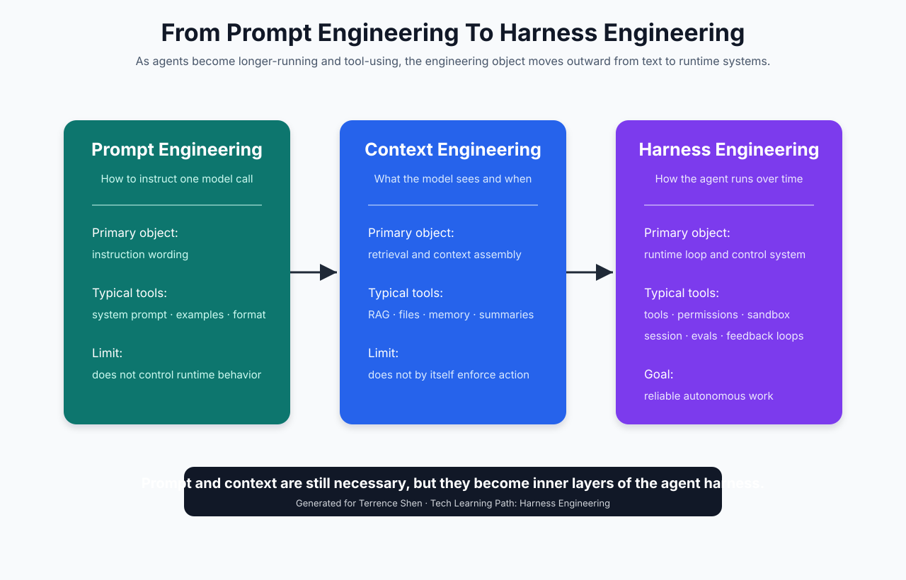
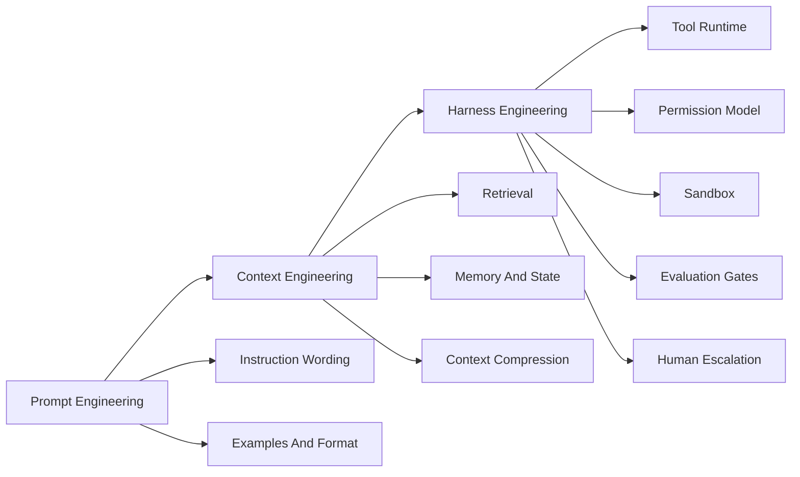
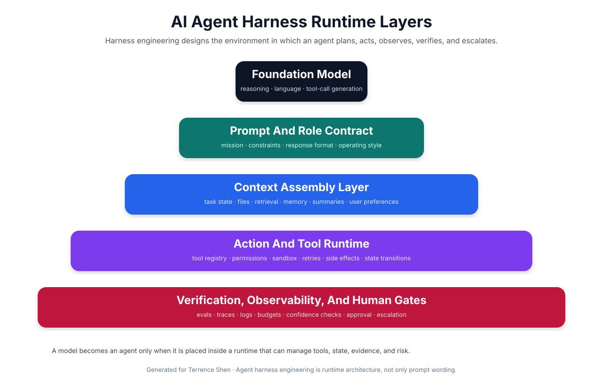
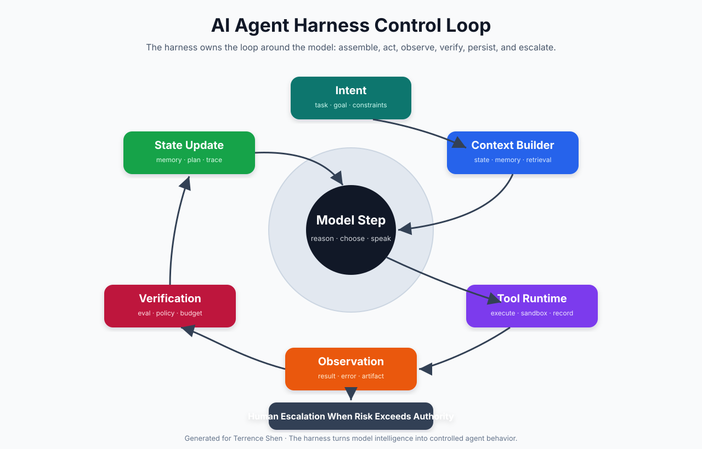
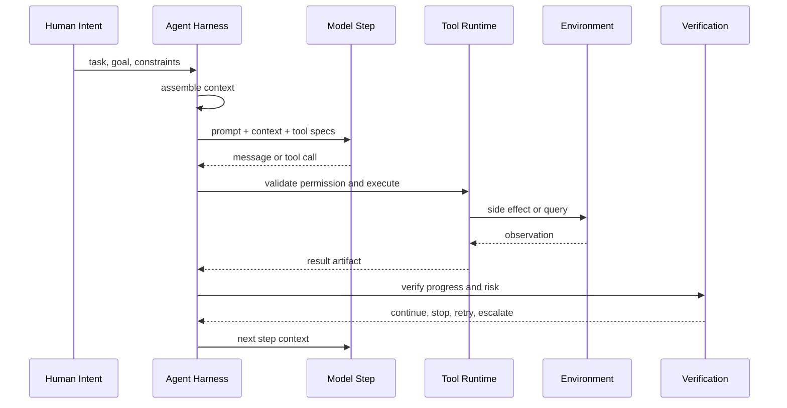
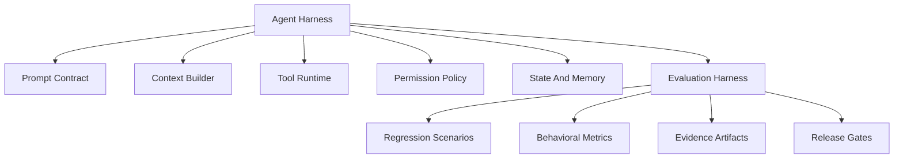

# 🧭 第三课：真正的 Agent Harness Engineering：从 Prompt、Context 到 Agent 运行时外骨骼

> 本课首先进行一次概念校准。前两课讨论的是广义测试、评估与证据工程意义上的 harness。它们不是无效内容，但它们并不是当前 AI Agent 开发语境下最前沿的 Harness Engineering 概念。本课从这里自然过渡：广义 evaluation harness 是 agent harness 的验证底座，而真正的 Agent Harness Engineering 是围绕 AI agent 运行时建立工具、权限、上下文、记忆、沙箱、反馈、观测和人工升级机制的工程 discipline。



## 🧷 目录

- [🧭 概念纠偏：前两课为什么偏了，但仍然有用](#-概念纠偏前两课为什么偏了但仍然有用)
- [🧠 三个阶段：Prompt Engineering、Context Engineering、Harness Engineering](#-三个阶段prompt-engineeringcontext-engineeringharness-engineering)
- [🧩 Agent Harness Engineering 的定义](#-agent-harness-engineering-的定义)
- [🏗️ Agent Harness 的运行时分层](#️-agent-harness-的运行时分层)
- [🔁 Agent Loop：Harness 真正管理的是循环](#-agent-loopharness-真正管理的是循环)
- [🧰 代码例子：一个极简 Agent Harness Loop](#-代码例子一个极简-agent-harness-loop)
- [📊 与前两课的关系：Evaluation Harness 成为验证层](#-与前两课的关系evaluation-harness-成为验证层)
- [🧭 工程地图：Agent Harness 需要设计哪些对象](#-工程地图agent-harness-需要设计哪些对象)
- [🏁 结论：Harness Engineering 是 Agent 时代的运行时工程](#-结论harness-engineering-是-agent-时代的运行时工程)

## 🧭 概念纠偏：前两课为什么偏了，但仍然有用

前两篇文章将 Harness Engineering 解释为围绕目标系统建立可复现执行、证据采集、评估门禁和成熟度治理的系统工程。这种解释在传统软件测试、模型评估、CI/CD、MLOps 和质量治理中是成立的，但它不是当前 AI Agent 语境里最值得学习的那个新概念。

AI Agent 语境中的 Harness Engineering 更靠近 agent runtime engineering。它关心的不是单次测试如何执行，而是一个 AI agent 如何被放置在一个可控环境中持续工作。这个环境需要管理模型调用、工具调用、上下文装配、长期任务状态、权限边界、文件系统或浏览器沙箱、预算、审计日志、评估器、人工确认点和失败恢复策略。

因此，前两课可以被重新定位为：

| 课程 | 实际主题 | 在 Agent Harness 中的位置 |
|---|---|---|
| 第一课 | 广义 harness 方法论、证据工程、成熟度模型 | 为 agent 行为验证提供理论基础 |
| 第二课 | Python Evaluation Harness 实战 | 可作为 agent eval、回归测试、证据归档模块 |
| 第三课 | AI Agent Harness Engineering | 正式进入 agent runtime 和自治系统设计 |

这个转场并不突兀。因为真正的 agent harness 同样需要可复现证据、评估指标、artifact、policy gate 和人类审批。区别在于：前两课的 harness 围绕被测系统运行；agent harness 围绕一个会思考、会选择工具、会修改环境、会持续行动的 agent 运行。

## 🧠 三个阶段：Prompt Engineering、Context Engineering、Harness Engineering

AI 应用开发的工程对象正在从内向外迁移。

Prompt Engineering 的核心对象是文字指令。工程师通过系统提示、少样本示例、输出格式约束、语气要求和任务分解来影响模型的一次输出。它适合单轮或短任务，但不足以控制一个长期运行的 agent。

Context Engineering 的核心对象是模型可见的信息。工程师设计检索、文件读取、摘要压缩、记忆注入、上下文排序、token 预算和任务状态，使模型在正确时间看到正确信息。它解决了模型“知道什么”的问题，但仍然不足以解决 agent “能做什么、何时做、做到哪里停、失败如何恢复”的问题。

Harness Engineering 的核心对象是 agent runtime。它把 prompt 和 context 放入一个更大的控制系统中，进一步管理工具、权限、沙箱、状态、反馈、观测、评估、预算和人工升级。它解决的是 agent 如何可靠工作的系统问题。



一个简洁判断是：prompt engineering 改写模型输入；context engineering 组织模型所见；harness engineering 设计 agent 所处的世界。

## 🧩 Agent Harness Engineering 的定义

在 AI Agent 开发语境中，Agent Harness Engineering 可以定义为：

> Agent Harness Engineering 是围绕 AI agent 构建运行时控制系统的工程实践。它通过工具接口、权限模型、上下文装配、状态管理、执行沙箱、反馈循环、评估门禁、观测记录和人工升级机制，将基础模型的推理能力转化为可控、可审计、可持续改进的 agent 行为。

该定义包含几个关键点。

第一，agent harness 的中心不是 prompt，而是 runtime。prompt 是内层协议，context 是信息供给，而 harness 是行动系统。

第二，agent harness 管理的是持续循环，而不是一次模型调用。agent 的工作通常表现为：理解意图、制定计划、调用工具、观察结果、更新状态、再次推理、继续行动，直到完成、失败或升级给人类。

第三，agent harness 关注 side effects。普通聊天模型输出文本，而 agent 会改文件、发请求、创建 PR、查询数据库、调用浏览器、发送邮件或部署服务。只要存在副作用，就必须有权限、审计和回滚边界。

第四，agent harness 是人机协作界面。OpenAI 对这个方向的描述强调人类负责 steer，agent 负责 execute；这意味着工程师的工作从直接写每一行实现，转向设计 agent 能够正确执行任务的环境、反馈和约束。

## 🏗️ Agent Harness 的运行时分层

一个可用 agent harness 可以被分为五层。



| 层级 | 作用 | 典型设计对象 |
|---|---|---|
| Foundation Model | 产生推理、文本和工具调用意图 | model selection、reasoning effort、sampling config |
| Prompt And Role Contract | 定义角色、目标、约束、输出格式 | system prompt、developer instruction、style guide |
| Context Assembly Layer | 决定模型在每一步看到什么 | files、retrieval、memory、summaries、task state |
| Action And Tool Runtime | 执行 agent 行动并管理副作用 | tool registry、permissions、sandbox、retry、timeouts |
| Verification And Human Gates | 判断行为是否可靠并处理风险 | evals、logs、traces、budgets、approval、escalation |

这五层共同构成 agent runtime 的外骨骼。基础模型本身提供能力，但 harness 决定能力如何进入现实环境。

## 🔁 Agent Loop：Harness 真正管理的是循环

一个 agent 与普通模型调用的区别在于 loop。普通模型调用通常是 request-response。agent loop 则是 request-action-observation-state-update 的连续过程。



该循环可以抽象为：



在这个循环中，模型不是唯一主角。harness 决定何时给模型什么信息，允许它调用哪些工具，工具调用是否需要确认，结果如何进入下一轮上下文，错误是否重试，任务是否完成，风险是否需要人类接管。

## 🧰 代码例子：一个极简 Agent Harness Loop

下面是一个极简 Python 伪实现。它不是完整框架，而是展示 agent harness 的核心职责：上下文装配、模型 step、工具路由、权限检查、观察记录和停止条件。

```python
from __future__ import annotations

from dataclasses import dataclass, field
from typing import Any, Protocol


@dataclass
class AgentTask:
    id: str
    goal: str
    constraints: list[str]
    max_steps: int = 12


@dataclass
class AgentState:
    task: AgentTask
    step: int = 0
    memory: list[str] = field(default_factory=list)
    observations: list[dict[str, Any]] = field(default_factory=list)
    done: bool = False


@dataclass
class ToolCall:
    name: str
    arguments: dict[str, Any]


@dataclass
class ModelDecision:
    message: str
    tool_call: ToolCall | None = None
    final_answer: str | None = None


class Model(Protocol):
    def decide(self, context: dict[str, Any]) -> ModelDecision:
        ...


class Tool(Protocol):
    name: str

    def run(self, arguments: dict[str, Any]) -> dict[str, Any]:
        ...


class PermissionPolicy:
    def allow(self, state: AgentState, tool_call: ToolCall) -> bool:
        if tool_call.name == "delete_file":
            return False
        if state.step >= state.task.max_steps:
            return False
        return True


class AgentHarness:
    def __init__(
        self,
        model: Model,
        tools: dict[str, Tool],
        permission_policy: PermissionPolicy,
    ) -> None:
        self.model = model
        self.tools = tools
        self.permission_policy = permission_policy

    def run(self, task: AgentTask) -> AgentState:
        state = AgentState(task=task)

        while not state.done and state.step < task.max_steps:
            context = self._build_context(state)
            decision = self.model.decide(context)
            state.memory.append(decision.message)

            if decision.final_answer:
                state.done = True
                state.observations.append({
                    "type": "final_answer",
                    "content": decision.final_answer,
                })
                break

            if decision.tool_call:
                observation = self._execute_tool_call(state, decision.tool_call)
                state.observations.append(observation)

            state.step += 1

        return state

    def _build_context(self, state: AgentState) -> dict[str, Any]:
        return {
            "goal": state.task.goal,
            "constraints": state.task.constraints,
            "memory": state.memory[-6:],
            "observations": state.observations[-6:],
            "available_tools": sorted(self.tools.keys()),
        }

    def _execute_tool_call(self, state: AgentState, tool_call: ToolCall) -> dict[str, Any]:
        if not self.permission_policy.allow(state, tool_call):
            return {
                "type": "tool_denied",
                "tool": tool_call.name,
                "reason": "permission policy denied the tool call",
            }

        tool = self.tools.get(tool_call.name)
        if tool is None:
            return {
                "type": "tool_error",
                "tool": tool_call.name,
                "reason": "unknown tool",
            }

        result = tool.run(tool_call.arguments)
        return {
            "type": "tool_result",
            "tool": tool_call.name,
            "result": result,
        }
```

这个例子说明：agent harness 并不是“把 prompt 写好”。它至少需要管理状态、工具、权限、上下文和循环终止条件。生产环境还需要增加 sandbox、artifact、trace、budget、human approval、eval 和 rollback。

## 📊 与前两课的关系：Evaluation Harness 成为验证层

前两课的 evaluation harness 在这里进入正确位置。它不是 agent harness 的全部，而是 agent harness 的验证层之一。



这意味着前两课仍然是有价值的：当 agent 能够执行复杂任务后，团队必须知道它是否真的可靠。evaluation harness 可以用来测试 agent 在固定任务集上的表现，保存行为 trace，比较不同 prompt、context、tool policy 和模型版本的差异，并作为发布门禁。

但是，evaluation harness 不等于 agent harness。前者回答 agent 表现是否合格，后者决定 agent 如何运行。

## 🧭 工程地图：Agent Harness 需要设计哪些对象

真正的 Agent Harness Engineering 至少需要设计以下对象。

| 工程对象 | 关键问题 | 常见产物 |
|---|---|---|
| Role Contract | agent 的职责边界是什么 | system prompt、developer instruction |
| Tool Registry | agent 能调用哪些能力 | tool schema、function registry、MCP tools |
| Permission Model | 哪些动作需要允许、拒绝或人工确认 | allowlist、risk tier、approval policy |
| Context Builder | 每一步向模型提供什么信息 | retrieval pipeline、file reader、memory selector |
| Session State | 长任务如何保持连续性 | task state、plan、step history、summaries |
| Sandbox | 工具调用如何隔离副作用 | workspace、container、browser profile、network policy |
| Observation Model | 工具结果如何进入下一轮 | structured observation、artifact、trace id |
| Budget Controller | 如何限制成本和时间 | max steps、token budget、cost budget、timeout |
| Evaluator | 如何判断行为是否正确 | unit eval、trajectory eval、policy eval |
| Human Gate | 何时升级给人类 | approval prompt、manual review、interrupt |
| Recovery Strategy | 失败后如何处理 | retry、rollback、alternate tool、stop condition |
| Audit Trail | 后续如何解释 agent 行为 | logs、traces、decision records、artifact store |

这些对象组合起来，构成 agent 的运行时系统。工程师学习 Harness Engineering，本质上是在学习如何从“调用模型”走向“构建可控 agent”。

## 🧠 一个具体例子：让 Agent 维护技术文章仓库

以当前这个文章仓库为例，一个写作 agent 的 harness 可以这样设计。

| 层级 | 设计 |
|---|---|
| Prompt Contract | 严肃技术写作；长文；大量标题 emoji；结尾固定联系方式 |
| Context Builder | 读取 README、文章索引、最近文章、用户新增要求 |
| Tool Registry | GitHub fetch/create/update file；SVG 图表生成；Markdown 检查 |
| Permission Model | 可创建文章和图片；更新 README；禁止删除旧文；重大改名需确认 |
| Session State | 当前课程编号、主题、已创建资产、待更新索引 |
| Evaluation | 检查文章是否包含图表、代码、联系方式、目录和自然过渡 |
| Human Gate | 如果主题不确定、可能跑题或需要账号权限，则向人类确认 |
| Audit Trail | 每次文件写入对应 commit sha 和最终 README 索引 |

这就是典型 agent harness 思维。它不只是让模型“写一篇文章”，而是设计一个 agent 能持续维护整个技术写作 repo 的运行环境。

## 🔐 Agent Harness 的风险模型

agent harness 必须显式处理风险，因为 agent 具备行动能力。

| 风险 | 示例 | Harness 控制方式 |
|---|---|---|
| 工具误用 | 调错 API、误删文件、错误更新配置 | tool allowlist、确认机制、dry run |
| 上下文污染 | 读取了过时或无关文档 | context ranking、source timestamp、scope filter |
| 目标漂移 | 执行中偏离用户原始目标 | task state、goal reminder、step verification |
| 无限循环 | agent 重复搜索、重复编辑、重复失败 | max steps、loop detector、budget controller |
| 过度自治 | 未经确认执行高风险动作 | permission tiers、human gate |
| 证据缺失 | 无法解释 agent 为什么这么做 | trace、tool log、decision record |
| 安全泄露 | 将 secret 写入日志或文章 | redaction、secret scanning、policy evaluator |

在 prompt engineering 阶段，许多风险只能通过“请不要”来约束。在 harness engineering 阶段，风险应当被编码进 runtime policy。

## 🧬 第三课之后的学习路线

从本课开始，本系列应转向 AI Agent Harness Engineering。后续课程可以按以下路线展开：

| 课程 | 主题 | 核心问题 |
|---|---|---|
| 第四课 | Agent Harness Runtime Design | 工具、权限、沙箱、session、memory 如何设计 |
| 第五课 | Agent Verification And Feedback Loop | eval、观测、人工升级、自动化运维如何形成闭环 |
| 第六课 | Context Engineering Inside Agent Harness | 长上下文、检索、摘要、记忆压缩如何服务 agent |
| 第七课 | Tool Use And Permission Architecture | 如何设计 tool schema、risk tier 和 approval gate |
| 第八课 | Production Agent Operations | 如何监控、回滚、审计和持续改进生产 agent |

这条路线把前两篇的 evaluation 体系保留下来，并将其放入 agent runtime 的正确位置。

## 🏁 结论：Harness Engineering 是 Agent 时代的运行时工程

AI Agent 语境下的 Harness Engineering 不是传统测试夹具的简单延伸，也不是 prompt engineering 的另一个名称。它是一种面向 agent runtime 的工程方法。它的目标是把基础模型的推理能力放入一个可控、可观测、可验证、可恢复、可升级的人机协作系统。

Prompt Engineering 让模型更好地理解指令。Context Engineering 让模型在正确时间看到正确信息。Harness Engineering 则进一步决定 agent 如何行动、能调用什么工具、在什么边界内行动、如何记录证据、如何接受评估、何时停止、何时请求人类确认，以及如何从失败中恢复。

因此，学习 Agent Harness Engineering 的重点应当从“怎样写一句更好的 prompt”转向“怎样设计一个能让 agent 正确工作的运行时世界”。这正是本系列从第三课开始要进入的主线。

## 📚 参考资料

- [OpenAI: Harness engineering](https://openai.com/index/harness-engineering/)
- [Anthropic: Building effective agents](https://www.anthropic.com/engineering/building-effective-agents)
- [Anthropic Claude Code Docs: How Claude Code works](https://code.claude.com/docs/en/how-claude-code-works)

## 📬 联系方式

Terrence Shen  
Email: slamshenxin@gmail.com  
Located in China
