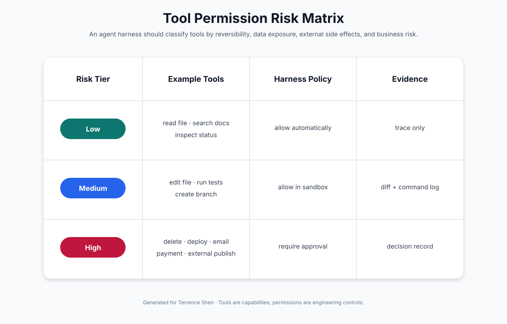
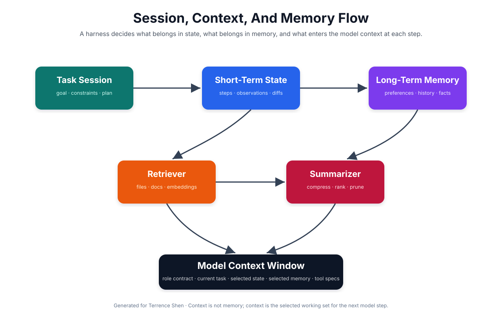
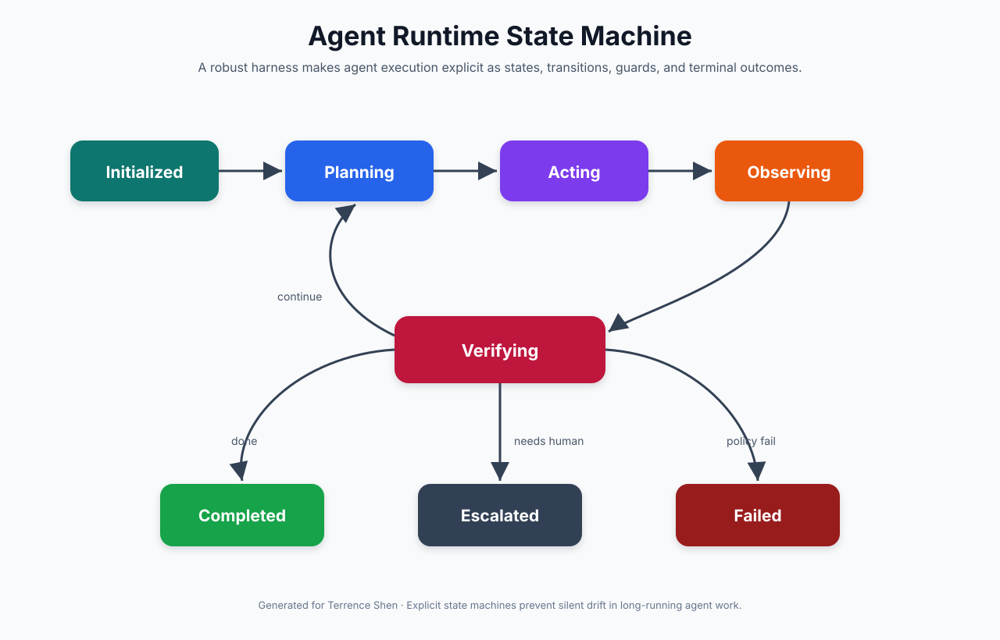

# 🛠️ 第四课：Agent Harness Runtime Design：工具、权限、沙箱、Session、Memory 与 Context Builder

> 第三课完成了概念纠偏：AI Agent 语境中的 Harness Engineering 不是传统测试 harness，而是围绕 agent 建立运行时外骨骼。本课进一步进入设计细节：一个 agent harness 到底要怎样管理工具、权限、沙箱、session、memory 和 context builder。



## 🧷 目录

- [🧭 核心观点：Agent 的能力来自模型，可靠性来自 Harness](#-核心观点agent-的能力来自模型可靠性来自-harness)
- [🧰 Tool Registry：把能力显式注册，而不是隐式暴露](#-tool-registry把能力显式注册而不是隐式暴露)
- [🔐 Permission Model：工具不是能不能用，而是在什么条件下用](#-permission-model工具不是能不能用而是在什么条件下用)
- [📦 Sandbox：副作用必须被隔离](#-sandbox副作用必须被隔离)
- [🧠 Session、Memory 与 Context 的区别](#-sessionmemory-与-context-的区别)
- [🧵 Context Builder：每一步都要重新选择模型该看什么](#-context-builder每一步都要重新选择模型该看什么)
- [🔁 Runtime State Machine：长任务必须显式状态化](#-runtime-state-machine长任务必须显式状态化)
- [🧪 Python 骨架：一个可扩展的 Agent Runtime](#-python-骨架一个可扩展的-agent-runtime)
- [🏁 结论：Runtime Design 是 Agent Harness 的主体工程](#-结论runtime-design-是-agent-harness-的主体工程)

## 🧭 核心观点：Agent 的能力来自模型，可靠性来自 Harness

基础模型提供语言理解、推理、规划和工具调用意图。但一个能在真实工程环境中工作的 agent 不能只依赖模型本身。只要 agent 能读文件、改代码、调用 API、运行命令、发邮件、创建 issue、更新 repo 或部署服务，它就进入了有副作用的世界。

在这个世界里，可靠性不是靠一句 prompt 维持的。可靠性来自 harness 对运行时的持续约束：工具必须被注册，权限必须被分级，副作用必须被隔离，状态必须被记录，上下文必须被选择，失败必须被恢复，高风险动作必须升级给人类。

这意味着 Agent Harness Runtime Design 的核心任务是：

| 设计对象 | 要解决的问题 |
|---|---|
| Tool Registry | agent 到底拥有哪些行动能力 |
| Permission Model | 哪些动作可自动执行，哪些必须确认 |
| Sandbox | 工具调用产生的副作用在哪里发生 |
| Session State | 长任务如何保持连续、可恢复和可审计 |
| Memory | 哪些信息需要跨任务保留 |
| Context Builder | 下一步模型调用应该看见什么 |
| State Machine | agent 执行过程如何进入完成、失败、重试或升级 |
| Trace And Artifacts | 事后如何解释 agent 做了什么 |

## 🧰 Tool Registry：把能力显式注册，而不是隐式暴露

工具是 agent 与外部世界交互的接口。工具不应该只是任意函数集合，而应该是一个具有名称、描述、输入 schema、风险等级、幂等性、超时、权限要求和审计策略的注册表。

```python
from __future__ import annotations

from dataclasses import dataclass
from enum import Enum
from typing import Any, Callable


class RiskTier(str, Enum):
    LOW = "low"
    MEDIUM = "medium"
    HIGH = "high"


@dataclass(frozen=True)
class ToolSpec:
    name: str
    description: str
    input_schema: dict[str, Any]
    risk_tier: RiskTier
    idempotent: bool
    timeout_seconds: int
    requires_approval: bool


@dataclass(frozen=True)
class ToolResult:
    ok: bool
    content: dict[str, Any]
    error: str | None = None


ToolHandler = Callable[[dict[str, Any]], ToolResult]


class ToolRegistry:
    def __init__(self) -> None:
        self._specs: dict[str, ToolSpec] = {}
        self._handlers: dict[str, ToolHandler] = {}

    def register(self, spec: ToolSpec, handler: ToolHandler) -> None:
        if spec.name in self._specs:
            raise ValueError(f"tool already registered: {spec.name}")
        self._specs[spec.name] = spec
        self._handlers[spec.name] = handler

    def spec(self, name: str) -> ToolSpec:
        return self._specs[name]

    def list_specs(self) -> list[ToolSpec]:
        return list(self._specs.values())

    def run(self, name: str, arguments: dict[str, Any]) -> ToolResult:
        if name not in self._handlers:
            return ToolResult(ok=False, content={}, error=f"unknown tool: {name}")
        return self._handlers[name](arguments)
```

这种注册表让 harness 可以在模型调用前暴露工具 schema，在工具调用时进行权限检查，在执行后记录结果。工具从“函数”变成了“受治理的能力”。

## 🔐 Permission Model：工具不是能不能用，而是在什么条件下用

agent 的工具权限不应该是二元开关。真实系统更适合使用风险分级。

| 风险等级 | 示例工具 | 默认策略 |
|---|---|---|
| Low | 读取文件、搜索文档、查询状态 | 自动允许，记录 trace |
| Medium | 修改工作区文件、运行测试、创建分支 | 沙箱内允许，记录 diff 和命令日志 |
| High | 删除文件、发送邮件、发生产请求、部署、发布文章 | 必须人工确认或需要显式授权 |

权限策略可以实现为代码。

```python
from dataclasses import dataclass


@dataclass(frozen=True)
class ToolCall:
    name: str
    arguments: dict


@dataclass(frozen=True)
class PermissionDecision:
    allowed: bool
    requires_approval: bool
    reason: str


class PermissionPolicy:
    def decide(self, tool_spec: ToolSpec, tool_call: ToolCall) -> PermissionDecision:
        if tool_spec.risk_tier == RiskTier.LOW:
            return PermissionDecision(True, False, "low-risk tool")

        if tool_spec.risk_tier == RiskTier.MEDIUM:
            return PermissionDecision(True, False, "medium-risk tool allowed in sandbox")

        if tool_spec.risk_tier == RiskTier.HIGH:
            return PermissionDecision(False, True, "high-risk tool requires human approval")

        return PermissionDecision(False, False, "unknown risk tier")
```

关键是：权限模型应当位于 harness，而不是只靠模型自觉。prompt 可以告诉模型不要做危险动作，但 runtime policy 才能真正阻断危险动作。

## 📦 Sandbox：副作用必须被隔离

agent 的工具调用一旦会改变外部环境，就需要 sandbox。sandbox 的形式取决于任务类型。

| 场景 | 推荐 Sandbox |
|---|---|
| 代码修改 | git branch、worktree、container、临时 workspace |
| 浏览器自动化 | 独立 browser profile、受限下载目录 |
| API 调用 | staging endpoint、mock server、rate limit |
| 文件处理 | 临时目录、只允许写指定目录 |
| 数据库操作 | read-only replica、transaction rollback、sandbox tenant |
| 发布动作 | dry run、preview environment、人工确认 |

一个简单 filesystem sandbox 可以这样表达。

```python
from pathlib import Path


class WorkspaceSandbox:
    def __init__(self, root: Path) -> None:
        self.root = root.resolve()

    def resolve_write_path(self, relative_path: str) -> Path:
        target = (self.root / relative_path).resolve()
        if not str(target).startswith(str(self.root)):
            raise PermissionError(f"write path escapes sandbox: {relative_path}")
        return target

    def write_text(self, relative_path: str, content: str) -> None:
        target = self.resolve_write_path(relative_path)
        target.parent.mkdir(parents=True, exist_ok=True)
        target.write_text(content, encoding="utf-8")
```

这个例子很小，但原则重要：工具不应直接拿到无限制文件系统权限。所有写操作都应经过 harness 的边界检查。

## 🧠 Session、Memory 与 Context 的区别

在 agent 系统中，session、memory 和 context 经常被混用，但它们在 harness 设计中应当区分。



| 概念 | 定义 | 生命周期 | 例子 |
|---|---|---|---|
| Session | 当前任务的完整运行状态 | 单个任务内 | goal、plan、steps、observations、diffs |
| Short-Term State | 当前 session 最近步骤的工作状态 | 单个任务内，持续更新 | 最近工具结果、当前错误、待办项 |
| Long-Term Memory | 跨任务保留的信息 | 多任务长期存在 | 用户偏好、项目规则、历史决策 |
| Context | 下一次模型调用实际看到的信息 | 每个 step 临时生成 | 选中的 session state、memory、文件、工具 schema |

因此，context 不是 memory。context 是每一步从 session、memory、retrieval、tool specs 和 user instruction 中选择出来的工作集。Harness Engineering 的关键任务之一，就是决定每一步选什么进入 context。

## 🧵 Context Builder：每一步都要重新选择模型该看什么

Context Builder 是 agent harness 的中枢组件之一。它不只是拼接字符串，而是基于任务状态、工具结果、预算和风险，构造下一次模型调用的输入。

```python
from dataclasses import dataclass
from typing import Any


@dataclass
class ContextBundle:
    system_contract: str
    task_goal: str
    constraints: list[str]
    recent_observations: list[dict[str, Any]]
    selected_memory: list[str]
    tool_specs: list[dict[str, Any]]
    budget: dict[str, Any]


class ContextBuilder:
    def __init__(self, system_contract: str) -> None:
        self.system_contract = system_contract

    def build(
        self,
        session: "AgentSession",
        registry: ToolRegistry,
        selected_memory: list[str],
    ) -> ContextBundle:
        return ContextBundle(
            system_contract=self.system_contract,
            task_goal=session.goal,
            constraints=session.constraints,
            recent_observations=session.observations[-8:],
            selected_memory=selected_memory[-6:],
            tool_specs=[self._tool_to_schema(spec) for spec in registry.list_specs()],
            budget={
                "max_steps": session.max_steps,
                "current_step": session.step,
                "remaining_steps": session.max_steps - session.step,
            },
        )

    def _tool_to_schema(self, spec: ToolSpec) -> dict[str, Any]:
        return {
            "name": spec.name,
            "description": spec.description,
            "input_schema": spec.input_schema,
            "risk_tier": spec.risk_tier.value,
        }
```

设计 Context Builder 时，最重要的问题不是“如何塞入更多信息”，而是“如何让模型看到当前决策所需的最小充分信息”。上下文过少会导致模型失明，上下文过多会导致噪声、成本上升和目标漂移。

## 🔁 Runtime State Machine：长任务必须显式状态化

长任务 agent 不能只是 while loop。它应当有明确状态：initialized、planning、acting、observing、verifying、completed、failed、escalated。



状态机的价值在于让 harness 可以在每个阶段施加不同策略。例如 planning 阶段不允许执行写操作；acting 阶段必须检查权限；observing 阶段必须记录 artifact；verifying 阶段决定继续、完成、失败或升级。

```python
from enum import Enum


class RuntimeState(str, Enum):
    INITIALIZED = "initialized"
    PLANNING = "planning"
    ACTING = "acting"
    OBSERVING = "observing"
    VERIFYING = "verifying"
    COMPLETED = "completed"
    FAILED = "failed"
    ESCALATED = "escalated"
```

状态机不是为了形式，而是为了防止长任务在隐式循环中漂移。显式状态可以帮助日志、调试、恢复和审计。

## 🧪 Python 骨架：一个可扩展的 Agent Runtime

下面给出一个更接近真实 harness 的骨架。它仍然是教学版，但已经包含 tool registry、permission policy、context builder、session state 和 runtime state。

```python
from __future__ import annotations

from dataclasses import dataclass, field
from typing import Any, Protocol


@dataclass
class AgentSession:
    id: str
    goal: str
    constraints: list[str]
    max_steps: int
    step: int = 0
    state: RuntimeState = RuntimeState.INITIALIZED
    observations: list[dict[str, Any]] = field(default_factory=list)
    final_answer: str | None = None


@dataclass(frozen=True)
class ModelOutput:
    message: str
    tool_call: ToolCall | None = None
    final_answer: str | None = None


class AgentModel(Protocol):
    def next(self, context: ContextBundle) -> ModelOutput:
        ...


class AgentRuntime:
    def __init__(
        self,
        model: AgentModel,
        registry: ToolRegistry,
        permission_policy: PermissionPolicy,
        context_builder: ContextBuilder,
    ) -> None:
        self.model = model
        self.registry = registry
        self.permission_policy = permission_policy
        self.context_builder = context_builder

    def run(self, session: AgentSession, memory: list[str]) -> AgentSession:
        session.state = RuntimeState.PLANNING

        while session.step < session.max_steps:
            context = self.context_builder.build(session, self.registry, memory)
            output = self.model.next(context)

            if output.final_answer:
                session.final_answer = output.final_answer
                session.state = RuntimeState.COMPLETED
                return session

            if output.tool_call is None:
                session.observations.append({
                    "type": "model_message",
                    "content": output.message,
                })
                session.step += 1
                continue

            session.state = RuntimeState.ACTING
            observation = self._act(session, output.tool_call)
            session.state = RuntimeState.OBSERVING
            session.observations.append(observation)
            session.state = RuntimeState.VERIFYING

            if observation.get("type") == "approval_required":
                session.state = RuntimeState.ESCALATED
                return session

            if observation.get("type") == "tool_error":
                session.state = RuntimeState.FAILED
                return session

            session.step += 1
            session.state = RuntimeState.PLANNING

        session.state = RuntimeState.FAILED
        session.observations.append({
            "type": "budget_exhausted",
            "reason": "max_steps reached",
        })
        return session

    def _act(self, session: AgentSession, tool_call: ToolCall) -> dict[str, Any]:
        try:
            spec = self.registry.spec(tool_call.name)
        except KeyError:
            return {
                "type": "tool_error",
                "tool": tool_call.name,
                "error": "unknown tool",
            }

        decision = self.permission_policy.decide(spec, tool_call)
        if decision.requires_approval:
            return {
                "type": "approval_required",
                "tool": tool_call.name,
                "reason": decision.reason,
            }
        if not decision.allowed:
            return {
                "type": "tool_denied",
                "tool": tool_call.name,
                "reason": decision.reason,
            }

        result = self.registry.run(tool_call.name, tool_call.arguments)
        if not result.ok:
            return {
                "type": "tool_error",
                "tool": tool_call.name,
                "error": result.error,
            }
        return {
            "type": "tool_result",
            "tool": tool_call.name,
            "content": result.content,
        }
```

这个骨架已经可以扩展出真实 agent framework。下一步可以增加 artifact store、trace id、cost budget、model call logging、retry policy、sandbox manager 和 evaluation gate。

## 📊 运行时设计检查表

设计 agent harness runtime 时，可以使用以下检查表。

| 检查项 | 问题 |
|---|---|
| 工具边界 | 每个工具是否有 schema、描述、风险等级和超时 |
| 权限边界 | 高风险工具是否必须人工确认 |
| 沙箱边界 | 文件、网络、浏览器、数据库副作用是否隔离 |
| 状态边界 | 长任务是否有明确 session state 和状态机 |
| 上下文边界 | 每一步 context 是否由 builder 显式构造 |
| 记忆边界 | 长期 memory 是否经过筛选，而不是全部注入 |
| 预算边界 | 是否限制 step、token、时间和成本 |
| 观测边界 | 每次工具调用是否记录参数、结果和错误 |
| 升级边界 | 不确定、高风险、权限不足时是否能升级给人类 |

这个检查表比单纯调 prompt 更接近 agent 工程的真实工作。

## 🏁 结论：Runtime Design 是 Agent Harness 的主体工程

Agent Harness Engineering 的核心不是寻找完美 prompt，而是设计 agent 的运行时世界。这个世界包括工具、权限、沙箱、session、memory、context builder、状态机、预算、观测和人工升级。

模型提供能力，但 harness 决定能力如何被使用。没有 harness，agent 容易变成一个能说会道但行为不可控的系统；有了 harness，模型能力才有机会转化为可审计、可恢复、可持续改进的工程行为。

因此，从第四课开始，学习重点应当转向运行时设计。谁能设计更好的 agent runtime，谁就更接近真正的 Agent Harness Engineering。

## 📚 参考资料

- [OpenAI: Harness engineering](https://openai.com/index/harness-engineering/)
- [Anthropic: Building effective agents](https://www.anthropic.com/engineering/building-effective-agents)
- [Anthropic Claude Code Docs: How Claude Code works](https://code.claude.com/docs/en/how-claude-code-works)

## 📬 联系方式

Terrence Shen  
Email: slamshenxin@gmail.com  
Located in China
