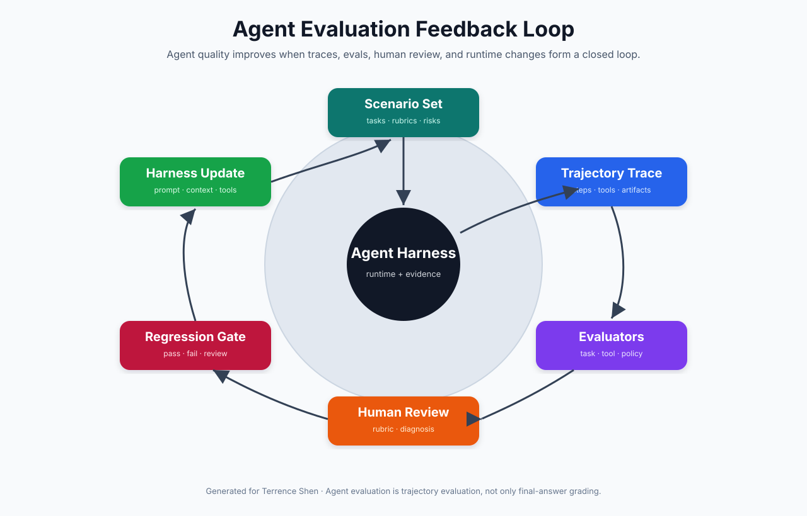
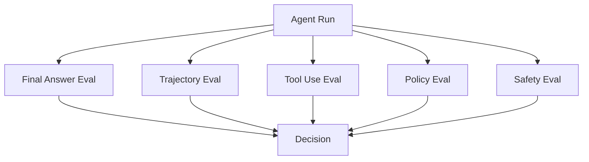
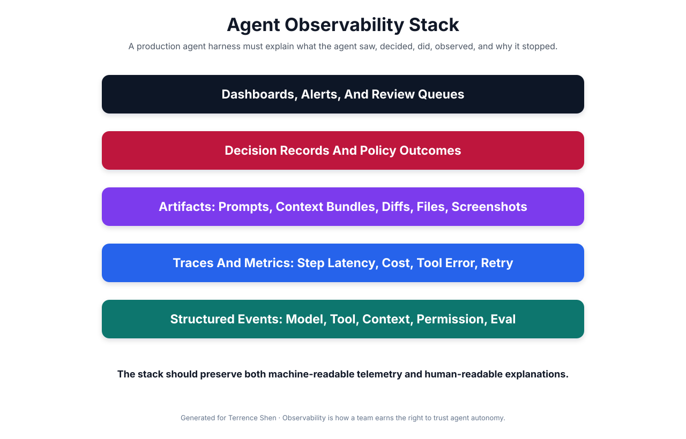
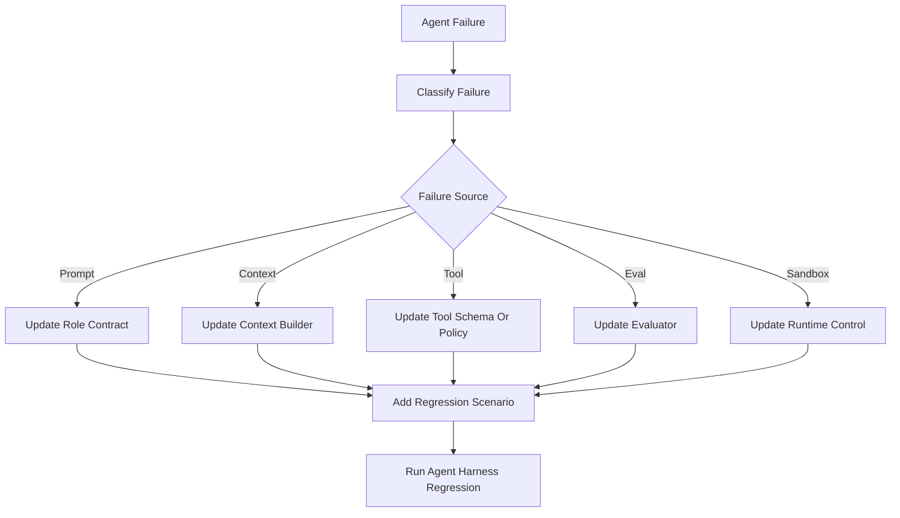
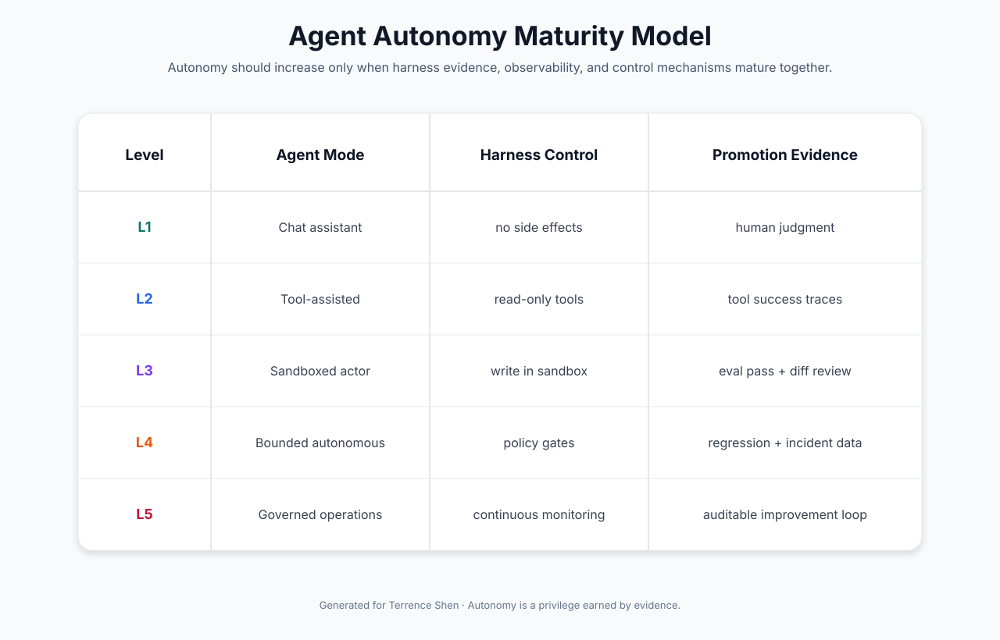

# 📈 第五课：Agent Harness 的验证闭环：Eval、Trajectory、Observability、Human Gate 与自治成熟度

> 第四课讨论了 agent harness 的运行时结构。本课进入可靠性与运维层：一个 agent 运行起来之后，如何知道它做得对、为什么做错、是否可以升级自治权限、何时需要人类介入，以及如何把失败沉淀为下一轮 harness 改进。



## 🧷 目录

- [🧭 核心观点：Agent Evaluation 是轨迹评估，不只是答案评估](#-核心观点agent-evaluation-是轨迹评估不只是答案评估)
- [🧪 Eval 类型：任务、轨迹、工具、策略与安全](#-eval-类型任务轨迹工具策略与安全)
- [🧾 Trajectory Trace：Agent 行为必须可重放、可解释](#-trajectory-traceagent-行为必须可重放可解释)
- [📡 Observability Stack：观察 agent 看见、决定、执行与停止的全过程](#-observability-stack观察-agent-看见决定执行与停止的全过程)
- [🚦 Human Gate：人类不是兜底按钮，而是风险控制层](#-human-gate人类不是兜底按钮而是风险控制层)
- [🔁 Feedback Loop：把错误转化为 Harness 更新](#-feedback-loop把错误转化为-harness-更新)
- [🧬 自治成熟度：Autonomy 必须由证据逐步换取](#-自治成熟度autonomy-必须由证据逐步换取)
- [🧰 代码例子：Trajectory Evaluator 与 Human Gate](#-代码例子trajectory-evaluator-与-human-gate)
- [🏁 结论：AgentOps 的核心是证据约束下的自治增长](#-结论agentops-的核心是证据约束下的自治增长)

## 🧭 核心观点：Agent Evaluation 是轨迹评估，不只是答案评估

传统 LLM 评估经常关注最终答案：答案是否正确、格式是否符合要求、是否违反安全策略。对于普通问答，这种方式可以提供一定信号。但 agent 的质量不能只看最终答案，因为 agent 会经历多个步骤，调用多个工具，产生外部副作用，并在执行过程中暴露风险。

一个 agent 可能最终给出正确答案，但过程错误：它可能读取了不该读取的文件，调用了不必要的高风险工具，泄露了敏感上下文，重复执行了昂贵调用，或者在没有证据的情况下声称任务完成。相反，一个 agent 最终失败，也可能提供有价值的轨迹证据：它正确识别了权限不足、主动升级给人类、保留了完整 artifact，并避免了危险副作用。

因此，Agent Evaluation 应当评估完整 trajectory。

| 评估对象 | 问题 |
|---|---|
| Final Answer | 最终输出是否满足任务目标 |
| Plan | 计划是否合理，是否分解正确 |
| Context Use | 是否读取了相关而非无关上下文 |
| Tool Use | 工具选择是否必要、正确、低风险 |
| Permission Behavior | 是否遵守权限与确认策略 |
| Observation Handling | 是否正确解释工具结果和错误 |
| Recovery | 失败后是否重试、换路或升级 |
| Cost And Latency | 是否在预算内完成 |
| Safety | 是否避免泄露、破坏和越权 |
| Evidence | 是否留下足够复查材料 |

这就是为什么前两课的 evaluation harness 可以成为 agent harness 的一层，但必须扩展为 trajectory-aware evaluation。

## 🧪 Eval 类型：任务、轨迹、工具、策略与安全

Agent Harness 的 eval 不应只有一种。至少可以分为五类。

| Eval 类型 | 评估内容 | 示例指标 |
|---|---|---|
| Task Eval | 是否完成用户任务 | task_success、rubric_score |
| Trajectory Eval | 执行路径是否合理 | unnecessary_tool_calls、loop_count、recovery_quality |
| Tool Eval | 工具调用是否正确 | tool_success_rate、invalid_arguments、tool_error_rate |
| Policy Eval | 是否遵守权限和预算 | denied_tool_attempts、approval_required_count、budget_exceeded |
| Safety Eval | 是否泄露或执行危险动作 | secret_exposure、unsafe_side_effect、policy_violation |

一个成熟 harness 会把这些 eval 组合起来，而不是依赖单一 pass/fail。



在生产环境中，这些 eval 可以分层运行。快速 eval 在每次 run 后立即执行；高成本 eval 可以进入异步队列；人工 review 可以只覆盖高风险、低置信或回归失败样本。

## 🧾 Trajectory Trace：Agent 行为必须可重放、可解释

Trajectory trace 是 agent harness 的核心证据。它记录 agent 在每一步看到什么、决定什么、调用什么工具、获得什么观察、触发什么策略、为什么继续或停止。

一个基础 trace event 可以这样定义。

```python
from __future__ import annotations

from dataclasses import dataclass, field
from typing import Any


@dataclass(frozen=True)
class TraceEvent:
    run_id: str
    step: int
    event_type: str
    timestamp_ms: int
    payload: dict[str, Any] = field(default_factory=dict)


@dataclass
class TrajectoryTrace:
    run_id: str
    events: list[TraceEvent] = field(default_factory=list)

    def append(self, event: TraceEvent) -> None:
        self.events.append(event)

    def by_type(self, event_type: str) -> list[TraceEvent]:
        return [event for event in self.events if event.event_type == event_type]
```

常见事件类型包括：

| Event Type | 内容 |
|---|---|
| `task_started` | 用户目标、约束、session id |
| `context_built` | 上下文来源、token 估计、memory 选择 |
| `model_called` | 模型、参数、step、预算 |
| `model_decision` | 消息、工具调用意图、置信信息 |
| `permission_checked` | 工具风险等级、允许/拒绝/需确认 |
| `tool_started` | 工具名、参数摘要、timeout |
| `tool_finished` | 工具结果、耗时、artifact |
| `eval_finished` | 指标、原因、判定 |
| `human_gate_triggered` | 升级原因、所需确认 |
| `task_finished` | 最终状态、总结、artifact 目录 |

这类事件让团队可以复查 agent 的完整行为。没有 trace 的 agent 很难进入生产，因为无法解释失败，也无法证明成功是可靠的。

## 📡 Observability Stack：观察 agent 看见、决定、执行与停止的全过程

Agent observability 不是普通服务监控的简单复制。普通服务通常关注请求量、错误率、延迟和资源使用。Agent 还需要关注模型行为、工具行为、上下文行为和策略行为。



推荐观察指标包括：

| 指标 | 说明 |
|---|---|
| task_success_rate | 任务成功率 |
| avg_steps_per_task | 平均完成步数 |
| loop_detected_rate | 循环或重复行为比例 |
| tool_success_rate | 工具调用成功比例 |
| tool_error_rate | 工具错误比例 |
| permission_denied_count | 被策略拒绝的工具调用数 |
| approval_required_count | 需要人工确认次数 |
| context_token_count | 每步上下文 token 大小 |
| context_relevance_score | 上下文相关性评分 |
| cost_per_task | 单任务成本 |
| p95_task_duration | 任务耗时尾部指标 |
| unsafe_event_count | 安全策略违规或接近违规事件 |

结构化事件可以写入 JSONL。

```python
import json
import time
from pathlib import Path
from typing import Any


class JsonlTraceWriter:
    def __init__(self, path: Path) -> None:
        self.path = path
        self.path.parent.mkdir(parents=True, exist_ok=True)

    def emit(self, run_id: str, step: int, event_type: str, payload: dict[str, Any]) -> None:
        record = {
            "run_id": run_id,
            "step": step,
            "event_type": event_type,
            "timestamp_ms": int(time.time() * 1000),
            "payload": payload,
        }
        with self.path.open("a", encoding="utf-8") as handle:
            handle.write(json.dumps(record, ensure_ascii=False) + "\n")
```

JSONL 的好处是简单、可追加、可被日志系统采集，也可以离线分析。生产环境可以进一步接入 OpenTelemetry、Prometheus、ClickHouse、ElasticSearch 或专门的 agent observability 平台。

## 🚦 Human Gate：人类不是兜底按钮，而是风险控制层

Human Gate 不应只是“模型不确定就问人”。它应当是 harness 的显式策略层，用于处理高风险动作、权限不足、低置信输出、预算异常、安全敏感和目标不明确。

常见触发条件：

| 触发条件 | 示例 |
|---|---|
| 高风险工具 | 删除文件、发邮件、部署、发布文章 |
| 外部副作用 | 影响真实用户、真实资金、真实生产环境 |
| 权限不足 | agent 想访问未授权系统 |
| 低置信 | evaluator 给出低分或多项不确定 |
| 目标冲突 | 用户要求与系统策略或安全规则冲突 |
| 预算异常 | 任务步数、时间、成本异常增长 |
| 安全风险 | 可能泄露 secret、PII 或内部策略 |

Human Gate 的输出也应结构化。

```python
from dataclasses import dataclass


@dataclass(frozen=True)
class HumanGateRequest:
    run_id: str
    step: int
    reason: str
    proposed_action: str
    risk_tier: str
    evidence_path: str


@dataclass(frozen=True)
class HumanGateDecision:
    approved: bool
    reviewer: str
    comment: str
```

一个简单判断函数如下。

```python
def should_trigger_human_gate(
    risk_tier: str,
    eval_score: float,
    budget_remaining_steps: int,
    unsafe_event_count: int,
) -> bool:
    if risk_tier == "high":
        return True
    if eval_score < 0.75:
        return True
    if budget_remaining_steps <= 0:
        return True
    if unsafe_event_count > 0:
        return True
    return False
```

Human Gate 的价值在于限制自治边界。一个好的 agent harness 并不是永远不问人，而是在正确时刻问正确问题，并提供足够证据让人快速决策。

## 🔁 Feedback Loop：把错误转化为 Harness 更新

Agent 的失败不应只是一次失败记录。每次失败都应被分类，并转化为 harness 的某种改进。

| 失败类型 | 可能修复对象 |
|---|---|
| 指令误解 | role contract、system prompt、task template |
| 上下文缺失 | context builder、retriever、memory selection |
| 工具误用 | tool description、schema、permission policy |
| 权限越界 | risk tier、approval policy、sandbox rule |
| 循环行为 | step budget、loop detector、planner constraint |
| 结果幻觉 | evaluator、evidence requirement、final answer contract |
| 安全风险 | safety policy、redaction、secret scanner |
| 成本过高 | model routing、context compression、tool caching |

这个闭环可以表示为：



核心原则是：每次重要失败都应留下一个新 scenario 或新 eval。否则团队会反复遇到相同失败。

## 🧬 自治成熟度：Autonomy 必须由证据逐步换取

agent autonomy 不应一次性打开。自治权限应当随着 harness 能力成熟逐步提升。



| 等级 | Agent 模式 | 控制机制 | 晋级证据 |
|---|---|---|---|
| L1 | Chat Assistant | 无副作用，仅建议 | 人类判断可用 |
| L2 | Tool-Assisted Agent | 只读工具，记录 trace | 工具成功率稳定 |
| L3 | Sandboxed Actor | 可在沙箱内写入和执行 | eval pass、diff review、无高风险违规 |
| L4 | Bounded Autonomous Agent | 策略门禁与人工确认 | 回归稳定、失败可解释、成本可控 |
| L5 | Governed Agent Operations | 持续监控、自动反馈、审计闭环 | 生产证据、事故回流、持续改进 |

这个模型强调：自治是证据换来的权限，而不是产品宣传口号。没有观测、eval、artifact 和 human gate 的 agent，不应获得高自治权限。

## 🧰 代码例子：Trajectory Evaluator 与 Human Gate

下面给出一个简单 trajectory evaluator。它检查工具错误、重复工具调用、高风险拒绝和是否完成任务。

```python
from dataclasses import dataclass
from collections import Counter


@dataclass(frozen=True)
class TrajectoryEvaluation:
    passed: bool
    score: float
    metrics: dict[str, float]
    reasons: list[str]


class TrajectoryEvaluator:
    def evaluate(self, trace: TrajectoryTrace) -> TrajectoryEvaluation:
        reasons: list[str] = []
        tool_events = trace.by_type("tool_finished")
        denied_events = trace.by_type("permission_denied")
        finished_events = trace.by_type("task_finished")

        tool_error_count = sum(
            1 for event in tool_events
            if event.payload.get("ok") is False
        )
        tool_names = [
            event.payload.get("tool")
            for event in tool_events
            if event.payload.get("tool")
        ]
        repeated_tool_count = sum(
            count - 1 for count in Counter(tool_names).values()
            if count > 1
        )
        completed = any(
            event.payload.get("status") == "completed"
            for event in finished_events
        )

        if tool_error_count > 0:
            reasons.append(f"tool_error_count={tool_error_count}")
        if repeated_tool_count > 3:
            reasons.append(f"repeated_tool_count={repeated_tool_count}")
        if denied_events:
            reasons.append(f"permission_denied_count={len(denied_events)}")
        if not completed:
            reasons.append("task did not complete")

        score = 1.0
        score -= min(tool_error_count * 0.15, 0.45)
        score -= min(repeated_tool_count * 0.05, 0.25)
        score -= min(len(denied_events) * 0.2, 0.4)
        if not completed:
            score -= 0.4
        score = max(score, 0.0)

        return TrajectoryEvaluation(
            passed=score >= 0.8 and not reasons,
            score=score,
            metrics={
                "tool_error_count": float(tool_error_count),
                "repeated_tool_count": float(repeated_tool_count),
                "permission_denied_count": float(len(denied_events)),
                "completed": 1.0 if completed else 0.0,
            },
            reasons=reasons,
        )
```

Human Gate 可以消费 evaluator 输出。

```python
class HumanGatePolicy:
    def decide(
        self,
        run_id: str,
        step: int,
        eval_result: TrajectoryEvaluation,
        current_risk_tier: str,
        evidence_path: str,
    ) -> HumanGateRequest | None:
        if current_risk_tier == "high":
            return HumanGateRequest(
                run_id=run_id,
                step=step,
                reason="high-risk action requested",
                proposed_action="review tool call before execution",
                risk_tier=current_risk_tier,
                evidence_path=evidence_path,
            )

        if eval_result.score < 0.75:
            return HumanGateRequest(
                run_id=run_id,
                step=step,
                reason=f"low trajectory score: {eval_result.score:.2f}",
                proposed_action="review trace and decide whether to continue",
                risk_tier=current_risk_tier,
                evidence_path=evidence_path,
            )

        return None
```

这种设计让 agent 的自治不是黑箱行为，而是受到 evaluator 和 human gate 的双重约束。

## 🔁 CI/CD 中的 Agent Regression

如果 agent 用于工程任务，例如修改代码、维护 repo、处理 issue 或生成文章，它也应当有 regression suite。

```yaml
name: agent-harness-regression

on:
  pull_request:
    branches:
      - main

jobs:
  agent-regression:
    runs-on: ubuntu-latest
    timeout-minutes: 30

    steps:
      - uses: actions/checkout@v4

      - uses: actions/setup-python@v5
        with:
          python-version: '3.11'

      - name: Install dependencies
        run: |
          python -m pip install --upgrade pip
          pip install -e '.[dev]'

      - name: Run agent regression scenarios
        run: |
          python -m agent_harness.eval \
            --scenario-dir scenarios/agent-regression \
            --artifact-dir artifacts/agent-regression \
            --policy policies/agent-release.yml

      - name: Upload trajectory artifacts
        uses: actions/upload-artifact@v4
        if: always()
        with:
          name: agent-trajectory-artifacts
          path: artifacts/agent-regression
```

这里的 regression 不一定要真实调用生产工具。许多场景可以使用 mock tools、fake filesystem、recorded observations 和 deterministic model stubs。目标是评估 harness 策略、工具 schema、上下文选择和高风险路径，而不是每次都消耗真实外部资源。

## 📊 文章仓库 Agent 的验证示例

以当前技术文章仓库为例，可以定义以下 agent eval：

| Eval | 检查内容 |
|---|---|
| Article Structure Eval | 是否有 front matter、目录、主标题、结论、联系方式 |
| Visual Asset Eval | 是否至少引用多张图表，图表路径是否存在 |
| Code Example Eval | 是否包含可读代码块，语言标记是否正确 |
| Topic Alignment Eval | 是否紧扣 AI Agent Harness Engineering，而不是传统测试 harness |
| Transition Eval | 第三课是否自然承认并连接前两课 |
| README Index Eval | 新文章是否出现在 README 索引中 |
| Safety Eval | 是否避免账号密码、secret、真实敏感数据 |

这说明 eval 不只是模型基准测试。它可以非常贴近具体工作流，用于保证 agent 持续维护一个 repo 时不会偏题、漏图、漏联系方式或破坏结构。

## 🏁 结论：AgentOps 的核心是证据约束下的自治增长

Agent Harness Engineering 最终会走向 AgentOps：让 agent 在真实工作流中持续执行、被观察、被评估、被约束、被改进。其核心不是盲目提高自治程度，而是在证据约束下逐步扩大自治边界。

一个 agent 能否被信任，不取决于它单次回答是否惊艳，而取决于它是否能在长期任务中留下完整轨迹、遵守权限、控制成本、正确使用上下文、失败时可解释、高风险时能升级给人类，并把失败沉淀为下一轮 harness 改进。

因此，Agent Harness 的验证闭环包括五个环节：运行 agent、记录 trajectory、执行 eval、触发 human gate、更新 harness。这个闭环使 agent 从“会执行任务的模型”逐步变成“可治理的工程系统”。

## 📚 参考资料

- [OpenAI: Harness engineering](https://openai.com/index/harness-engineering/)
- [Anthropic: Building effective agents](https://www.anthropic.com/engineering/building-effective-agents)
- [Anthropic Claude Code Docs: How Claude Code works](https://code.claude.com/docs/en/how-claude-code-works)

## 📬 联系方式

Terrence Shen  
Email: slamshenxin@gmail.com  
Located in China
