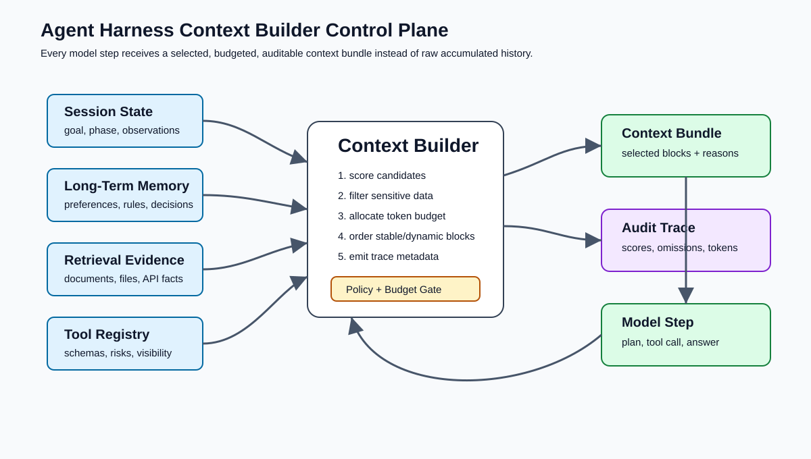
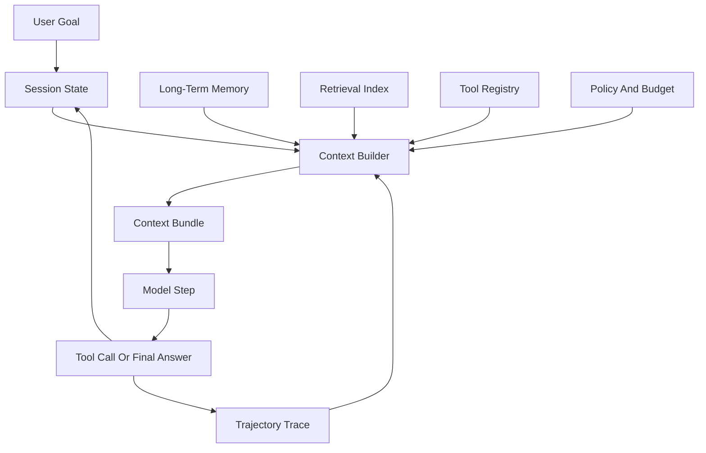
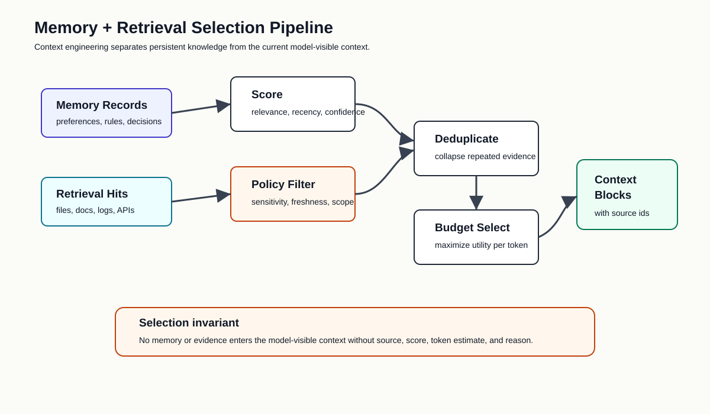
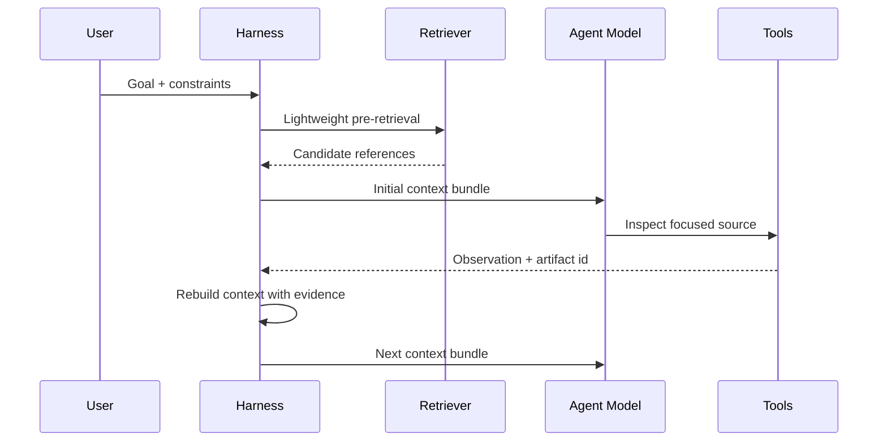
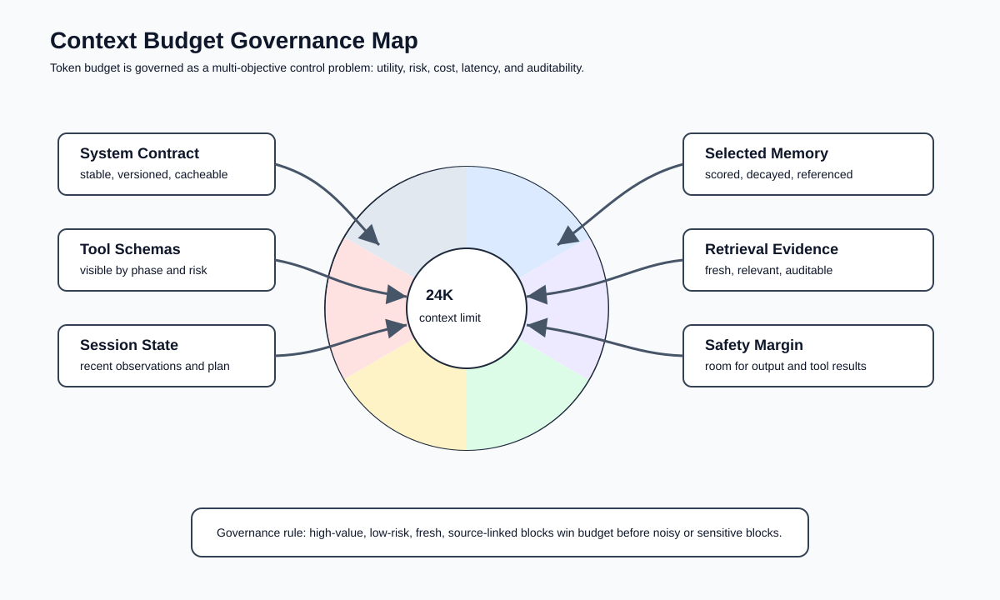
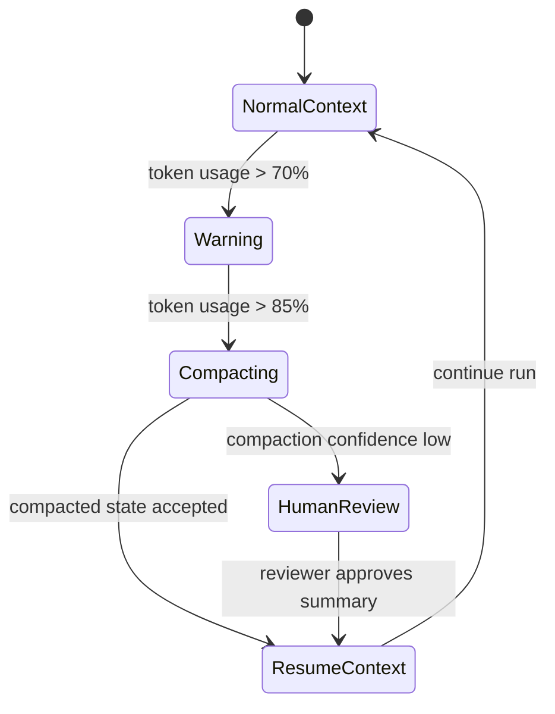
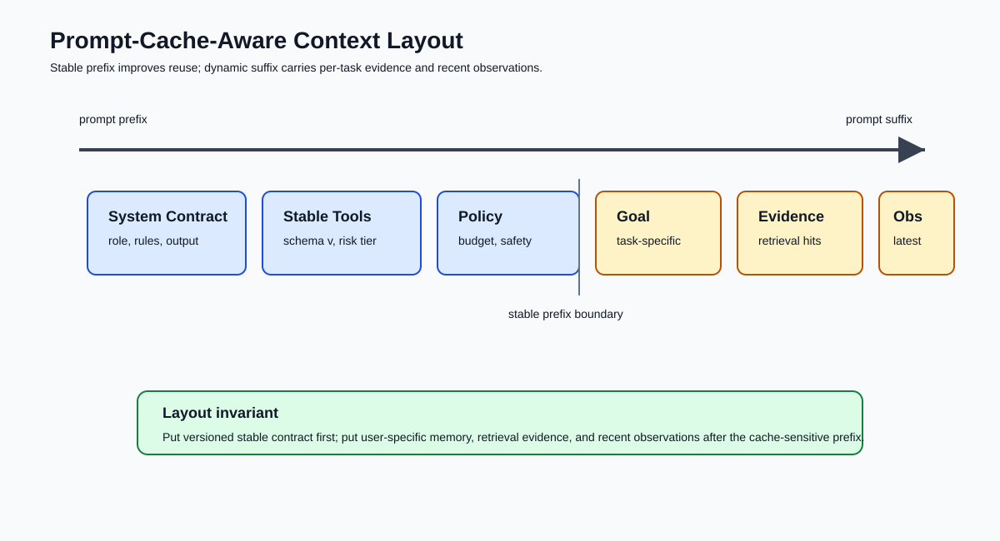

# 🧵 第六课：Context Engineering Inside Agent Harness：检索、记忆选择、压缩、预算与上下文治理

> 第四课建立了 agent harness 的运行时结构，第五课建立了 trajectory-aware 的验证闭环。本课进入一个更细的控制层：Context Engineering。对于工具型 agent，可靠性并不只取决于模型能力，也取决于每一步模型调用前，harness 选择让模型看见什么、隐藏什么、压缩什么、延后什么、记录什么。



## 🧷 目录

- [🧭 核心观点：Context 是运行时决策面，不是 Prompt 的长尾附录](#-核心观点context-是运行时决策面不是-prompt-的长尾附录)
- [🧱 Context Plane：Agent Harness 中的上下文控制平面](#-context-planeagent-harness-中的上下文控制平面)
- [🔎 Retrieval：从预检索转向 Just-In-Time 证据装载](#-retrieval从预检索转向-just-in-time-证据装载)
- [🧠 Memory Selection：长期记忆必须被筛选、衰减与引用](#-memory-selection长期记忆必须被筛选衰减与引用)
- [🪓 Compaction：压缩不是摘要，而是轨迹状态迁移](#-compaction压缩不是摘要而是轨迹状态迁移)
- [📦 Context Budget：把 Token、成本、延迟和风险一起治理](#-context-budget把-token成本延迟和风险一起治理)
- [⚡ Prompt-Cache-Aware Layout：上下文布局也是性能工程](#-prompt-cache-aware-layout上下文布局也是性能工程)
- [🧪 Context Evals：评估模型之前先评估上下文本身](#-context-evals评估模型之前先评估上下文本身)
- [🧰 Python 骨架：一个可审计的 Context Builder](#-python-骨架一个可审计的-context-builder)
- [🏁 结论：优秀 Agent Harness 的关键是持续选择最小充分上下文](#-结论优秀-agent-harness-的关键是持续选择最小充分上下文)

## 🧭 核心观点：Context 是运行时决策面，不是 Prompt 的长尾附录

在单轮问答系统中，prompt 往往被视为主要控制对象：系统指令、用户问题、少量示例和输出格式共同构成模型输入。Agent 系统则不同。Agent 在循环中工作，它会读取文件、调用工具、观察失败、修改计划、产生 artifact、请求权限、接受人类反馈，并在多轮运行中不断改变世界状态。此时，上下文不再是静态 prompt，而是每一步运行时决策前的控制面。

Anthropic 在关于 agent context engineering 的工程文章中将 context engineering 描述为从 prompt engineering 的自然演进：工程重点从写出正确指令，转向在每次推理时维护最可能产生目标行为的上下文状态。OpenAI 的 Agents 文档同样把 agent 构建描述为模型、工具、知识、guardrails、workflow 和 eval 的组合工程，而不是孤立模型调用。由此可见，agent harness 中的 context builder 应当是显式组件，而不是若干字符串拼接函数。

| 传统 Prompt Engineering | Agent Harness Context Engineering |
|---|---|
| 关注静态指令文本 | 关注每一步运行时可见状态 |
| 多数信息在调用前一次性写入 | 信息按任务进展动态选择 |
| 主要优化回答质量 | 同时优化行为、成本、权限、安全、可观测性 |
| 失败后人工改 prompt | 失败后更新检索、记忆、压缩、预算和 eval |
| 缺少可审计边界 | 每个 context bundle 都应有来源、权重和理由 |

因此，Context Engineering Inside Agent Harness 的核心命题是：**模型并不需要看见全部信息，模型需要看见当前决策所需的最小充分信息，并且 harness 必须能解释这种选择。**



## 🧱 Context Plane：Agent Harness 中的上下文控制平面

一个成熟的 agent harness 可以被分为若干平面：tool plane 负责能力暴露，permission plane 负责副作用治理，eval plane 负责验证，observability plane 负责记录，而 context plane 负责决定模型每一步的可见世界。



Context plane 至少包含六类输入。

| 输入类型 | 典型内容 | 风险 | Harness 处理策略 |
|---|---|---|---|
| System Contract | 角色、边界、输出契约、安全策略 | 过长会稀释任务信号 | 固定前缀、版本化、可缓存 |
| User Goal | 当前任务目标、用户约束、验收标准 | 模糊或冲突 | 结构化解析、冲突检测 |
| Session State | 当前计划、最近步骤、未解决问题、artifact 路径 | 轨迹膨胀 | 只保留最近窗口与关键状态 |
| Long-Term Memory | 用户偏好、项目规则、历史决策 | 过期、错误、隐私敏感 | 打分、衰减、引用来源 |
| Retrieval Evidence | 文件片段、文档段落、API 结果 | 低相关或噪声 | top-k、去重、证据分层 |
| Tool Schemas | 可用工具、参数、权限、风险等级 | 工具集膨胀 | 按任务阶段暴露最小工具集 |

Context builder 的输出也不应只是字符串。它应当是一个带有元数据的 bundle：每一段上下文都有来源、token 估算、选择原因、风险标签和可追踪 id。

```python
from __future__ import annotations

from dataclasses import dataclass, field
from enum import Enum
from typing import Any


class ContextSource(str, Enum):
    SYSTEM = "system"
    USER = "user"
    SESSION = "session"
    MEMORY = "memory"
    RETRIEVAL = "retrieval"
    TOOL = "tool"
    POLICY = "policy"


@dataclass(frozen=True)
class ContextBlock:
    id: str
    source: ContextSource
    text: str
    token_estimate: int
    relevance_score: float
    risk_tags: list[str] = field(default_factory=list)
    reason: str = ""


@dataclass(frozen=True)
class ContextBundle:
    run_id: str
    step: int
    blocks: list[ContextBlock]
    total_token_estimate: int
    budget_limit: int
    omitted_block_ids: list[str]
```

这种结构化设计带来三个直接收益。

| 收益 | 工程含义 |
|---|---|
| 可审计 | 事后能解释模型为什么看见某些信息 |
| 可评估 | eval 可以检查上下文是否相关、是否泄露、是否超预算 |
| 可优化 | 成本、延迟、缓存命中率和成功率可以被关联分析 |

## 🔎 Retrieval：从预检索转向 Just-In-Time 证据装载

许多早期 RAG 系统会在模型调用前一次性检索若干文档片段，并把它们放入 prompt。Agent 系统更适合混合策略：对于稳定、短小、强相关的信息可以预检索；对于大型、动态、结构复杂的信息，应当让 agent 通过工具在运行时逐步装载。



| 策略 | 适用场景 | 优点 | 代价 |
|---|---|---|---|
| Pre-Retrieval | FAQ、固定知识库、短任务 | 快速、实现简单 | 容易装入无关信息 |
| Just-In-Time Retrieval | 代码库、日志、长文档、数据库 | 上下文更聚焦 | 多轮工具调用增加延迟 |
| Hybrid Retrieval | 产品级 agent、工程任务、研究任务 | 兼顾启动速度和探索能力 | 需要 policy 控制何时探索 |
| Human-Curated Context | 高风险决策、法律、医疗、财务 | 人类责任边界清晰 | 扩展性较弱 |

一个 agent harness 的 retriever 不应只返回 text chunk，还应返回可复查证据。

```python
from dataclasses import dataclass


@dataclass(frozen=True)
class RetrievalHit:
    id: str
    source_uri: str
    title: str
    snippet: str
    score: float
    last_modified: str | None
    metadata: dict[str, str]


class EvidenceRetriever:
    def search(self, query: str, top_k: int) -> list[RetrievalHit]:
        raise NotImplementedError


class RetrievalContextAdapter:
    def to_context_block(self, hit: RetrievalHit) -> ContextBlock:
        freshness = f"last_modified={hit.last_modified}" if hit.last_modified else "freshness=unknown"
        return ContextBlock(
            id=f"retrieval:{hit.id}",
            source=ContextSource.RETRIEVAL,
            text=f"Source: {hit.source_uri}\nTitle: {hit.title}\n{freshness}\n\n{hit.snippet}",
            token_estimate=max(1, len(hit.snippet) // 4),
            relevance_score=hit.score,
            risk_tags=[],
            reason="retrieved as task evidence",
        )
```

关键点不在于向量检索是否先进，而在于 harness 能否回答以下问题。

| 问题 | 失败信号 |
|---|---|
| 这段证据为什么进入 context | trace 中没有选择理由 |
| 它是否足够新 | 引用旧文档导致错误行动 |
| 它是否与当前步骤相关 | 模型在无关材料中漂移 |
| 它是否可复查 | 最终答案无法回溯到来源 |
| 它是否包含敏感信息 | context 泄露 secret、PII 或内部策略 |

## 🧠 Memory Selection：长期记忆必须被筛选、衰减与引用

Memory 不等于 context。Memory 是可跨任务保留的信息；context 是当前模型调用实际可见的信息。把全部 memory 注入 context 是一种常见反模式，会导致噪声累积、过期规则污染和隐私风险。

Agent harness 应当把 memory selection 设计为一个可解释的排序问题。

| 记忆类型 | 示例 | 默认生命周期 | 选择依据 |
|---|---|---|---|
| User Preference | 输出语言、格式偏好、禁用工具 | 长期 | 用户明确表达、近期确认 |
| Project Convention | 目录结构、测试命令、发布规则 | 中长期 | 当前仓库、文件路径、任务类型 |
| Historical Decision | 曾经选择的架构方案 | 中期 | 与当前模块或目标相关 |
| Failure Memory | 过去失败原因、规避策略 | 中期 | 当前错误模式相似度 |
| Temporary Note | 本次任务 TODO、局部发现 | 短期 | 当前 session step 距离 |



```python
from dataclasses import dataclass
from math import exp


@dataclass(frozen=True)
class MemoryRecord:
    id: str
    text: str
    tags: list[str]
    created_step: int
    last_used_step: int
    confidence: float
    sensitivity: str


@dataclass(frozen=True)
class MemoryScore:
    record: MemoryRecord
    score: float
    reasons: list[str]


def score_memory(record: MemoryRecord, task_tags: set[str], current_step: int) -> MemoryScore:
    reasons: list[str] = []
    overlap = len(task_tags.intersection(record.tags)) / max(len(task_tags), 1)
    recency = exp(-(current_step - record.last_used_step) / 50)
    score = 0.55 * overlap + 0.30 * recency + 0.15 * record.confidence

    if overlap > 0:
        reasons.append(f"tag_overlap={overlap:.2f}")
    if recency > 0.5:
        reasons.append(f"recent={recency:.2f}")
    if record.sensitivity in {"secret", "pii"}:
        score = 0.0
        reasons.append("blocked_sensitive_memory")

    return MemoryScore(record=record, score=score, reasons=reasons)
```

Memory selection 的治理原则可以被概括为四条。

| 原则 | 解释 |
|---|---|
| 显式选择 | 每条进入 context 的 memory 都有选择理由 |
| 时间衰减 | 越久未使用的信息越不应默认注入 |
| 置信度管理 | 由模型推断出的记忆需要较低初始置信度 |
| 敏感隔离 | secret、PII、凭证、内部策略默认不可进入模型上下文 |

## 🪓 Compaction：压缩不是摘要，而是轨迹状态迁移

长任务 agent 一定会遇到上下文窗口压力。Compaction 通常被称为摘要，但在 harness 语境中，更精确的定义是：**把一段膨胀的 trajectory 转换为下一轮可执行状态**。它不追求文学性概括，而追求任务连续性、决策保真度和可恢复性。



Compaction 应保留的信息与应丢弃的信息不同。

| 应保留 | 应丢弃或外置 |
|---|---|
| 用户目标与验收标准 | 重复的工具 stdout 全量内容 |
| 已确认的架构决策 | 已解决的中间错误堆栈 |
| 当前计划和剩余 TODO | 低相关检索片段 |
| 未解决风险与权限限制 | 过期候选方案 |
| artifact 路径与证据 id | 可由 artifact store 重取的大对象 |
| 最近关键观察 | 重复的模型自述 |

```python
@dataclass(frozen=True)
class CompactedState:
    goal: str
    accepted_facts: list[str]
    open_questions: list[str]
    decisions: list[str]
    remaining_tasks: list[str]
    evidence_refs: list[str]
    risk_notes: list[str]
    dropped_event_count: int


class TrajectoryCompactor:
    def compact(self, events: list[dict[str, object]]) -> CompactedState:
        facts: list[str] = []
        decisions: list[str] = []
        evidence_refs: list[str] = []
        remaining: list[str] = []
        risks: list[str] = []

        for event in events:
            kind = event.get("event_type")
            payload = event.get("payload", {})
            if kind == "decision_recorded":
                decisions.append(str(payload.get("decision")))
            elif kind == "evidence_saved":
                evidence_refs.append(str(payload.get("artifact_uri")))
            elif kind == "risk_detected":
                risks.append(str(payload.get("risk")))
            elif kind == "todo_updated":
                remaining = list(payload.get("remaining", []))  # type: ignore[arg-type]
            elif kind == "fact_confirmed":
                facts.append(str(payload.get("fact")))

        return CompactedState(
            goal=str(events[0].get("goal", "")) if events else "",
            accepted_facts=facts[-20:],
            open_questions=[],
            decisions=decisions[-12:],
            remaining_tasks=remaining[-20:],
            evidence_refs=evidence_refs[-20:],
            risk_notes=risks[-12:],
            dropped_event_count=max(0, len(events) - 64),
        )
```

Compaction 自身也需要 eval。若压缩后丢失关键约束，agent 会在看似连续的任务中悄悄改变目标。

| Compaction Eval | 检查内容 |
|---|---|
| Goal Preservation | 原始目标与压缩目标是否一致 |
| Constraint Preservation | 用户禁令、权限限制、输出要求是否保留 |
| Decision Preservation | 已做出的架构决策是否保留 |
| Evidence Linkage | 关键证据是否仍可通过 artifact id 找回 |
| Risk Preservation | 未解决风险是否仍被提示 |
| Noise Reduction | 压缩后 token 是否显著下降 |

## 📦 Context Budget：把 Token、成本、延迟和风险一起治理

Token budget 不应只是最大长度限制。Agent harness 需要同时考虑模型窗口、成本、延迟、缓存命中、信息价值和安全风险。不同任务阶段也应有不同预算。

| 阶段 | 上下文重点 | 推荐预算策略 |
|---|---|---|
| Planning | 目标、约束、少量高层证据、工具概览 | 低噪声，中等预算 |
| Acting | 当前步骤所需证据、工具 schema、权限策略 | 聚焦预算，限制无关 memory |
| Observing | 工具结果摘要、artifact 引用、错误分类 | 保存证据，不塞全量输出 |
| Verifying | 验收标准、diff、eval 结果、风险记录 | 加强证据与检查清单 |
| Finalizing | 用户目标、完成证据、限制说明 | 压缩轨迹，强调可复查结论 |

预算分配可以写成明确策略。

```python
@dataclass(frozen=True)
class BudgetPolicy:
    max_tokens: int
    system_tokens: int
    tool_schema_tokens: int
    session_tokens: int
    memory_tokens: int
    retrieval_tokens: int
    safety_margin: int


DEFAULT_CONTEXT_BUDGET = BudgetPolicy(
    max_tokens=24_000,
    system_tokens=3_000,
    tool_schema_tokens=4_000,
    session_tokens=5_000,
    memory_tokens=3_000,
    retrieval_tokens=7_000,
    safety_margin=2_000,
)


def budget_for_phase(phase: str) -> BudgetPolicy:
    if phase == "acting":
        return BudgetPolicy(24_000, 3_000, 5_000, 3_500, 2_000, 8_500, 2_000)
    if phase == "verifying":
        return BudgetPolicy(24_000, 2_500, 2_500, 5_500, 1_500, 10_000, 2_000)
    return DEFAULT_CONTEXT_BUDGET
```

选择候选 block 时，harness 可以将相关性、风险、token 成本和来源多样性组合为排序函数。

```python
def select_blocks(candidates: list[ContextBlock], token_limit: int) -> list[ContextBlock]:
    def utility(block: ContextBlock) -> float:
        risk_penalty = 0.30 if block.risk_tags else 0.0
        cost_penalty = min(block.token_estimate / 10_000, 0.25)
        return block.relevance_score - risk_penalty - cost_penalty

    selected: list[ContextBlock] = []
    used = 0
    for block in sorted(candidates, key=utility, reverse=True):
        if used + block.token_estimate > token_limit:
            continue
        selected.append(block)
        used += block.token_estimate
    return selected
```

这段示例很小，但表达了关键思想：context builder 不是“拼接全部材料”，而是在预算约束下求解信息选择问题。

## ⚡ Prompt-Cache-Aware Layout：上下文布局也是性能工程

OpenAI 的 Prompt Caching 文档强调，缓存命中依赖 prompt 前缀匹配；静态或重复内容应放在 prompt 前部，动态用户信息应放在后部。对于 agent harness，这意味着 context builder 的布局会直接影响延迟和成本。



一个 cache-aware context layout 通常如下。

| 区段 | 稳定性 | 是否适合放前部 | 示例 |
|---|---|---|---|
| System Contract | 高 | 是 | agent 角色、禁止事项、输出契约 |
| Tool Schema Stable Subset | 中高 | 是 | 常用只读工具、固定 schema |
| Project Policy | 中 | 是，但需版本化 | 编码规范、发布规则 |
| User Goal | 低 | 否 | 当前任务描述 |
| Selected Memory | 中低 | 靠后 | 与本任务相关的历史偏好 |
| Retrieval Evidence | 低 | 靠后 | 当前检索片段、文件内容 |
| Recent Observations | 低 | 靠后 | 最近工具结果、错误、diff |

```python
def render_context_for_model(bundle: ContextBundle) -> str:
    stable = [
        block for block in bundle.blocks
        if block.source in {ContextSource.SYSTEM, ContextSource.TOOL, ContextSource.POLICY}
    ]
    dynamic = [block for block in bundle.blocks if block not in stable]

    sections: list[str] = []
    sections.append("# Stable Agent Contract")
    sections.extend(block.text for block in stable)
    sections.append("# Dynamic Task Context")
    sections.extend(block.text for block in dynamic)
    sections.append("# Context Audit")
    sections.append(
        f"run_id={bundle.run_id}; step={bundle.step}; "
        f"tokens={bundle.total_token_estimate}/{bundle.budget_limit}; "
        f"omitted={len(bundle.omitted_block_ids)}"
    )
    return "\n\n".join(sections)
```

缓存友好并不意味着牺牲安全。若工具 schema 或 policy 变化，稳定前缀必须带版本号，避免模型接收过期能力描述。

| 风险 | 防护措施 |
|---|---|
| 旧工具 schema 被缓存认知依赖 | schema version 写入稳定区段 |
| 权限策略更新但 context 未变化 | policy version 写入 stable prefix |
| 动态证据被错误放入前缀 | 把 retrieval 和 observations 放在后部 |
| 大型工具列表降低缓存命中 | 按任务阶段暴露工具子集 |

## 🧪 Context Evals：评估模型之前先评估上下文本身

如果上下文本身是错误的，模型 eval 结果往往会误导团队。一个 agent 失败可能不是模型推理差，而是 context builder 没有给出关键文件、给了过期记忆、塞入了大量噪声，或漏掉了权限限制。

Context eval 可以独立于模型输出运行。

| Eval 名称 | 输入 | 判断标准 |
|---|---|---|
| Relevance Eval | context blocks + task | 高分 block 是否与目标相关 |
| Coverage Eval | task checklist + context | 必需证据是否被覆盖 |
| Noise Eval | context bundle | 低相关内容比例是否过高 |
| Safety Eval | context blocks | 是否包含 secret、PII、越权数据 |
| Budget Eval | token report | 是否超出阶段预算 |
| Freshness Eval | evidence metadata | 是否引用过期来源 |
| Cache Layout Eval | rendered prompt | 静态前缀是否稳定，动态内容是否靠后 |

```python
@dataclass(frozen=True)
class ContextEvaluation:
    passed: bool
    score: float
    metrics: dict[str, float]
    reasons: list[str]


class ContextEvaluator:
    def evaluate(self, bundle: ContextBundle) -> ContextEvaluation:
        reasons: list[str] = []
        total = max(bundle.total_token_estimate, 1)
        risky_tokens = sum(
            block.token_estimate for block in bundle.blocks
            if block.risk_tags
        )
        low_relevance_tokens = sum(
            block.token_estimate for block in bundle.blocks
            if block.relevance_score < 0.35
        )

        risk_ratio = risky_tokens / total
        noise_ratio = low_relevance_tokens / total
        over_budget = bundle.total_token_estimate > bundle.budget_limit

        if risk_ratio > 0.05:
            reasons.append(f"risk_ratio={risk_ratio:.2f}")
        if noise_ratio > 0.25:
            reasons.append(f"noise_ratio={noise_ratio:.2f}")
        if over_budget:
            reasons.append("context_over_budget")

        score = 1.0 - min(risk_ratio, 0.5) - min(noise_ratio, 0.5)
        if over_budget:
            score -= 0.25
        score = max(score, 0.0)

        return ContextEvaluation(
            passed=score >= 0.80 and not over_budget,
            score=score,
            metrics={
                "risk_ratio": risk_ratio,
                "noise_ratio": noise_ratio,
                "over_budget": 1.0 if over_budget else 0.0,
            },
            reasons=reasons,
        )
```

在 CI/CD 中，可以把 context eval 作为 agent regression 的第一层 gate。

```yaml
name: agent-context-regression

on:
  pull_request:
    branches:
      - main

jobs:
  context-eval:
    runs-on: ubuntu-latest
    steps:
      - uses: actions/checkout@v4
      - uses: actions/setup-python@v5
        with:
          python-version: '3.11'
      - name: Run context bundle evals
        run: |
          python -m agent_harness.context_eval \
            --scenarios scenarios/context \
            --policy policies/context-budget.yml \
            --artifact-dir artifacts/context-eval
```

## 🧰 Python 骨架：一个可审计的 Context Builder

下面给出一个教学版 Context Builder。它把 system contract、session block、memory candidates、retrieval hits 和 tool specs 合并为可审计 bundle，并记录 omitted blocks。

```python
from dataclasses import dataclass, field
from typing import Protocol


@dataclass(frozen=True)
class AgentSession:
    run_id: str
    step: int
    phase: str
    goal: str
    constraints: list[str]
    recent_observations: list[str] = field(default_factory=list)


@dataclass(frozen=True)
class ToolSpecView:
    name: str
    description: str
    risk_tier: str
    schema_summary: str


class MemoryStore(Protocol):
    def candidates(self, session: AgentSession) -> list[MemoryRecord]:
        ...


class ToolCatalog(Protocol):
    def visible_tools(self, phase: str) -> list[ToolSpecView]:
        ...


class AuditableContextBuilder:
    def __init__(
        self,
        system_contract: str,
        memory_store: MemoryStore,
        retriever: EvidenceRetriever,
        tool_catalog: ToolCatalog,
    ) -> None:
        self.system_contract = system_contract
        self.memory_store = memory_store
        self.retriever = retriever
        self.tool_catalog = tool_catalog

    def build(self, session: AgentSession) -> ContextBundle:
        budget = budget_for_phase(session.phase)
        candidates: list[ContextBlock] = []
        candidates.append(self._system_block(budget))
        candidates.append(self._session_block(session))
        candidates.extend(self._memory_blocks(session, budget.memory_tokens))
        candidates.extend(self._retrieval_blocks(session, budget.retrieval_tokens))
        candidates.extend(self._tool_blocks(session, budget.tool_schema_tokens))

        selected = select_blocks(candidates, budget.max_tokens - budget.safety_margin)
        selected_ids = {block.id for block in selected}
        omitted = [block.id for block in candidates if block.id not in selected_ids]
        total = sum(block.token_estimate for block in selected)

        return ContextBundle(
            run_id=session.run_id,
            step=session.step,
            blocks=selected,
            total_token_estimate=total,
            budget_limit=budget.max_tokens,
            omitted_block_ids=omitted,
        )

    def _system_block(self, budget: BudgetPolicy) -> ContextBlock:
        return ContextBlock(
            id="system:contract:v1",
            source=ContextSource.SYSTEM,
            text=self.system_contract,
            token_estimate=min(len(self.system_contract) // 4, budget.system_tokens),
            relevance_score=1.0,
            reason="stable system contract",
        )

    def _session_block(self, session: AgentSession) -> ContextBlock:
        text = "\n".join([
            f"Goal: {session.goal}",
            "Constraints:",
            *[f"- {item}" for item in session.constraints],
            "Recent observations:",
            *[f"- {item}" for item in session.recent_observations[-8:]],
        ])
        return ContextBlock(
            id=f"session:{session.run_id}:{session.step}",
            source=ContextSource.SESSION,
            text=text,
            token_estimate=max(1, len(text) // 4),
            relevance_score=0.95,
            reason="current task state",
        )

    def _memory_blocks(self, session: AgentSession, token_limit: int) -> list[ContextBlock]:
        task_tags = set(session.goal.lower().replace(",", " ").split())
        scored = [
            score_memory(record, task_tags, session.step)
            for record in self.memory_store.candidates(session)
        ]
        blocks: list[ContextBlock] = []
        used = 0
        for item in sorted(scored, key=lambda x: x.score, reverse=True):
            if item.score <= 0:
                continue
            tokens = max(1, len(item.record.text) // 4)
            if used + tokens > token_limit:
                continue
            blocks.append(ContextBlock(
                id=f"memory:{item.record.id}",
                source=ContextSource.MEMORY,
                text=item.record.text,
                token_estimate=tokens,
                relevance_score=item.score,
                risk_tags=[item.record.sensitivity] if item.record.sensitivity != "normal" else [],
                reason="; ".join(item.reasons),
            ))
            used += tokens
        return blocks

    def _retrieval_blocks(self, session: AgentSession, token_limit: int) -> list[ContextBlock]:
        hits = self.retriever.search(session.goal, top_k=8)
        adapter = RetrievalContextAdapter()
        blocks = [adapter.to_context_block(hit) for hit in hits]
        return select_blocks(blocks, token_limit)

    def _tool_blocks(self, session: AgentSession, token_limit: int) -> list[ContextBlock]:
        blocks: list[ContextBlock] = []
        for spec in self.tool_catalog.visible_tools(session.phase):
            text = (
                f"Tool: {spec.name}\n"
                f"Description: {spec.description}\n"
                f"Risk: {spec.risk_tier}\n"
                f"Schema: {spec.schema_summary}"
            )
            blocks.append(ContextBlock(
                id=f"tool:{spec.name}",
                source=ContextSource.TOOL,
                text=text,
                token_estimate=max(1, len(text) // 4),
                relevance_score=0.80,
                risk_tags=[spec.risk_tier] if spec.risk_tier == "high" else [],
                reason=f"visible during phase={session.phase}",
            ))
        return select_blocks(blocks, token_limit)
```

这个骨架体现了 agent harness 的基本纪律：任何进入模型的内容都不是“自然出现”的，而是由 policy、budget、retrieval、memory selection 和 tool visibility 共同决定。

## 📡 Context Observability：记录模型看见了什么

第五课讨论了 trajectory trace。本课需要进一步强调：trace 中必须记录 context bundle 的摘要。否则团队只能看到模型输出和工具调用，却无法知道导致这些行为的输入状态。

| Trace Event | 建议字段 |
|---|---|
| `context_candidates_built` | candidate_count、source_distribution、estimated_tokens |
| `context_block_selected` | block_id、source、score、tokens、reason |
| `context_block_omitted` | block_id、source、tokens、omit_reason |
| `context_budget_checked` | used_tokens、limit、phase、margin |
| `context_compacted` | before_tokens、after_tokens、retained_decisions、dropped_events |
| `context_eval_finished` | score、risk_ratio、noise_ratio、passed |

```python
import json
import time
from pathlib import Path
from typing import Any


class ContextTraceWriter:
    def __init__(self, path: Path) -> None:
        self.path = path
        self.path.parent.mkdir(parents=True, exist_ok=True)

    def emit_bundle_summary(self, bundle: ContextBundle) -> None:
        source_distribution: dict[str, int] = {}
        for block in bundle.blocks:
            source_distribution[block.source.value] = source_distribution.get(block.source.value, 0) + 1

        record: dict[str, Any] = {
            "event_type": "context_bundle_built",
            "timestamp_ms": int(time.time() * 1000),
            "run_id": bundle.run_id,
            "step": bundle.step,
            "total_token_estimate": bundle.total_token_estimate,
            "budget_limit": bundle.budget_limit,
            "source_distribution": source_distribution,
            "selected_block_ids": [block.id for block in bundle.blocks],
            "omitted_block_ids": bundle.omitted_block_ids,
        }
        with self.path.open("a", encoding="utf-8") as handle:
            handle.write(json.dumps(record, ensure_ascii=False) + "\n")
```

可观测性使 context engineering 从经验性调参变成证据驱动优化。团队可以分析哪些 memory 经常进入 context 却没有帮助，哪些检索源导致失败，哪些工具 schema 占用过多 token，哪些任务阶段容易超预算。

## 🧯 常见反模式与修复策略

| 反模式 | 表现 | 修复策略 |
|---|---|---|
| 全量历史注入 | prompt 越来越长，模型目标漂移 | session window + compaction |
| 全量 memory 注入 | 旧偏好污染新任务 | memory scoring + decay |
| 工具 schema 全暴露 | 模型选择困难、缓存变差 | phase-based tool visibility |
| 检索片段无来源 | 最终答案不可审计 | evidence id + source uri |
| 大型 stdout 直接进入 context | token 爆炸、关键信息被稀释 | artifact store + summarized observation |
| 只评估最终答案 | 找不到上下文失败根因 | context eval + trajectory eval |
| 动态内容放在 prompt 前缀 | prompt cache 命中率低 | stable prefix + dynamic suffix |

这些反模式说明，Context Engineering 不是单纯“把窗口塞满”。在 agent harness 中，信息越多未必越好；未治理的信息会形成 context pollution，并在多步任务中被放大。

## 🧭 与前后课程的关系

| 课程 | 与本课关系 |
|---|---|
| 003 Agent Harness Engineering | 定义 agent harness 是运行时外骨骼 |
| 004 Runtime Design | 提供 tool、permission、session、memory、context builder 的基本组件 |
| 005 Evaluation Feedback Ops | 提供 trajectory eval、observability、human gate 和反馈闭环 |
| 006 Context Engineering | 深入 context builder 的选择、压缩、预算和可观测性 |
| 007 Tool Use Architecture | 将进一步展开 tool schema、MCP、权限层级和副作用控制 |

## 🏁 结论：优秀 Agent Harness 的关键是持续选择最小充分上下文

AI Agent Harness Engineering 的一个核心难题是：agent 必须在不断变化的任务世界中保持目标一致、证据充分、成本可控和行为可审计。Context Engineering 正是这个难题的运行时答案。

一个优秀的 agent harness 不会把上下文窗口当作无限容器，也不会把 memory、retrieval、工具结果和历史轨迹无差别塞入模型。它会在每一步明确选择：哪些信息进入稳定前缀，哪些信息进入动态任务区，哪些信息保存在 artifact store，哪些信息被压缩，哪些信息因为风险或低相关而被拒绝。

因此，Context Engineering 的成熟度可以用一句话衡量：当 agent 成功或失败时，团队是否能解释模型当时看见了什么、为什么看见这些、没有看见什么，以及这些选择如何影响了后续行为。只有当这些问题可以被回答，agent 才真正从“会调用工具的模型”走向“可治理的工程系统”。

## 📚 参考资料

- [OpenAI: Agents](https://platform.openai.com/docs/guides/agents)
- [OpenAI: Agents SDK](https://platform.openai.com/docs/guides/agents-sdk/)
- [OpenAI: Prompt caching](https://platform.openai.com/docs/guides/prompt-caching)
- [OpenAI: Prompting](https://platform.openai.com/docs/guides/prompting)
- [Anthropic: Effective context engineering for AI agents](https://www.anthropic.com/engineering/effective-context-engineering-for-ai-agents)
- [Anthropic: Context windows](https://docs.anthropic.com/en/docs/build-with-claude/context-windows)

## 📬 联系方式

Terrence Shen  
Email: slamshenxin@gmail.com  
Located in China
