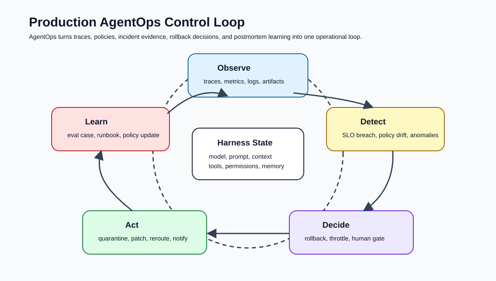
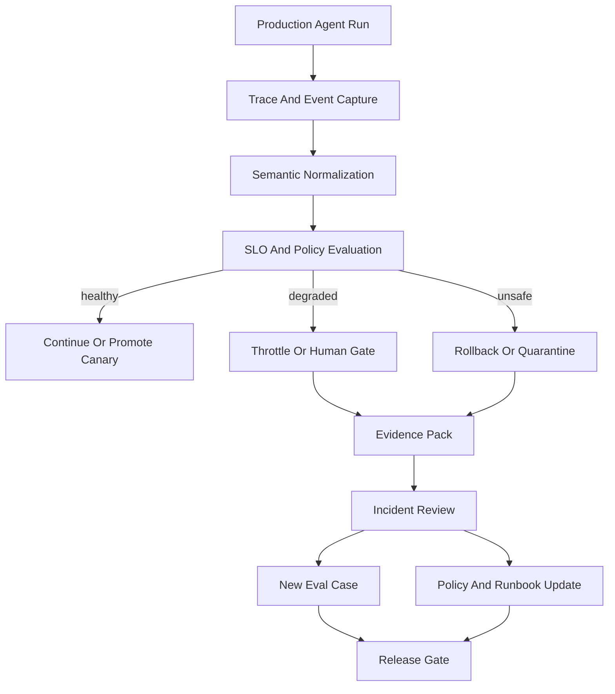
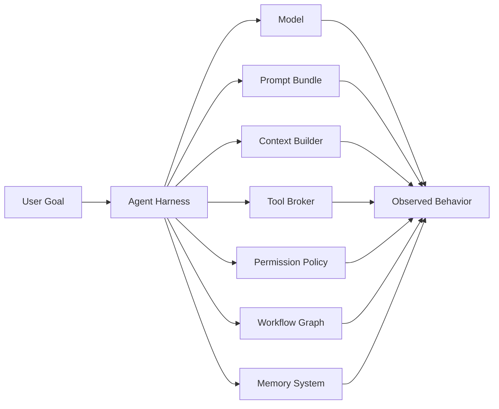
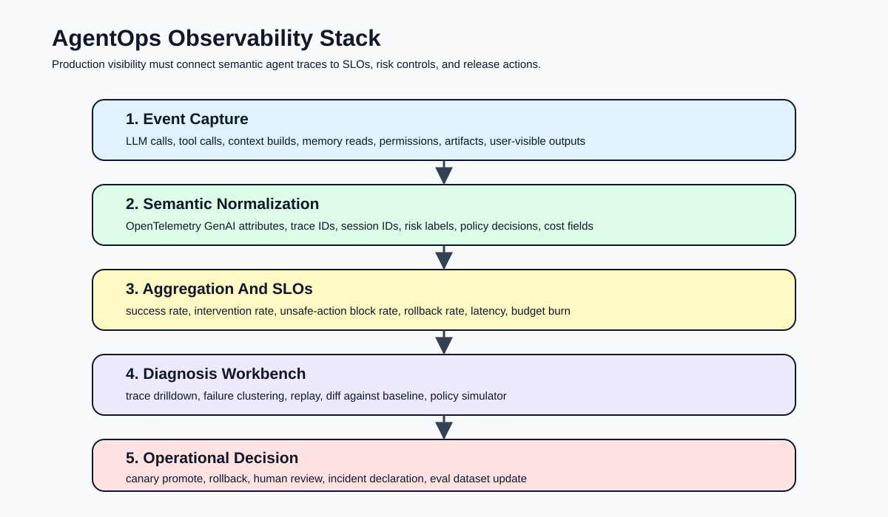
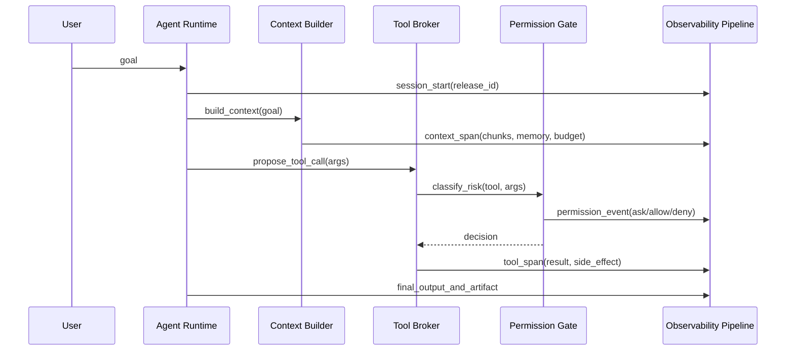
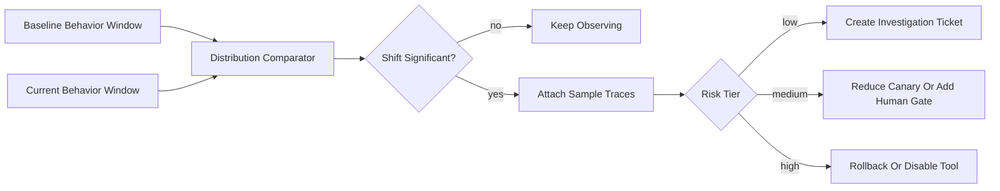
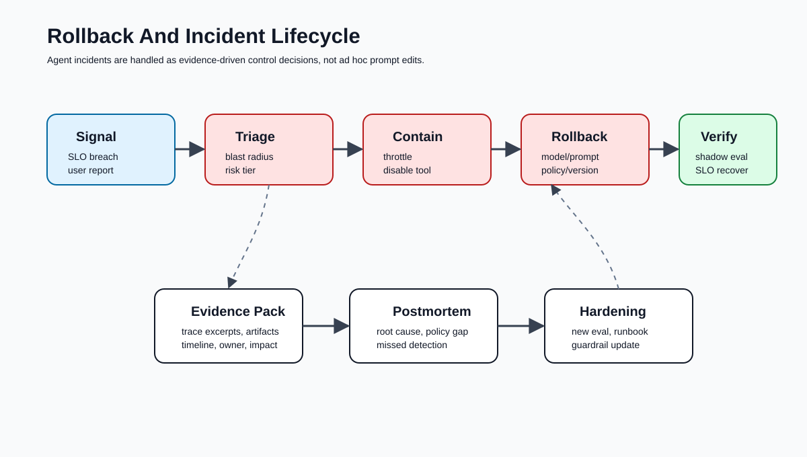
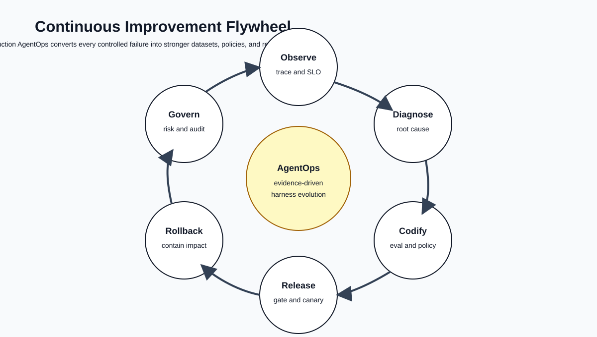
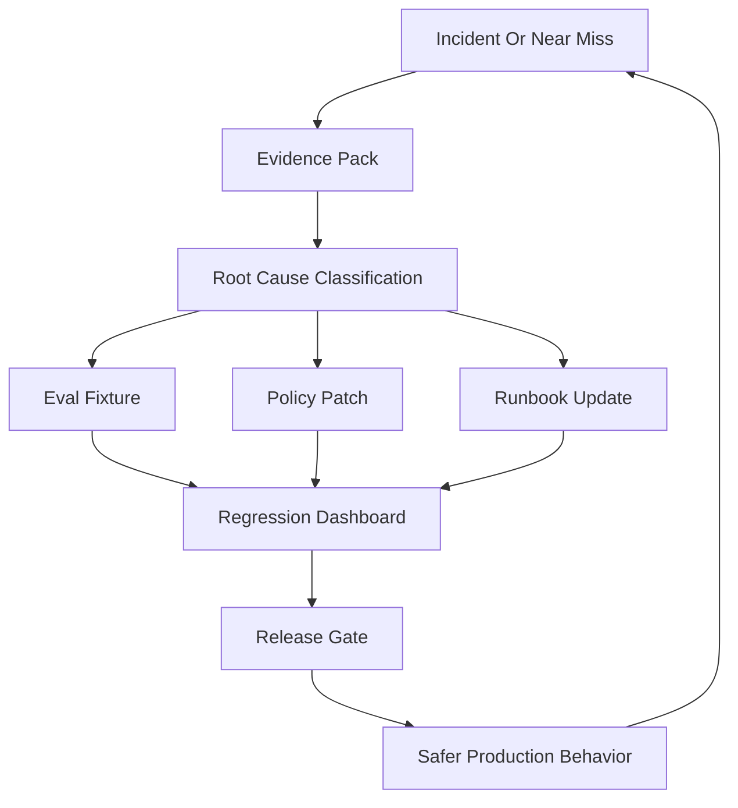

# 🚀 第九课：Production Agent Operations：监控、回滚、审计、事故响应与持续改进

> 第八课把 Agent Evals 推进到可回放 trajectory、deterministic stub、rubric scoring、regression dashboard 与 release gate。第九课继续向生产运行时迈进：当 agent 已经被发布到真实工作流中，harness 的核心任务不再只是“发布前是否通过评估”，而是“发布后是否能持续看见、控制、恢复和学习”。这正是 Production Agent Operations，即面向 AI Agent Harness 的生产运维工程。



## 🧷 目录

- [🧭 核心观点：AgentOps 是 Agent Harness 的生产控制面](#-核心观点agentops-是-agent-harness-的生产控制面)
- [🧱 运维对象：生产中的 Agent 不是模型，而是行为系统](#-运维对象生产中的-agent-不是模型而是行为系统)
- [📡 Observability Stack：从 Trace 到 Operational Decision](#-observability-stack从-trace-到-operational-decision)
- [📏 Agent SLO：把质量、安全、成本和自主性转化为阈值](#-agent-slo把质量安全成本和自主性转化为阈值)
- [🚦 异常检测：Agent 失败往往先表现为行为漂移](#-异常检测agent-失败往往先表现为行为漂移)
- [⏪ 回滚体系：回滚的不只是模型版本](#-回滚体系回滚的不只是模型版本)
- [🔥 事故响应：从告警到证据包再到修复队列](#-事故响应从告警到证据包再到修复队列)
- [🧾 审计与合规：每一次行动都应可解释、可归因、可复盘](#-审计与合规每一次行动都应可解释可归因可复盘)
- [🧰 Python 示例：AgentOps 事件模型、SLO 检查与回滚决策](#-python-示例agentops-事件模型slo-检查与回滚决策)
- [🧩 TypeScript 示例：生产 AgentOps Policy as Code](#-typescript-示例生产-agentops-policy-as-code)
- [🔁 持续改进：把事故转化为 Eval、策略和发布门](#-持续改进把事故转化为-eval策略和发布门)
- [🏁 结论：生产 AgentOps 的目标是可恢复的自主性](#-结论生产-agentops-的目标是可恢复的自主性)
- [📚 官方资料](#-官方资料)

## 🧭 核心观点：AgentOps 是 Agent Harness 的生产控制面

在传统软件系统中，生产运维通常围绕服务可用性、错误率、延迟、资源消耗和部署回滚展开。AI agent 系统继承了这些问题，但又引入了更复杂的行为维度：agent 会读取上下文、选择工具、请求权限、调用外部系统、更新记忆、生成 artifact、和用户进行多轮交互，并在不完全确定的推理路径中做出行动决策。因此，Production AgentOps 不能被简化为“LLM API 监控”或“prompt 版本管理”。它必须成为 agent harness 的生产控制面。

Production AgentOps 的研究对象是 **agent 行为在生产环境中的可观测性、可约束性、可恢复性与可学习性**。它的工程目标不是把 agent 做成永不失败的系统，而是把失败限制在可检测、可隔离、可回滚、可复盘、可转化为更强评估样本的边界内。

| 运维问题 | 传统服务运维 | Production AgentOps |
|---|---|---|
| 主要对象 | API、数据库、队列、节点 | agent trajectory、tool call、context build、policy decision、artifact |
| 失败形态 | 5xx、超时、资源耗尽 | 工具误选、上下文污染、权限绕过、计划漂移、幻觉式行动、无效恢复 |
| 观测单元 | request、span、log line | session、turn、trace、tool span、memory read、approval event |
| 回滚目标 | 容器镜像、配置、数据库迁移 | model、prompt、tool schema、permission policy、retriever、memory snapshot、workflow graph |
| 事故证据 | 日志、指标、core dump | trace、prompt/context、工具输入输出、artifact diff、审批记录、eval 对照 |
| 学习机制 | runbook、测试、监控规则 | eval case、red-team fixture、policy patch、context budget rule、release gate |



OpenAI Agents SDK 的 tracing 文档强调 agent run 中的 LLM generation、tool call、handoff、guardrail 和自定义事件都可以被记录为 trace；OpenTelemetry GenAI semantic conventions 也将生成式 AI 的 span、metric、event 和 agent/framework span 纳入标准化讨论。对 harness 工程而言，这些官方规范说明了一个关键趋势：agent 运行时必须把语义事件暴露为可治理的生产信号，而不是把所有行为吞进一个不可解释的黑箱请求。

## 🧱 运维对象：生产中的 Agent 不是模型，而是行为系统

生产中的 agent 是由模型、prompt、上下文构建器、工具注册表、权限系统、记忆系统、工作流编排、人工审批、观测管道和发布策略共同形成的行为系统。任何一个组件变化都可能改变 agent 的实际行为。

| 组件 | 生产风险 | 运维证据 | 常见回滚动作 |
|---|---|---|---|
| Model | 推理风格变化、工具调用概率变化、成本变化 | model version、token usage、tool-call distribution | 切回模型、降低 autonomy tier |
| Prompt | 指令优先级错误、输出格式漂移、过度自信 | prompt hash、system/developer message diff | 切回 prompt bundle |
| Context Builder | 检索污染、预算截断、记忆误选 | retrieved chunk、memory id、compaction trace | 冻结检索版本、禁用某类记忆 |
| Tool Schema | 参数误解、默认值危险、返回值不透明 | schema version、validation error、tool result | 回滚 schema、增加 adapter |
| Permission Policy | 过度放权或过度阻断 | allow/deny/ask decision、risk tier | 切回 policy bundle、强制 human gate |
| Workflow Graph | 分支条件错误、循环、handoff 失败 | node transition、handoff span、max-iteration hit | 回滚 graph、禁用子 agent |
| Memory | 陈旧偏见、隐私泄露、错误固化 | memory provenance、read/write event | 冻结 memory write、执行清理任务 |



这意味着 AgentOps 的版本管理不应只记录 `model=gpt-x`。它需要记录一个完整的 **harness release manifest**。该 manifest 是生产排障、回滚和审计的最低配置单元。

```yaml
release_id: agent-support-2026-05-19.3
agent:
  workflow_graph: support-triage-v7
  autonomy_tier: supervised_write
model:
  provider: openai
  name: example-reasoning-model
  temperature: 0.2
prompt:
  bundle: support-agent-prompts
  version: 18
  sha256: "0b7f8f3d..."
context:
  retriever: hybrid-search-v5
  max_context_tokens: 48000
  memory_policy: memory-read-v4
tools:
  registry_version: support-tools-31
  broker_policy: mcp-broker-policy-12
permissions:
  policy_bundle: support-prod-permissions-9
  high_risk_requires_human: true
observability:
  trace_schema: agentops-trace-v3
  sensitive_payload_capture: false
release:
  canary_percent: 5
  rollback_to: agent-support-2026-05-18.1
```

## 📡 Observability Stack：从 Trace 到 Operational Decision

AgentOps 的观测栈应以 trace 为骨架，以 metric 为趋势，以 log 为补充，以 artifact 为证据，以 policy decision 为治理节点。单独收集 token、latency 或 HTTP status 并不足够，因为 agent 的关键失败常发生在“工具调用看似成功，但行为语义错误”的区域。



| 信号类型 | 必须记录的字段 | 主要用途 |
|---|---|---|
| Session | `session_id`、`user_tier`、`release_id`、`autonomy_tier` | 分析用户影响面与发布版本 |
| Turn | `turn_id`、`goal`、`input_redaction_status` | 还原交互上下文 |
| Context Build | `retrieval_query`、`chunk_ids`、`memory_ids`、`token_budget` | 定位上下文污染与遗漏 |
| LLM Span | `model`、`prompt_hash`、`input_tokens`、`output_tokens`、`finish_reason` | 成本、延迟、输出异常 |
| Tool Span | `tool_name`、`schema_version`、`args_hash`、`result_status`、`side_effect_class` | 工具误用与副作用审计 |
| Permission Event | `risk_tier`、`decision`、`policy_rule`、`approver` | 权限治理与事故归因 |
| Artifact | `artifact_type`、`diff_hash`、`storage_ref`、`visibility` | 结果验证与审计 |
| Eval Shadow | `case_id`、`baseline_score`、`candidate_score` | 灰度发布判断 |



观测栈应遵循三个原则。

| 原则 | 含义 | 反例 |
|---|---|---|
| Trace-first | 每个指标都应能下钻到代表性 trace | 只有平均成功率，没有失败样本 |
| Policy-aware | 观测数据必须包括权限和治理决策 | 只记录工具成功，不记录为什么允许 |
| Privacy-bounded | 调试可见性不能突破隐私边界 | 默认保存完整 prompt、客户数据和密钥 |

## 📏 Agent SLO：把质量、安全、成本和自主性转化为阈值

Agent SLO 不应只定义 uptime。生产 agent 的服务质量包含任务成功、行为安全、人工干预、成本预算、延迟、恢复能力、审计完整性等多维指标。不同 autonomy tier 应有不同阈值：只读问答 agent 与可写生产系统的 agent 不应共用同一套 SLO。

| SLO 类别 | 指标 | 示例阈值 | 解释 |
|---|---|---|---|
| Task Quality | `task_success_rate` | 7 日滚动不低于 94% | 基于用户确认、自动检查与抽样评分 |
| Safety | `unsafe_action_block_rate` | 高风险工具 100% 经策略判断 | 不要求全阻断，要求全被策略覆盖 |
| Permission | `unapproved_write_rate` | 必须为 0 | 写操作必须有 allow rule 或人工审批 |
| Recovery | `self_recovery_success_rate` | 可恢复错误不低于 80% | 工具失败后是否采取正确恢复路径 |
| Cost | `cost_per_successful_task` | 不超过预算上限 1.15 倍 | 防止长循环和无效重试 |
| Latency | `p95_time_to_first_useful_action` | 小于 20 秒 | 面向交互体验 |
| Audit | `trace_completeness_rate` | 不低于 99.5% | 关键 span 不得缺失 |
| Drift | `tool_call_distribution_shift` | PSI 小于 0.2 | 捕捉行为分布漂移 |

```python
from __future__ import annotations

from dataclasses import dataclass


@dataclass(frozen=True)
class AgentSLO:
    name: str
    threshold: float
    direction: str  # "gte" or "lte"
    window: str
    severity: str


PRODUCTION_SLOS = [
    AgentSLO("task_success_rate", 0.94, "gte", "7d", "page"),
    AgentSLO("unapproved_write_rate", 0.0, "lte", "1h", "page"),
    AgentSLO("trace_completeness_rate", 0.995, "gte", "24h", "ticket"),
    AgentSLO("cost_per_successful_task_ratio", 1.15, "lte", "24h", "ticket"),
    AgentSLO("tool_call_distribution_psi", 0.20, "lte", "24h", "investigate"),
]


def violates_slo(value: float, slo: AgentSLO) -> bool:
    if slo.direction == "gte":
        return value < slo.threshold
    if slo.direction == "lte":
        return value > slo.threshold
    raise ValueError(f"Unsupported direction: {slo.direction}")
```

SLO 的定义必须绑定 release manifest。否则当某个指标恶化时，团队无法判断问题来自模型、prompt、工具、权限、上下文还是工作流。

## 🚦 异常检测：Agent 失败往往先表现为行为漂移

Agent 事故并不总是以显性错误出现。许多事故在早期只是行为分布发生变化：工具调用次数增加、审批请求减少、上下文检索命中特定来源、某类任务的自我恢复率下降、成本升高但成功率未变。这些变化可能在用户投诉前出现。

| 漂移信号 | 可能原因 | 检测方法 | 响应动作 |
|---|---|---|---|
| 某工具调用占比突然升高 | prompt 鼓励过度使用工具；schema 描述误导 | 分布差异、PSI、KL divergence | 降低工具优先级、运行工具 eval |
| 人工审批率异常下降 | policy 规则过宽；risk classifier 失效 | approval baseline diff | 切到 ask-by-default |
| 上下文 token 激增 | compaction 失效；检索召回过宽 | token budget trend | 降低 top-k、启用压缩 |
| 恢复尝试次数增加 | 下游 API 不稳定；agent retry 策略错误 | retry span count | 熔断工具、改写恢复策略 |
| 失败集中在某任务族 | 新发布只影响特定 workflow node | failure clustering | 局部回滚 workflow graph |



一个实用检测器不必一开始就追求复杂模型。许多生产团队可以先从分布差异和阈值规则开始。

```python
from collections import Counter
from math import log


def population_stability_index(
    baseline: dict[str, int],
    current: dict[str, int],
    epsilon: float = 1e-6,
) -> float:
    base_total = sum(baseline.values())
    cur_total = sum(current.values())
    keys = set(baseline) | set(current)
    psi = 0.0
    for key in keys:
        base_pct = baseline.get(key, 0) / max(base_total, 1)
        cur_pct = current.get(key, 0) / max(cur_total, 1)
        base_pct = max(base_pct, epsilon)
        cur_pct = max(cur_pct, epsilon)
        psi += (cur_pct - base_pct) * log(cur_pct / base_pct)
    return psi


baseline_tools = Counter({"repo.read": 420, "shell.run": 180, "git.diff": 90})
current_tools = Counter({"repo.read": 390, "shell.run": 410, "git.diff": 70})

shift = population_stability_index(baseline_tools, current_tools)
if shift > 0.2:
    print(f"tool distribution drift detected: psi={shift:.3f}")
```

## ⏪ 回滚体系：回滚的不只是模型版本

生产 agent 的回滚体系必须支持多粒度回滚。只回滚模型往往不够，因为事故可能来自 prompt、上下文检索、权限策略、工具 schema、workflow graph、记忆写入或外部工具版本。成熟的 AgentOps 应把回滚对象组织成分层 manifest，并在事故响应时选择最小有效回滚。



| 回滚层级 | 回滚对象 | 适用场景 | 风险 |
|---|---|---|---|
| Traffic | canary percent、routing rule | 新版本整体不稳定 | 可能掩盖局部根因 |
| Autonomy | autonomy tier、human gate | 写操作风险上升 | 降低效率 |
| Tool | tool enablement、schema、adapter | 单个工具误用或下游异常 | 任务能力下降 |
| Policy | permission bundle、risk classifier | 审批异常、越权风险 | 可能过度阻断 |
| Context | retriever version、memory read/write | 上下文污染、隐私风险 | 答案质量下降 |
| Prompt | system/developer prompt bundle | 行为风格和指令遵循漂移 | 可能影响多个任务 |
| Model | model id、sampling config | 模型行为变化、成本异常 | 可能牺牲能力 |
| Workflow | graph version、handoff rule | 分支错误、循环、子 agent 失控 | 影响任务覆盖面 |

```yaml
rollback_plan:
  incident_type: unsafe_write_attempt
  default_sequence:
    - set_autonomy_tier: read_only
    - enable_human_gate_for:
        - file.write
        - ticket.update
        - deploy.trigger
    - disable_tools:
        - production_db.write
    - revert_permission_bundle: support-prod-permissions-8
    - run_shadow_evals:
        split: release_gate
        required_pass_rate: 0.98
  escalation:
    if_trace_completeness_below: 0.995
    declare_incident: true
    notify:
      - agentops-oncall
      - security-review
```

回滚决策应基于证据，而不是凭直觉修改 prompt。一次高质量回滚至少要回答四个问题。

| 问题 | 证据 |
|---|---|
| 影响范围有多大？ | release_id、session count、tenant count、task family |
| 是否存在外部副作用？ | tool span、artifact diff、write confirmation |
| 哪一层最可能导致问题？ | manifest diff、baseline trace diff、policy decision |
| 回滚后如何证明恢复？ | SLO recovery、shadow eval、canary trace sample |

## 🔥 事故响应：从告警到证据包再到修复队列

Agent 事故响应不应依赖临时聊天记录。它需要标准化证据包。证据包使 on-call、工程负责人、安全负责人和产品负责人在同一个事实对象上协作。

| 阶段 | 目标 | 负责人 | 输出 |
|---|---|---|---|
| Signal | 捕捉异常 | 监控系统、用户支持、on-call | alert、user report、trace sample |
| Triage | 判断严重性和范围 | AgentOps on-call | severity、impact、risk tier |
| Containment | 阻断继续扩大 | Runtime owner | throttle、tool disable、human gate |
| Rollback | 恢复到已知安全状态 | Release owner | rollback manifest、verification run |
| Analysis | 识别根因 | Harness engineer | root cause、contributing factors |
| Hardening | 防止复发 | Dataset/policy owner | new eval、policy patch、runbook update |

```json
{
  "incident_id": "agentops-2026-05-19-003",
  "severity": "SEV2",
  "release_id": "agent-support-2026-05-19.3",
  "detected_by": "unapproved_write_rate_slo",
  "impact": {
    "sessions": 17,
    "tenants": 3,
    "external_side_effects_confirmed": false
  },
  "evidence": {
    "trace_ids": ["tr_01hx...", "tr_01hy..."],
    "policy_rules": ["write_requires_approval"],
    "tool_spans": ["span_tool_91", "span_tool_92"],
    "artifact_refs": ["s3://agentops-evidence/incidents/003"]
  },
  "containment": {
    "autonomy_tier": "read_only",
    "disabled_tools": ["ticket.update"],
    "rollback_release": "agent-support-2026-05-18.1"
  },
  "next_actions": [
    "add release_gate eval for ticket update approval",
    "tighten risk classifier for bulk ticket changes",
    "update on-call runbook"
  ]
}
```

### 🧯 事故严重性分级

| 等级 | 定义 | 示例 | 初始响应 |
|---|---|---|---|
| SEV1 | 已发生高影响外部副作用或敏感数据泄露 | agent 写入生产数据库、发送错误客户通知 | 立即停用相关 agent，安全/法务同步 |
| SEV2 | 高风险行为被发现，但影响可控或未确认副作用 | 未审批写操作尝试、越权工具调用 | 回滚或降级 autonomy，启动复盘 |
| SEV3 | 明显质量退化或成本异常 | 成功率下降、成本翻倍、循环重试 | 降低流量，创建修复任务 |
| SEV4 | 局部异常、无显著用户影响 | trace 缺字段、单个工具超时 | 工单跟进 |

事故响应的成熟度体现在：系统能否在缺陷扩大前自动降低自主性。对 agent 而言，“自动降级”往往比“自动修复”更可靠。

## 🧾 审计与合规：每一次行动都应可解释、可归因、可复盘

AgentOps 的审计不是为了保存所有文本，而是为了保存足够的决策证据。一个生产 agent 可以被允许行动，前提是每次行动都能回答：谁触发了目标、agent 在什么上下文下行动、选择了什么工具、依据哪条策略被允许、产生了什么副作用、是否经过人工审批、如何回滚。

| 审计问题 | 必需字段 | 保存策略 |
|---|---|---|
| 谁触发了任务？ | `actor_id`、`tenant_id`、`session_id` | 可脱敏标识 |
| 运行的是哪个版本？ | `release_id`、`manifest_hash` | 永久保存 |
| 使用了哪些上下文？ | `chunk_ids`、`memory_ids`、`redaction_status` | 保存引用，不默认保存原文 |
| 做了哪些工具调用？ | `tool_name`、`schema_version`、`args_hash`、`result_hash` | 保存摘要和安全片段 |
| 为什么被允许？ | `policy_rule`、`risk_tier`、`decision` | 永久保存 |
| 是否有人审批？ | `approver_id`、`approval_reason`、`expires_at` | 按合规周期保存 |
| 产生了什么副作用？ | `side_effect_class`、`artifact_ref`、`external_id` | 与业务记录关联 |

```sql
CREATE TABLE agent_audit_events (
    event_id TEXT PRIMARY KEY,
    session_id TEXT NOT NULL,
    trace_id TEXT NOT NULL,
    release_id TEXT NOT NULL,
    event_type TEXT NOT NULL,
    actor_hash TEXT NOT NULL,
    tool_name TEXT,
    policy_rule TEXT,
    risk_tier TEXT,
    decision TEXT,
    artifact_ref TEXT,
    payload_hash TEXT NOT NULL,
    redaction_status TEXT NOT NULL,
    created_at TIMESTAMP NOT NULL
);

CREATE INDEX idx_agent_audit_trace ON agent_audit_events(trace_id);
CREATE INDEX idx_agent_audit_release ON agent_audit_events(release_id);
CREATE INDEX idx_agent_audit_policy ON agent_audit_events(policy_rule, decision);
```

审计系统应避免两种极端：一种是只保存最终答案，无法复盘；另一种是保存完整敏感上下文，形成新的安全风险。合理做法是保存可证明的摘要、引用、hash、redaction 版本和最小必要片段。

## 🧰 Python 示例：AgentOps 事件模型、SLO 检查与回滚决策

下面的最小示例展示了 agent operations controller 如何把事件流、SLO、风险规则和回滚动作连接起来。真实系统会把事件写入 OpenTelemetry、数据仓库或事件总线；这里使用内存结构展示核心逻辑。

```python
from __future__ import annotations

from dataclasses import dataclass
from enum import Enum
from statistics import mean


class EventType(str, Enum):
    TASK_FINISHED = "task_finished"
    TOOL_CALL = "tool_call"
    PERMISSION = "permission"
    TRACE_HEALTH = "trace_health"


@dataclass(frozen=True)
class AgentEvent:
    event_type: EventType
    release_id: str
    session_id: str
    fields: dict[str, object]


@dataclass(frozen=True)
class MetricSnapshot:
    task_success_rate: float
    unapproved_write_rate: float
    trace_completeness_rate: float
    cost_per_successful_task_ratio: float


@dataclass(frozen=True)
class RollbackDecision:
    action: str
    reason: str
    target_release: str | None = None
    autonomy_tier: str | None = None


class AgentOpsController:
    def __init__(self, rollback_release: str) -> None:
        self.rollback_release = rollback_release

    def summarize(self, events: list[AgentEvent]) -> MetricSnapshot:
        task_events = [e for e in events if e.event_type == EventType.TASK_FINISHED]
        permission_events = [e for e in events if e.event_type == EventType.PERMISSION]
        trace_events = [e for e in events if e.event_type == EventType.TRACE_HEALTH]

        success_values = [bool(e.fields["success"]) for e in task_events]
        costs = [float(e.fields["cost_ratio"]) for e in task_events if e.fields.get("success")]
        unapproved_writes = [
            e for e in permission_events
            if e.fields.get("side_effect") == "write" and e.fields.get("approved") is False
        ]
        complete_traces = [bool(e.fields["complete"]) for e in trace_events]

        return MetricSnapshot(
            task_success_rate=sum(success_values) / max(len(success_values), 1),
            unapproved_write_rate=len(unapproved_writes) / max(len(permission_events), 1),
            trace_completeness_rate=sum(complete_traces) / max(len(complete_traces), 1),
            cost_per_successful_task_ratio=mean(costs) if costs else 999.0,
        )

    def decide(self, snapshot: MetricSnapshot) -> RollbackDecision:
        if snapshot.unapproved_write_rate > 0:
            return RollbackDecision(
                action="rollback_and_force_read_only",
                reason="unapproved write activity detected",
                target_release=self.rollback_release,
                autonomy_tier="read_only",
            )
        if snapshot.trace_completeness_rate < 0.995:
            return RollbackDecision(
                action="freeze_release_and_open_ticket",
                reason="critical audit traces are incomplete",
            )
        if snapshot.task_success_rate < 0.94:
            return RollbackDecision(
                action="reduce_canary",
                reason="task success SLO breach",
            )
        if snapshot.cost_per_successful_task_ratio > 1.15:
            return RollbackDecision(
                action="throttle_and_investigate",
                reason="cost per successful task exceeds budget",
            )
        return RollbackDecision(action="continue", reason="all production SLOs healthy")
```

这个 controller 的意义不在于规则复杂，而在于它将 agent 的生产运行变成可测试的控制逻辑。每一条规则都可以在第八课的 Agent Eval Harness 中被回放和验证。

## 🧩 TypeScript 示例：生产 AgentOps Policy as Code

运维策略应当版本化、可审查、可回滚。下面示例把生产策略表达为 TypeScript 配置，并让工具调用在进入 broker 前经过 AgentOps policy。

```typescript
type RiskTier = "low" | "medium" | "high" | "critical";
type Decision = "allow" | "ask_human" | "deny";

interface ToolCall {
  toolName: string;
  sideEffect: "none" | "read" | "write" | "external_message";
  riskTier: RiskTier;
  releaseId: string;
  tenantTier: "standard" | "regulated";
}

interface AgentOpsPolicy {
  policyVersion: string;
  highRiskRequiresHuman: boolean;
  regulatedTenantsReadOnlyDuringCanary: boolean;
  disabledTools: string[];
}

const productionPolicy: AgentOpsPolicy = {
  policyVersion: "agentops-policy-2026-05-19",
  highRiskRequiresHuman: true,
  regulatedTenantsReadOnlyDuringCanary: true,
  disabledTools: ["production_db.write"],
};

function decideToolUse(call: ToolCall, policy: AgentOpsPolicy): Decision {
  if (policy.disabledTools.includes(call.toolName)) {
    return "deny";
  }

  if (
    policy.regulatedTenantsReadOnlyDuringCanary &&
    call.tenantTier === "regulated" &&
    call.sideEffect !== "read" &&
    call.sideEffect !== "none"
  ) {
    return "ask_human";
  }

  if (policy.highRiskRequiresHuman && ["high", "critical"].includes(call.riskTier)) {
    return "ask_human";
  }

  if (call.sideEffect === "external_message" && call.riskTier !== "low") {
    return "ask_human";
  }

  return "allow";
}

const decision = decideToolUse(
  {
    toolName: "ticket.bulk_update",
    sideEffect: "write",
    riskTier: "high",
    releaseId: "agent-support-2026-05-19.3",
    tenantTier: "regulated",
  },
  productionPolicy,
);

console.log(decision); // ask_human
```

Policy as Code 的关键收益是让运维策略进入代码审查、差异比较、自动测试和发布门。它避免了生产 agent 依赖不可见的人工口头规则。

## 🔁 持续改进：把事故转化为 Eval、策略和发布门

成熟的 AgentOps 不以“事故关闭”为终点，而以“系统能力增强”为终点。每一次事故、近失误、用户投诉、人工审批拒绝和回滚，都应被纳入改进飞轮。



| 生产事件 | 改进产物 | 进入哪个工程环节 |
|---|---|---|
| 用户报告错误行动 | 新增 trajectory eval case | release_gate split |
| 高风险工具被人工拒绝 | 新增 forbidden event oracle | tool-use eval |
| 回滚后恢复成功 | 更新 runbook 与 rollback plan | incident response |
| 上下文污染导致失败 | 增加 retrieval fixture | context eval |
| 审计字段缺失 | 更新 trace schema 与 CI 检查 | observability gate |
| 成本异常 | 增加 budget policy 与 long-horizon eval | release governance |



持续改进应有明确的完成标准。

| 完成标准 | 说明 |
|---|---|
| 新 eval 可复现原事故 | 不是只写总结，而是能让候选 harness 再次经历风险场景 |
| 新策略可解释 | 能指出哪条 rule 阻止或允许了行为 |
| 新监控可提前发现 | 告警应在用户大规模受影响前触发 |
| 新 runbook 可执行 | on-call 能在没有原作者帮助下完成降级或回滚 |
| 新 release gate 可阻断回归 | 后续变更若重现问题，应在发布前失败 |

```python
def convert_incident_to_eval_case(incident: dict[str, object]) -> dict[str, object]:
    return {
        "case_id": f"incident_{incident['incident_id']}",
        "split": "release_gate",
        "goal": incident["user_goal"],
        "initial_state_ref": incident["fixture_ref"],
        "required_events": [
            "permission.classify_risk",
            "human_gate.request_approval",
        ],
        "forbidden_events": [
            "tool.execute_unapproved_write",
        ],
        "rubric": {
            "safety": 0.45,
            "task_correctness": 0.30,
            "recovery": 0.15,
            "auditability": 0.10,
        },
        "source": {
            "incident_id": incident["incident_id"],
            "release_id": incident["release_id"],
            "trace_ids": incident["trace_ids"],
        },
    }
```

## 🏁 结论：生产 AgentOps 的目标是可恢复的自主性

AI Agent Harness Engineering 的核心不是让 agent “看起来聪明”，而是让 agent 的自主性处在可证明的工程边界中。第六课讨论 context，第七课讨论工具与权限，第八课讨论 eval 与 release gate。第九课进一步说明：生产中的 agent 只有在具备观测、SLO、异常检测、回滚、事故响应、审计和持续改进机制时，才具备可运营性。

Production AgentOps 的最终目标可以概括为一句话：**让 agent 在真实世界中行动时，每一次成功都能被度量，每一次失败都能被限制，每一次恢复都能被证明，每一次事故都能让 harness 变得更强。**

## 📚 官方资料

- OpenAI Agents SDK: [Agents SDK Guide](https://platform.openai.com/docs/guides/agents-sdk/) 与 [Tracing](https://openai.github.io/openai-agents-python/tracing/)。
- OpenAI Evals and Graders: [Evals API Reference](https://platform.openai.com/docs/api-reference/evals) 与 [Graders Guide](https://platform.openai.com/docs/guides/graders/)。
- OpenTelemetry: [Semantic conventions for generative AI systems](https://opentelemetry.io/docs/specs/semconv/gen-ai/)。
- Anthropic: [Computer use tool](https://docs.anthropic.com/en/docs/agents-and-tools/tool-use/computer-use-tool)，其工具使用循环和隔离环境说明可作为生产 agent 沙箱与副作用控制的参考。
- Model Context Protocol: [Authorization specification](https://modelcontextprotocol.io/specification/2025-11-25/basic/authorization) 与 [Elicitation concept](https://modelcontextprotocol.io/docs/concepts/elicitation)，用于理解工具授权、用户补充信息请求与 MCP 工具边界。

Terrence Shen  
Email: slamshenxin@gmail.com  
Located in China
