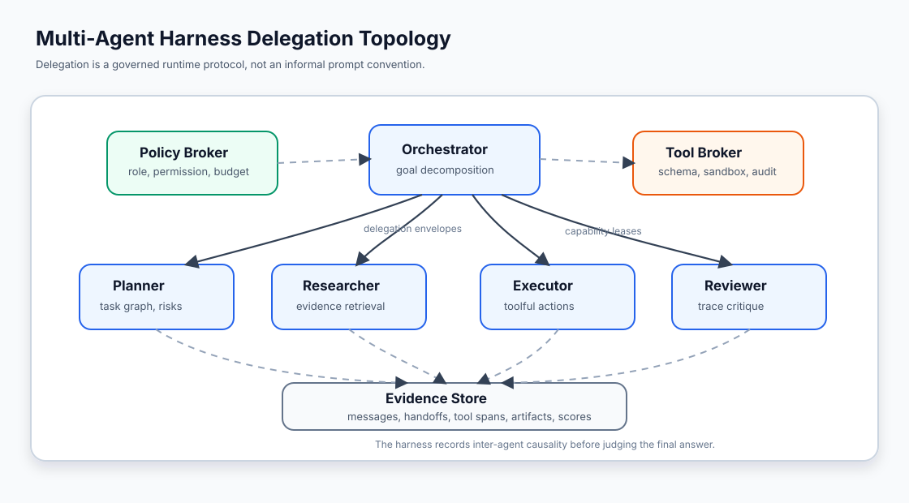
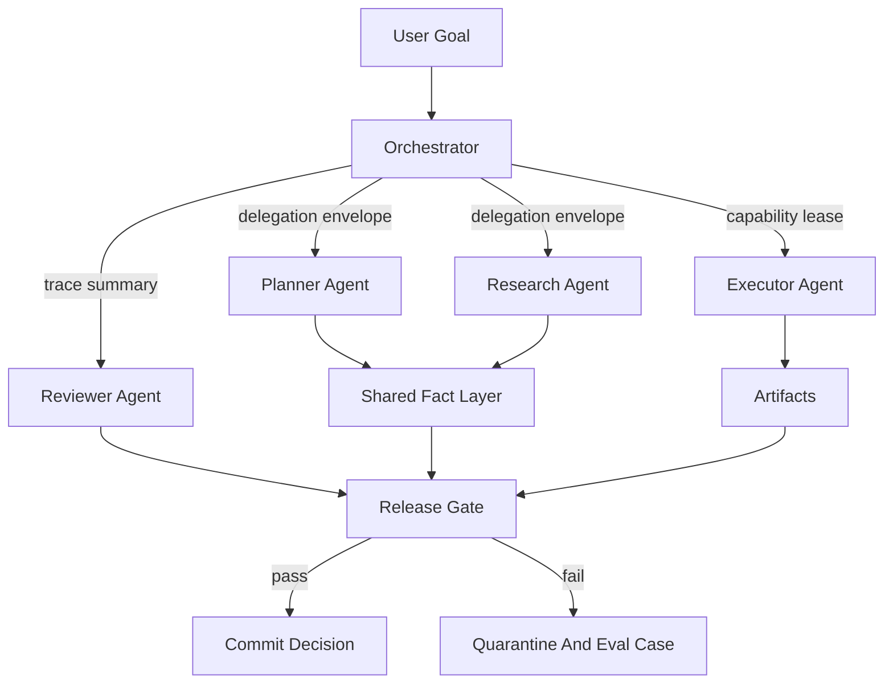
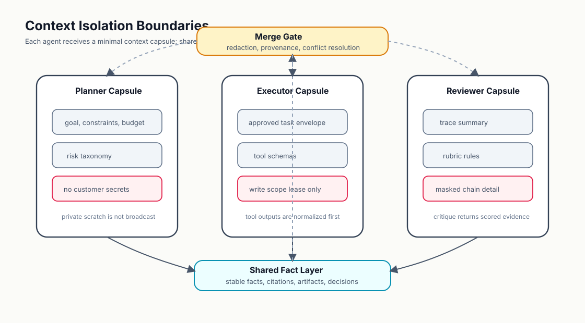
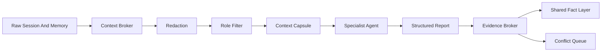
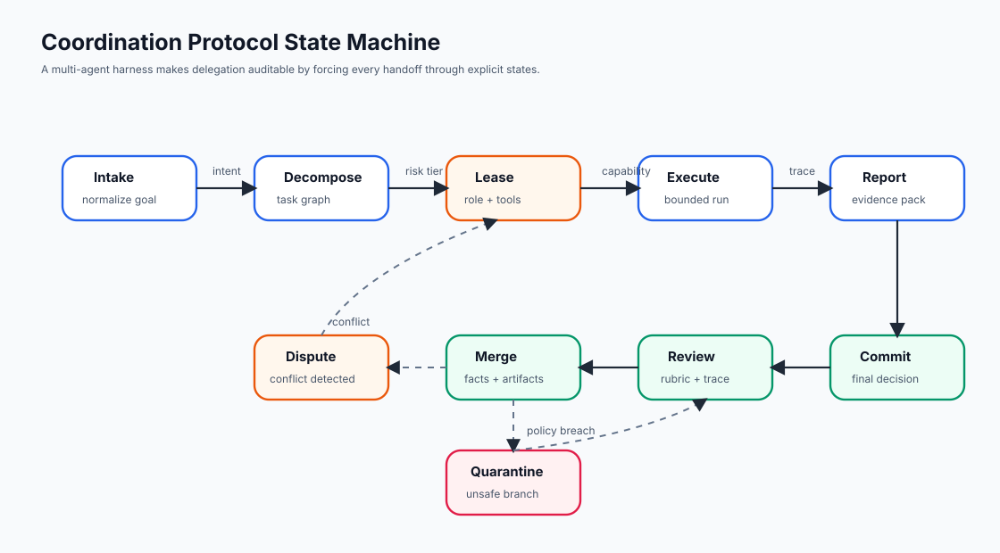
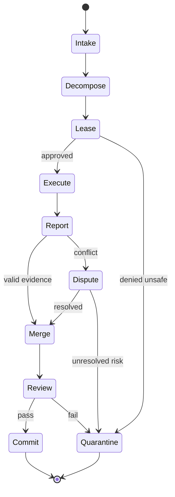
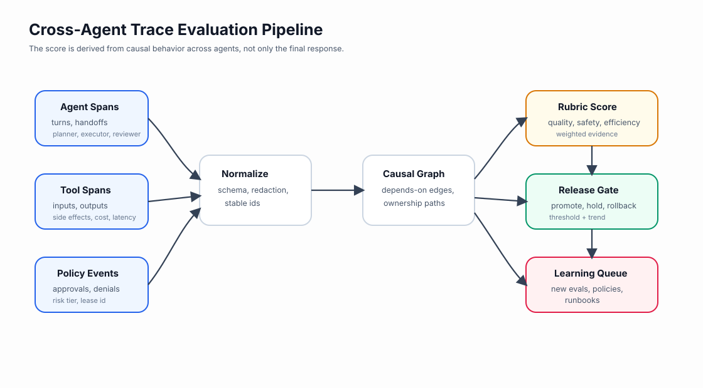
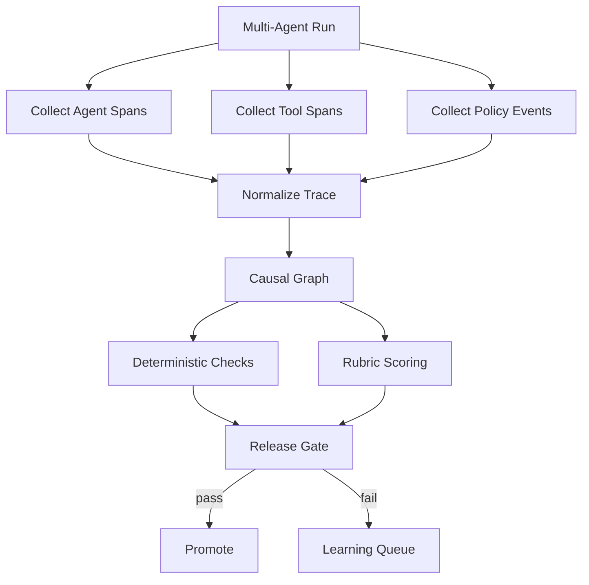

# 🧬 第十课：Multi-Agent Harnesses：委派、上下文隔离、协同协议与跨 Agent Trace 评估

> 第九课把 Agent Harness Engineering 推进到生产 AgentOps：观测、SLO、漂移检测、回滚、审计、事故响应与持续改进。第十课继续讨论更复杂的生产形态：一个 agent 不再独自完成全部任务，而是把规划、检索、执行、审查、合规、回滚等职责委派给多个专业 agent。此时，harness 的核心问题不再是“如何运行一个 agent”，而是“如何让多个 agent 在受控边界内协作，并且让协作行为可以被解释、评估和治理”。



## 🧷 目录

- [🧭 核心观点：多 Agent 系统需要 Harness，而不只是更多 Prompt](#-核心观点多-agent-系统需要-harness而不只是更多-prompt)
- [🧩 拓扑模型：Orchestrator、Specialist 与 Broker](#-拓扑模型orchestratorspecialist-与-broker)
- [🧱 上下文隔离：每个 Agent 都应拥有最小上下文胶囊](#-上下文隔离每个-agent-都应拥有最小上下文胶囊)
- [🎟️ 能力租约：把工具、权限和预算绑定到委派任务](#️-能力租约把工具权限和预算绑定到委派任务)
- [🔁 协同协议：委派必须经过显式状态机](#-协同协议委派必须经过显式状态机)
- [🧪 跨 Agent Trace Eval：评估协同行为，而不只评估最终答案](#-跨-agent-trace-eval评估协同行为而不只评估最终答案)
- [🧰 Python 示例：一个最小多 Agent Harness 调度器](#-python-示例一个最小多-agent-harness-调度器)
- [🧾 TypeScript 示例：委派策略与能力租约 Policy as Code](#-typescript-示例委派策略与能力租约-policy-as-code)
- [🗃️ SQL 示例：跨 Agent Trace 的发布门查询](#️-sql-示例跨-agent-trace-的发布门查询)
- [🛡️ 治理原则：多 Agent 自治必须以可证明边界为前提](#️-治理原则多-agent-自治必须以可证明边界为前提)
- [🏁 结论：Multi-Agent Harness 的目标是可组合的自治](#-结论multi-agent-harness-的目标是可组合的自治)
- [📚 官方资料](#-官方资料)

## 🧭 核心观点：多 Agent 系统需要 Harness，而不只是更多 Prompt

多 Agent 系统常被描述为“让多个角色互相讨论”。这种描述在原型阶段有启发性，但在生产工程中并不充分。只要多个 agent 能够互相传递任务、共享上下文、调用工具、修改 artifact、评价彼此结果，系统就形成了一个分布式行为系统。分布式系统的主要风险并非单个节点不会思考，而是边界、时序、所有权和故障传播不清晰。

在 AI Agent Harness Engineering 中，Multi-Agent Harness 是围绕多个 agent 的运行时控制面。它负责定义谁可以委派、委派什么、带着哪些上下文、拥有哪些工具、使用多少预算、如何合并结果、如何处理冲突、如何记录证据、如何评分、如何回滚。若这些问题只依靠自然语言约定，系统会出现难以复现的隐性耦合：一个 reviewer 看到过多私有上下文，一个 executor 获得过宽工具权限，一个 researcher 返回未标注来源的事实，一个 orchestrator 在冲突中选择了不可审计的路径。

| 维度 | 单 Agent Harness | Multi-Agent Harness |
|---|---|---|
| 控制对象 | 单个 agent 的 turn、tool call、memory、artifact | 多个 agent 的委派、交接、冲突、合并、跨 trace 因果关系 |
| 主要风险 | 工具误用、上下文污染、权限越界、评估不足 | 责任漂移、上下文泄漏、重复行动、协同死锁、相互强化错误 |
| 关键机制 | tool schema、permission gate、context builder、trace | delegation envelope、capability lease、context capsule、causal trace graph |
| 评估单位 | 单段 trajectory | 多 agent 协同 trajectory 与 agent 间依赖图 |
| 生产治理 | 发布门、回滚、事故证据包 | 角色版本治理、委派协议版本、跨 agent SLO、冲突审计 |

OpenAI Agents SDK 的官方文档把 agent 描述为带有 instructions、tools、guardrails、handoffs 等配置的对象，并提供 handoff、agents-as-tools 与 tracing 等机制；Anthropic Claude Code 的 subagents 文档也强调专业子 agent 具有独立上下文窗口、可配置工具和任务级委派。对 harness 工程而言，这些文档共同指向一个事实：多 agent 不是“多个聊天窗口”，而是带有权限、上下文和 trace 边界的运行时拓扑。



## 🧩 拓扑模型：Orchestrator、Specialist 与 Broker

多 Agent Harness 的第一步是把角色拓扑显式化。一个成熟系统通常不会让所有 agent 彼此任意通信，而是把通信组织为可审计的委派拓扑。常见形态包括中心编排、黑板协作、流水线、委员会审查与层级代理。不同拓扑的差异不只是架构风格，也决定了风险传播方式。

| 拓扑 | 结构 | 优点 | 风险 | 适合场景 |
|---|---|---|---|---|
| 中心编排 | Orchestrator 分配任务并合并结果 | 容易审计，责任集中 | 编排器成为瓶颈 | 代码修复、客服工单、运营自动化 |
| 流水线 | agent 按阶段传递 artifact | 时序清晰，易做阶段门 | 上游错误会累积 | 文档生成、数据处理、合规审查 |
| 黑板协作 | 多 agent 写入共享事实层 | 适合开放探索 | 冲突与污染风险较高 | 研究、威胁分析、复杂检索 |
| 委员会审查 | 多 agent 独立评分后聚合 | 可降低单点偏差 | 成本与延迟较高 | 高风险发布、安全评审 |
| 层级代理 | 上级 agent 管理下级 agent | 可扩展复杂组织 | 责任链过长 | 企业流程、跨系统运维 |



### 🧪 角色不应等同于人格

工程上更可靠的定义方式是用能力、输入、输出、工具边界和评估标准描述 agent，而不是用模糊人格描述 agent。一个“谨慎的 reviewer”不如一个明确的 reviewer contract：

| 字段 | 说明 | 示例 |
|---|---|---|
| `role_id` | 稳定角色标识 | `release_reviewer.v3` |
| `input_contract` | 可接收的上下文类型 | trace summary、artifact diff、rubric |
| `output_contract` | 必须返回的结构 | score、blocking_findings、evidence_refs |
| `allowed_tools` | 可用工具集合 | `repo.read`、`eval.read_baseline` |
| `forbidden_tools` | 禁止工具集合 | `repo.write`、`git.push`、`ticket.close` |
| `budget` | token、时间、工具次数上限 | 8k tokens、3 tool calls、60 seconds |
| `eval_rubric` | 角色质量标准 | 发现高风险缺陷优先于风格建议 |

```yaml
role_id: release_reviewer.v3
purpose: score_multi_agent_trace_before_release
input_contract:
  required:
    - trace_summary
    - artifact_diff
    - policy_decisions
    - eval_baseline
output_contract:
  type: object
  required:
    - decision
    - score
    - blocking_findings
    - evidence_refs
allowed_tools:
  - repo.read
  - eval.fetch_baseline
  - trace.fetch_span
forbidden_tools:
  - repo.write
  - shell.run
  - git.push
budget:
  max_tokens: 8000
  max_tool_calls: 3
  timeout_seconds: 60
```

### 🧰 Broker 是 Harness 的神经中枢

在多 Agent Harness 中，broker 的价值在于把 agent 之间的非结构化关系转换为结构化控制点。Policy Broker 决定角色、权限、预算与风险层级；Tool Broker 决定工具 schema、沙箱、审计与副作用；Evidence Broker 决定哪些事实可以进入共享层，哪些推理过程必须保留在私有 scratch 中。

| Broker | 输入 | 输出 | 控制目标 |
|---|---|---|---|
| Policy Broker | user goal、risk tier、agent role | capability lease、approval requirement | 防止权限随委派扩散 |
| Tool Broker | tool schema、role lease、sandbox profile | executable tool handle、audit event | 防止工具被越权调用 |
| Context Broker | source documents、memory、trace summary | context capsule、redaction report | 防止上下文泄漏和污染 |
| Evidence Broker | agent reports、artifacts、tool outputs | shared facts、conflict markers | 防止未经证据支持的结论进入合并层 |
| Eval Broker | trace graph、rubric、baseline | score、release decision、learning item | 防止最终答案掩盖中间危险行为 |

## 🧱 上下文隔离：每个 Agent 都应拥有最小上下文胶囊

多 Agent 系统的常见错误是把完整会话、完整工具输出和完整内存广播给所有 agent。这样做会带来三个后果：隐私边界被破坏，agent 之间相互污染，评估时无法判断某个结论来自证据还是来自其他 agent 的暗示。上下文隔离的目标不是让 agent 彼此失明，而是让每个 agent 只看到完成角色任务所必需的信息。

上下文胶囊通常包含六类内容：

| 内容 | 描述 | 治理规则 |
|---|---|---|
| 任务 envelope | 目标、验收条件、风险等级 | 必须稳定、可哈希、可回放 |
| 角色说明 | role contract、输出 schema | 版本化管理 |
| 最小事实 | 经过引用和来源标注的事实 | 禁止无来源结论进入共享层 |
| 工具视图 | 当前角色可见的工具 schema | 根据 lease 过滤 |
| 预算视图 | token、时间、调用次数、成本预算 | 每次委派独立计量 |
| 私有 scratch | agent 的局部推理与草稿 | 不自动广播，不进入共享事实层 |



### 🧯 上下文泄漏矩阵

| 泄漏类型 | 例子 | 生产影响 | Harness 防线 |
|---|---|---|---|
| 横向泄漏 | executor 看到 reviewer 的未发布批评 | agent 适配评审而非解决问题 | reviewer context 独立生成 |
| 纵向泄漏 | 低权限 agent 获得高权限工具输出 | 越权推断或间接执行 | tool output 按角色脱敏 |
| 记忆泄漏 | 上一任务的客户信息进入新任务 | 隐私与合规风险 | memory lookup scoped by tenant and task |
| 推理泄漏 | 私有 scratch 被当作事实广播 | 错误推理被放大 | only cited facts enter shared layer |
| 评估泄漏 | agent 看到 eval oracle | 数据集污染 | oracle 只对 eval broker 可见 |

### 🧬 合并不是拼接

多 agent 的结果合并不是把所有回复拼接成一段更长文本。合并层必须处理事实冲突、来源权重、artifact 版本、工具副作用和时间顺序。若 researcher 声称依赖 A，executor 修改了 B，reviewer 批评 C，则 harness 应能追踪这些结论之间是否存在因果联系。

```json
{
  "shared_fact": {
    "fact_id": "fact.build_failure.root_cause.010",
    "statement": "The release check failed because the tool lease did not include repo.write.",
    "sources": [
      {"span_id": "executor.tool.repo.apply_patch.denied", "kind": "tool_event"},
      {"span_id": "policy.lease.issue.42", "kind": "policy_event"}
    ],
    "confidence": 0.91,
    "conflicts": [],
    "visible_to": ["orchestrator", "reviewer"]
  }
}
```

## 🎟️ 能力租约：把工具、权限和预算绑定到委派任务

多 Agent Harness 不应把工具权限永久绑定到 agent 身份。更安全的方式是给每次委派签发 capability lease。能力租约是一份短期、可审计、可撤销的权限凭证，它把 agent 角色、任务 envelope、工具集合、资源预算、风险等级和过期条件绑定在一起。

| 租约字段 | 工程含义 | 示例 |
|---|---|---|
| `lease_id` | 可追踪的权限实例 | `lease_20260520_exec_0042` |
| `delegation_id` | 对应委派任务 | `delegation_fix_ci_0042` |
| `role_id` | 被授权角色 | `executor.patch.v2` |
| `tool_scope` | 可用工具和参数约束 | `repo.apply_patch` limited to `src/auth/**` |
| `side_effect_class` | 副作用等级 | read-only、workspace-write、external-write |
| `approval_mode` | 是否需要人工批准 | auto、human-before-write、dual-control |
| `budget` | token、时间、调用次数、成本 | max 5 calls、120 seconds |
| `expires_at` | 过期时间 | ISO-8601 timestamp |

```json
{
  "lease_id": "lease_20260520_exec_0042",
  "delegation_id": "delegation_ci_patch_0042",
  "role_id": "executor.patch.v2",
  "tool_scope": {
    "repo.apply_patch": {
      "paths": ["src/auth/**", "tests/auth/**"],
      "max_changed_files": 4
    },
    "shell.run": {
      "allowed_commands": ["pytest tests/auth", "npm test -- auth"],
      "timeout_seconds": 120
    }
  },
  "side_effect_class": "workspace-write",
  "approval_mode": "human-before-external-write",
  "budget": {
    "max_tool_calls": 8,
    "max_tokens": 12000,
    "max_cost_usd": 1.5
  },
  "expires_at": "2026-05-20T10:30:00+08:00"
}
```

Model Context Protocol 的授权规范把授权放在传输层语境中讨论，强调受限服务器、资源所有者和凭证处理；OpenAI Agents SDK 的 tools 与 hosted MCP 文档则展示了 agent 工具接入的工程形态。对多 agent harness 来说，这些机制应进一步上升为委派级权限治理：不是“某个 agent 可以用某工具”，而是“在某个任务、某段时间、某个风险等级下，某个 agent 可以用某工具的某个受限参数空间”。

## 🔁 协同协议：委派必须经过显式状态机

多 agent 协作若没有协议，会退化成不可预测的群聊。生产系统需要将协作过程建模为状态机，使每一次委派、执行、报告、合并、审查、提交或隔离都有明确条件。



| 状态 | 进入条件 | 退出条件 | 记录证据 |
|---|---|---|---|
| `intake` | 用户目标进入 harness | 目标被规范化 | normalized goal、risk tag |
| `decompose` | 目标可拆分 | 任务图和角色映射生成 | task graph、role contracts |
| `lease` | 子任务需要执行 | 租约签发或拒绝 | lease、policy decision |
| `execute` | agent 获得上下文胶囊和租约 | 返回结构化报告 | tool spans、artifacts |
| `report` | 子 agent 完成或失败 | 证据包通过 schema 检查 | report JSON、errors |
| `dispute` | 事实冲突、权限异常或评分分歧 | 冲突被解决或隔离 | conflict records |
| `merge` | 报告可合并 | 共享事实层更新 | fact ids、source refs |
| `review` | 进入发布门 | reviewer 评分完成 | rubric score |
| `commit` | 评分和策略通过 | 产出最终响应或变更 | final decision |
| `quarantine` | 检测到不安全行为 | 生成事故或 eval case | evidence pack |



### 🧭 协同协议的非功能指标

| 指标 | 定义 | 风险信号 |
|---|---|---|
| handoff success rate | 委派被目标 agent 成功理解并完成的比例 | 低于基线表示 role contract 或 context capsule 不清晰 |
| duplicate action rate | 多个 agent 对同一 artifact 重复执行的比例 | 表示任务所有权不清 |
| dispute resolution latency | 冲突从发现到解决的时间 | 高延迟会导致协同停滞 |
| lease violation rate | 工具调用超出租约的比例 | 表示权限边界或工具 broker 存在缺陷 |
| merge rejection rate | 报告因证据不足被拒绝合并的比例 | 表示 specialist 输出 schema 或引用质量不足 |

## 🧪 跨 Agent Trace Eval：评估协同行为，而不只评估最终答案

多 Agent Harness 的 eval 需要覆盖 agent 间因果关系。一个最终答案可能正确，但中间过程可能存在严重风险：planner 把任务分配给错误角色，executor 在没有 lease 的情况下尝试写操作，reviewer 未检查关键 artifact，orchestrator 忽略了 researcher 与 executor 的事实冲突。若 eval 只看最终答案，这些风险都会被掩盖。



| 评估层 | 问题 | 自动检查 | 人工或模型评分 |
|---|---|---|---|
| 委派层 | 任务是否被正确拆分给合适角色 | role-task compatibility | 委派粒度是否合理 |
| 上下文层 | agent 是否只获得必要上下文 | capsule diff、redaction check | 信息是否足够完成任务 |
| 权限层 | 工具调用是否符合租约 | lease validator | 风险处置是否保守 |
| 行为层 | agent 是否遵守协议状态机 | state transition check | 恢复策略是否合理 |
| 合并层 | 共享事实是否有证据来源 | citation coverage | 冲突解释是否可信 |
| 发布层 | 最终结果是否满足目标和治理要求 | release threshold | 质量、安全、效率综合判断 |



OpenAI Agents SDK 的 tracing 文档说明 trace 可以记录 LLM generation、tool call、handoff、guardrail 和自定义事件。多 Agent Harness 应把这些 span 扩展为跨 agent 的因果图，并在 eval 中计算如下指标：

| 指标 | 计算方式 | 解释 |
|---|---|---|
| handoff precision | 正确角色委派数 / 总委派数 | 衡量 orchestrator 是否把任务交给合适 agent |
| context minimality | 必要字段数 / 实际上下文字段数 | 衡量上下文是否过度暴露 |
| evidence coverage | 有来源事实数 / 合并事实总数 | 衡量共享事实层是否可审计 |
| lease compliance | 合规工具调用数 / 工具调用总数 | 衡量权限边界是否有效 |
| recovery quality | 被正确恢复的失败数 / 可恢复失败总数 | 衡量系统是否能从子 agent 失败中恢复 |
| review independence | reviewer 未见私有 scratch 的检查通过率 | 衡量评审是否独立 |

## 🧰 Python 示例：一个最小多 Agent Harness 调度器

下面的示例展示了一个最小但结构化的多 Agent Harness。它并不实现真实模型调用，而是强调生产系统应保存的工程对象：任务 envelope、上下文胶囊、能力租约、agent 报告和 trace event。

```python
from __future__ import annotations

from dataclasses import dataclass, field
from datetime import datetime, timedelta, timezone
from typing import Any, Literal
from uuid import uuid4


RiskTier = Literal["low", "medium", "high"]
SideEffect = Literal["read_only", "workspace_write", "external_write"]


@dataclass(frozen=True)
class DelegationEnvelope:
    delegation_id: str
    role_id: str
    goal: str
    acceptance_criteria: list[str]
    risk_tier: RiskTier


@dataclass(frozen=True)
class ContextCapsule:
    capsule_id: str
    delegation_id: str
    facts: dict[str, str]
    tool_view: dict[str, Any]
    hidden_fields: list[str]


@dataclass(frozen=True)
class CapabilityLease:
    lease_id: str
    delegation_id: str
    role_id: str
    allowed_tools: set[str]
    side_effect: SideEffect
    expires_at: datetime
    max_tool_calls: int

    def allows(self, tool_name: str, now: datetime) -> bool:
        return now < self.expires_at and tool_name in self.allowed_tools


@dataclass
class TraceEvent:
    event_id: str
    delegation_id: str
    role_id: str
    kind: str
    payload: dict[str, Any]
    created_at: datetime = field(default_factory=lambda: datetime.now(timezone.utc))


class MultiAgentHarness:
    def __init__(self) -> None:
        self.trace: list[TraceEvent] = []

    def delegate(self, role_id: str, goal: str, criteria: list[str], risk: RiskTier) -> DelegationEnvelope:
        envelope = DelegationEnvelope(
            delegation_id=f"delegation_{uuid4().hex[:10]}",
            role_id=role_id,
            goal=goal,
            acceptance_criteria=criteria,
            risk_tier=risk,
        )
        self.record(envelope, "delegation.created", {"goal": goal, "risk": risk})
        return envelope

    def build_context(self, envelope: DelegationEnvelope, raw_facts: dict[str, str]) -> ContextCapsule:
        allowed_facts = {
            key: value for key, value in raw_facts.items()
            if not key.startswith("secret.") and not key.startswith("oracle.")
        }
        capsule = ContextCapsule(
            capsule_id=f"capsule_{uuid4().hex[:10]}",
            delegation_id=envelope.delegation_id,
            facts=allowed_facts,
            tool_view={"repo.read": {}, "trace.read": {}},
            hidden_fields=sorted(set(raw_facts) - set(allowed_facts)),
        )
        self.record(envelope, "context.capsule.created", {"hidden_fields": capsule.hidden_fields})
        return capsule

    def issue_lease(self, envelope: DelegationEnvelope) -> CapabilityLease:
        if envelope.risk_tier == "high":
            allowed_tools = {"repo.read", "trace.read"}
            side_effect: SideEffect = "read_only"
        else:
            allowed_tools = {"repo.read", "repo.apply_patch", "shell.run"}
            side_effect = "workspace_write"

        lease = CapabilityLease(
            lease_id=f"lease_{uuid4().hex[:10]}",
            delegation_id=envelope.delegation_id,
            role_id=envelope.role_id,
            allowed_tools=allowed_tools,
            side_effect=side_effect,
            expires_at=datetime.now(timezone.utc) + timedelta(minutes=20),
            max_tool_calls=6,
        )
        self.record(envelope, "lease.issued", {"allowed_tools": sorted(allowed_tools)})
        return lease

    def run_agent(self, envelope: DelegationEnvelope, capsule: ContextCapsule, lease: CapabilityLease) -> dict[str, Any]:
        now = datetime.now(timezone.utc)
        if not lease.allows("repo.read", now):
            self.record(envelope, "agent.blocked", {"reason": "missing repo.read lease"})
            return {"decision": "blocked", "evidence": []}

        self.record(envelope, "tool.called", {"tool": "repo.read", "side_effect": "read_only"})
        report = {
            "decision": "completed",
            "role_id": envelope.role_id,
            "evidence": list(capsule.facts.keys()),
            "summary": f"{envelope.role_id} completed delegated goal with cited evidence.",
        }
        self.record(envelope, "agent.reported", report)
        return report

    def record(self, envelope: DelegationEnvelope, kind: str, payload: dict[str, Any]) -> None:
        self.trace.append(
            TraceEvent(
                event_id=f"event_{uuid4().hex[:10]}",
                delegation_id=envelope.delegation_id,
                role_id=envelope.role_id,
                kind=kind,
                payload=payload,
            )
        )


harness = MultiAgentHarness()
task = harness.delegate(
    role_id="reviewer.release.v3",
    goal="Review the executor patch before release.",
    criteria=["cite trace evidence", "block unsafe write scope", "score against rubric"],
    risk="high",
)
context = harness.build_context(
    task,
    {
        "fact.patch.changed_files": "src/auth/session.py, tests/auth/test_session.py",
        "fact.eval.baseline": "auth regression score 0.94",
        "secret.customer_token": "redacted",
        "oracle.expected_score": "hidden from agent",
    },
)
lease = harness.issue_lease(task)
report = harness.run_agent(task, context, lease)

print(report)
print([event.kind for event in harness.trace])
```

### 🧪 Trace 检查器

```python
def check_cross_agent_trace(events: list[TraceEvent]) -> dict[str, Any]:
    by_delegation: dict[str, list[TraceEvent]] = {}
    for event in events:
        by_delegation.setdefault(event.delegation_id, []).append(event)

    findings: list[str] = []
    for delegation_id, group in by_delegation.items():
        kinds = {event.kind for event in group}
        if "context.capsule.created" not in kinds:
            findings.append(f"{delegation_id}: missing context capsule")
        if "lease.issued" not in kinds:
            findings.append(f"{delegation_id}: missing capability lease")
        if "agent.reported" in kinds and "tool.called" not in kinds:
            findings.append(f"{delegation_id}: report has no supporting tool evidence")

    return {
        "passed": not findings,
        "findings": findings,
        "delegation_count": len(by_delegation),
    }
```

## 🧾 TypeScript 示例：委派策略与能力租约 Policy as Code

多 Agent Harness 的策略应当可审查、可测试、可版本化。以下 TypeScript 示例把角色、风险、工具和审批模式编码为显式策略。

```typescript
type RiskTier = "low" | "medium" | "high";
type ApprovalMode = "auto" | "human-before-write" | "dual-control";

interface DelegationRequest {
  roleId: string;
  riskTier: RiskTier;
  taskType: "research" | "plan" | "patch" | "review" | "release";
  requestedTools: string[];
  targetPaths?: string[];
}

interface LeaseDecision {
  approved: boolean;
  allowedTools: string[];
  approvalMode: ApprovalMode;
  maxToolCalls: number;
  reasons: string[];
}

const ROLE_TOOL_ALLOWLIST: Record<string, string[]> = {
  "researcher.evidence.v2": ["web.search", "docs.fetch", "trace.read"],
  "planner.task_graph.v2": ["trace.read", "repo.read"],
  "executor.patch.v2": ["repo.read", "repo.apply_patch", "shell.run"],
  "reviewer.release.v3": ["repo.read", "trace.read", "eval.fetch_baseline"],
};

export function decideLease(request: DelegationRequest): LeaseDecision {
  const roleTools = ROLE_TOOL_ALLOWLIST[request.roleId] ?? [];
  const allowedTools = request.requestedTools.filter((tool) => roleTools.includes(tool));
  const deniedTools = request.requestedTools.filter((tool) => !roleTools.includes(tool));
  const reasons: string[] = [];

  if (deniedTools.length > 0) {
    reasons.push(`Denied tools outside role allowlist: ${deniedTools.join(", ")}`);
  }

  if (request.riskTier === "high" && allowedTools.includes("repo.apply_patch")) {
    reasons.push("High-risk delegation cannot receive write tools automatically.");
    return {
      approved: false,
      allowedTools: allowedTools.filter((tool) => tool !== "repo.apply_patch"),
      approvalMode: "dual-control",
      maxToolCalls: 2,
      reasons,
    };
  }

  const writes = allowedTools.some((tool) => tool.includes("apply") || tool.includes("write"));
  return {
    approved: true,
    allowedTools,
    approvalMode: writes ? "human-before-write" : "auto",
    maxToolCalls: request.taskType === "research" ? 5 : 8,
    reasons,
  };
}
```

### 🧷 策略测试

```typescript
import { strict as assert } from "node:assert";
import { decideLease } from "./delegation-policy";

const decision = decideLease({
  roleId: "reviewer.release.v3",
  riskTier: "high",
  taskType: "review",
  requestedTools: ["repo.read", "repo.apply_patch", "trace.read"],
});

assert.equal(decision.approved, true);
assert.deepEqual(decision.allowedTools, ["repo.read", "trace.read"]);
assert.equal(decision.approvalMode, "auto");
assert.ok(decision.reasons.some((reason) => reason.includes("Denied tools")));
```

## 🗃️ SQL 示例：跨 Agent Trace 的发布门查询

当多 Agent Harness 进入生产，release gate 不应只读取最终分数。它应查询 trace 中是否存在越权、上下文泄漏、未解决冲突和无证据事实。

```sql
WITH run_events AS (
  SELECT
    run_id,
    delegation_id,
    role_id,
    event_kind,
    payload,
    created_at
  FROM agent_trace_events
  WHERE run_id = :candidate_run_id
),
lease_violations AS (
  SELECT COUNT(*) AS count
  FROM run_events
  WHERE event_kind = 'tool.denied'
    AND payload->>'reason' = 'lease_violation'
),
unresolved_disputes AS (
  SELECT COUNT(*) AS count
  FROM run_events
  WHERE event_kind = 'merge.dispute.opened'
    AND NOT EXISTS (
      SELECT 1
      FROM run_events resolved
      WHERE resolved.event_kind = 'merge.dispute.resolved'
        AND resolved.payload->>'dispute_id' = run_events.payload->>'dispute_id'
    )
),
uncited_facts AS (
  SELECT COUNT(*) AS count
  FROM run_events
  WHERE event_kind = 'shared_fact.created'
    AND jsonb_array_length(payload->'sources') = 0
)
SELECT
  CASE
    WHEN lease_violations.count > 0 THEN 'block'
    WHEN unresolved_disputes.count > 0 THEN 'block'
    WHEN uncited_facts.count > 0 THEN 'hold'
    ELSE 'pass'
  END AS release_decision,
  lease_violations.count AS lease_violations,
  unresolved_disputes.count AS unresolved_disputes,
  uncited_facts.count AS uncited_facts
FROM lease_violations, unresolved_disputes, uncited_facts;
```

### 📊 发布门阈值表

| 条件 | 阈值 | 决策 |
|---|---:|---|
| lease violation | `> 0` | block |
| unresolved dispute | `> 0` | block |
| uncited shared fact | `> 0` | hold |
| handoff precision | `< 0.92` | hold |
| context minimality | `< 0.60` | review |
| reviewer independence failure | `> 0` | block |
| total cost over budget | `> 110%` | hold |

## 🛡️ 治理原则：多 Agent 自治必须以可证明边界为前提

多 Agent Harness 的治理目标不是抑制协作，而是防止协作变成不可审计的自治扩散。治理原则可以概括为五条。

| 原则 | 说明 | 可验证证据 |
|---|---|---|
| 最小委派 | 每个子任务应有明确目标和验收标准 | delegation envelope hash |
| 最小上下文 | 每个 agent 只接收角色必需信息 | context capsule diff |
| 最小权限 | 每次委派只获得短期能力租约 | lease issue and expiry events |
| 显式合并 | 共享事实必须带来源和冲突状态 | fact source refs |
| 跨 Agent 评估 | release gate 必须检查协同轨迹 | causal trace graph and rubric score |

### 🧯 事故模式与修复动作

| 事故模式 | 典型症状 | 修复动作 |
|---|---|---|
| 委派循环 | 两个 agent 反复要求对方补充信息 | 设置最大 handoff depth，加入 dispute resolver |
| 角色漂移 | reviewer 开始执行写操作 | 收紧 role allowlist，强制 read-only lease |
| 上下文污染 | researcher 的假设被 executor 当作事实 | shared fact layer 要求 citation coverage |
| 工具争用 | 多 agent 同时修改同一 artifact | artifact ownership lock 与 merge queue |
| 评审串音 | reviewer 看到 executor 私有 scratch 后降低独立性 | reviewer context 只包含 trace summary 与 artifact diff |
| 成本失控 | 多 agent 重复检索或重复运行测试 | per-delegation budget 与 dedup cache |

## 🏁 结论：Multi-Agent Harness 的目标是可组合的自治

多 Agent 系统的价值在于把复杂任务拆解给专业角色，使规划、检索、执行、审查和治理能够并行或分层进行。但这种价值只有在 harness 提供边界时才会稳定释放。没有上下文隔离，协作会变成污染；没有能力租约，委派会变成权限扩散；没有协同协议，交接会变成随机对话；没有跨 agent trace eval，最终答案会掩盖中间风险。

因此，Multi-Agent Harness 的目标不是创造更多 agent，而是创造可组合的自治。每个 agent 都应像一个受约束的运行时组件：有输入契约、输出契约、工具边界、上下文胶囊、可回放 trace 和可评分行为。只有当这些组件能够被组合、被观测、被评估、被回滚时，多 agent 才能从演示性协作走向生产工程。

## 📚 官方资料

- [OpenAI Agents SDK：Agents](https://openai.github.io/openai-agents-python/agents/)
- [OpenAI Agents SDK：Handoffs](https://openai.github.io/openai-agents-python/handoffs/)
- [OpenAI Agents SDK：Tools](https://openai.github.io/openai-agents-python/tools/)
- [OpenAI Agents SDK：Tracing](https://openai.github.io/openai-agents-python/tracing/)
- [Anthropic Claude Code：Subagents](https://docs.anthropic.com/en/docs/claude-code/sub-agents)
- [Anthropic Claude Code：Hooks](https://docs.anthropic.com/en/docs/claude-code/hooks)
- [Model Context Protocol：Authorization Specification](https://modelcontextprotocol.io/specification/2025-03-26/basic/authorization)

Terrence Shen  
Email: slamshenxin@gmail.com  
Located in China
