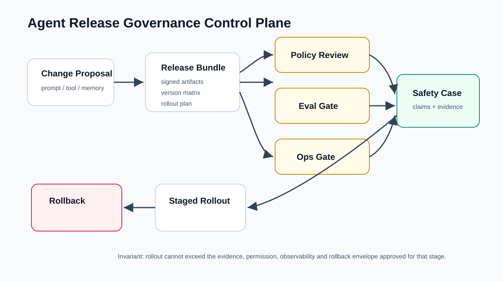
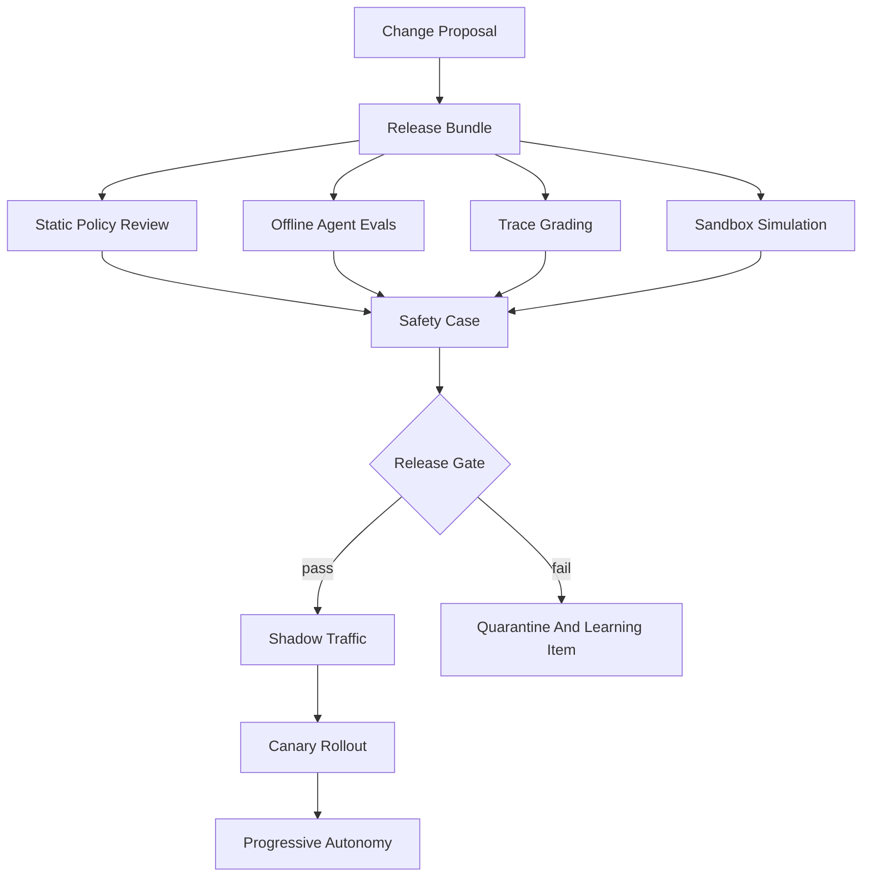
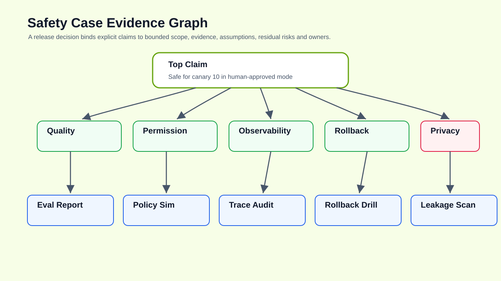
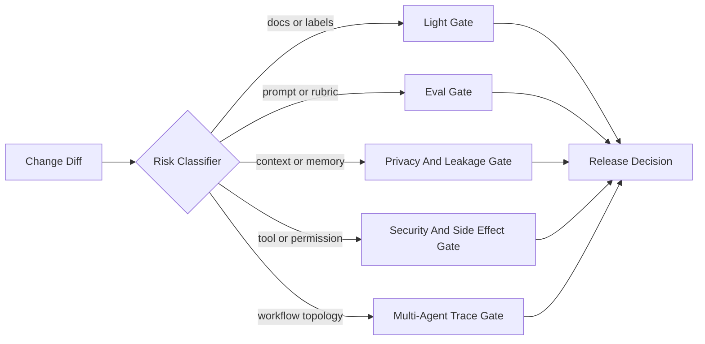
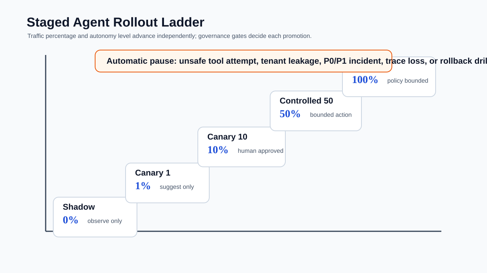
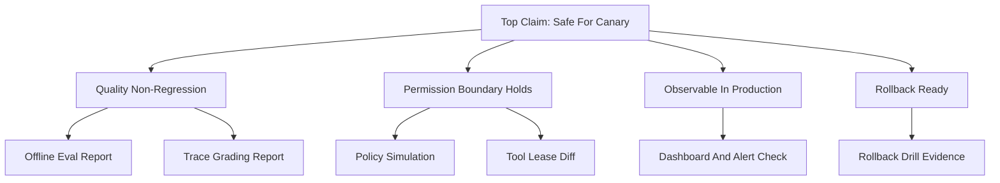
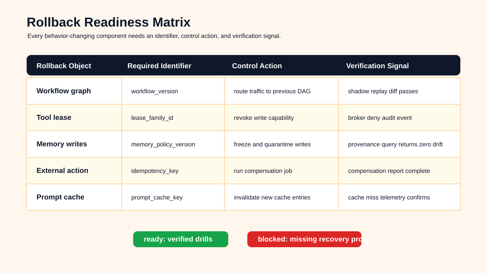
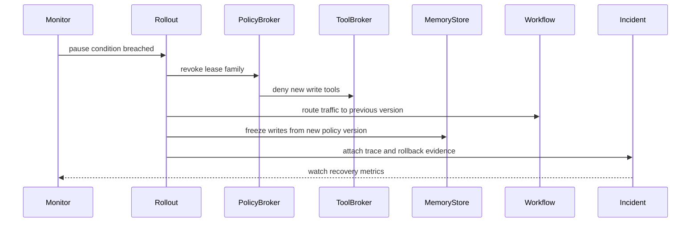

# 🛡️ 第十一课：Agent Release Governance：分阶段发布、策略评审、安全论证、版本治理与回滚就绪

> 第十课讨论了 Multi-Agent Harnesses：委派拓扑、上下文隔离、能力租约、协同协议与跨 agent trace 评估。第十一课继续向生产治理推进：当 agent harness 已经能够编排多个 agent、工具、记忆、评估与观测之后，真正困难的问题变成“什么样的变更可以发布，如何发布，发布后如何证明它仍然处于可接受风险内，以及失败时如何回滚”。Agent Release Governance 不是传统软件发布流程的简单迁移，而是面向概率行为系统、工具副作用系统与上下文依赖系统的证据化发布控制面。



## 🧷 目录

- [🧭 核心观点：Agent 发布对象是一组行为边界](#-核心观点agent-发布对象是一组行为边界)
- [📦 发布单元：Release Bundle](#-发布单元release-bundle)
- [🧪 证据门：Eval、Trace、Policy 与 Observability](#-证据门evaltracepolicy-与-observability)
- [🧾 Safety Case：结构化发布论证](#-safety-case结构化发布论证)
- [🚦 分阶段发布：流量与自治双轴推进](#-分阶段发布流量与自治双轴推进)
- [🧬 版本治理：兼容矩阵](#-版本治理兼容矩阵)
- [🧯 回滚就绪：停止、降级与补偿](#-回滚就绪停止降级与补偿)
- [🧰 工程实现示例](#-工程实现示例)
- [📚 官方资料](#-官方资料)

## 🧭 核心观点：Agent 发布对象是一组行为边界

在传统软件系统中，发布对象通常是代码、镜像、配置和数据库迁移。在 AI Agent Harness Engineering 中，发布对象更复杂：一个 agent 的行为不仅由模型名称决定，还由 instructions、context builder、memory retrieval、tool schema、permission policy、sandbox profile、guardrail、workflow graph、subagent role、eval dataset、trace grader、human gate 与 rollout policy 共同决定。

因此，Agent Release Governance 的第一原则是：发布的不是“一个更聪明的助手”，而是一组可执行、可审计、可回滚的行为边界。发布治理必须回答以下问题。

| 问题 | 传统发布视角 | Agent Harness 发布视角 |
|---|---|---|
| 发布了什么 | 代码包、镜像、配置 | agent role、prompt、tool schema、memory policy、workflow graph、eval rubric、guardrail 与 rollout plan |
| 如何验证 | 单元测试、集成测试、性能测试 | trajectory eval、trace grading、tool side-effect audit、policy simulation、human review、shadow traffic |
| 风险来自哪里 | 代码缺陷、依赖漏洞、容量不足 | 上下文污染、工具越权、记忆泄漏、非确定性决策、评估集污染、协同错误 |
| 谁批准 | 工程负责人、变更委员会 | 产品、工程、安全、合规、AgentOps、领域专家和自动证据门 |
| 如何回滚 | 部署旧版本 | 停止 rollout、冻结工具租约、切回旧 workflow、禁用 memory 写入、恢复 eval baseline |

OpenAI 官方 Agents 文档强调 agent 应用需要工具、协作、状态、审批、追踪、评估与监控；OpenAI trace grading 与 agent evals 文档强调对 agent trace 的结构化评分和回归验证；Anthropic Claude Code 的 subagents、settings 与 hooks 文档体现了子 agent、工具权限、项目配置和工具前后钩子的工程边界。Release Governance 的作用，是把这些能力从“运行时功能”提升为“可审计发布合同”。



## 📦 发布单元：Release Bundle

发布治理的起点是 release bundle。它不是一个口头说明，而是一份机器可读、可签名、可比较、可回放的发布合同。它描述本次发布改变了哪些 agent 行为边界、依赖哪些证据、要求哪些 rollout 条件、提供哪些回滚动作。



| Bundle 组成 | 典型文件 | 治理意义 |
|---|---|---|
| Agent contract | `agents/refund_planner.v4.yaml` | 定义角色、输入、输出、工具、预算与失败模式 |
| Prompt/instruction | `prompts/refund_planner.v4.md` | 记录自然语言控制面的版本变化 |
| Tool schema | `tools/refund_api.v2.schema.json` | 明确工具参数、权限、幂等性和副作用 |
| Context policy | `context/refund_context_policy.v3.yaml` | 定义检索源、脱敏、压缩与引用规则 |
| Memory policy | `memory/customer_memory_policy.v2.yaml` | 定义记忆写入、保留、遗忘和租户隔离 |
| Eval dataset | `evals/refund_agent_regression_2026_05.jsonl` | 固化发布前必须通过的轨迹样本 |
| Trace grader | `graders/refund_trace_grader.v2.py` | 对工具调用、证据引用和安全行为评分 |
| Rollout plan | `rollout/refund_agent_2026_05_26.yaml` | 定义阶段、流量、指标、暂停条件与回滚动作 |

一个最小 release bundle 可以用如下 YAML 表示：

```yaml
release_id: agent_refund_planner_2026_05_26
owner: agentops-platform
risk_tier: high
change_summary:
  - upgrade_agent_contract: refund_planner.v3 -> refund_planner.v4
  - add_tool: refund_api.preview_adjustment.v2
  - tighten_context_policy: pii_redaction.required
artifacts:
  agent_contract: agents/refund_planner.v4.yaml
  tool_schemas:
    - tools/refund_api.v2.schema.json
  context_policy: context/refund_context_policy.v3.yaml
  memory_policy: memory/customer_memory_policy.v2.yaml
  workflow_graph: workflows/refund_resolution.v5.yaml
evidence:
  offline_eval_report: artifacts/evals/refund_regression_2026_05_26.json
  trace_grading_report: artifacts/traces/refund_trace_grade_2026_05_26.json
  policy_simulation: artifacts/policy/refund_policy_sim_2026_05_26.json
  rollback_drill: artifacts/rollback/refund_rollback_drill_2026_05_26.json
rollout:
  strategy: staged
  stages:
    - name: shadow
      traffic_percent: 0
      autonomy: observe_only
    - name: canary_1
      traffic_percent: 1
      autonomy: suggest_only
    - name: canary_10
      traffic_percent: 10
      autonomy: human_approved_action
rollback:
  primary_action: disable_workflow_version
  secondary_action: revoke_tool_lease_family
  data_repair: replay_compensation_jobs
```

### 🧩 变更类型决定证据强度

| 变更类型 | 示例 | 风险等级 | 最低证据要求 |
|---|---|---:|---|
| 说明性变更 | dashboard 标签、日志字段说明 | 低 | smoke trace、文档审查 |
| Prompt 变更 | 修改 agent 指令、rubric 文案 | 中 | regression eval、trace diff、人工 spot check |
| Context 变更 | 新增检索源、改变压缩策略 | 中高 | context eval、引用覆盖率、泄漏扫描 |
| Tool schema 变更 | 新增参数、放宽枚举 | 高 | schema diff、policy simulation、side-effect replay |
| Permission 变更 | 读权限变写权限 | 极高 | 安全审查、dual approval、rollback drill |
| Workflow 变更 | 增加 subagent、改变路由 | 高 | multi-agent trace eval、deadlock simulation |
| Memory 变更 | 新增长期记忆写入 | 极高 | 隐私审查、租户隔离测试、遗忘流程演练 |



## 🧪 证据门：Eval、Trace、Policy 与 Observability

Agent 发布失败常见于“最终答案看起来正确，但中间路径已经越界”。例如，agent 最终给出正确退款建议，却在过程中读取了不必要的隐私字段；或者 reviewer 最终批准了变更，但 executor 曾尝试调用未授权工具。Release Gate 必须同时观察结果质量和路径质量。



| 证据门 | 检查对象 | 通过信号 | 失败信号 |
|---|---|---|---|
| Offline eval gate | 固定 eval dataset | 质量分数不低于 baseline，关键任务无回归 | pass@k 下降、拒答率异常、幻觉率升高 |
| Trace grading gate | 决策、工具调用、证据引用 | 高风险步骤有证据链，工具调用符合策略 | 无引用结论、越权工具尝试、无效重试 |
| Policy simulation gate | 权限、预算、工具副作用 | 所有 delegation 均获得合法 lease | lease 扩散、参数越界、审批缺失 |
| Sandbox replay gate | 工具调用与副作用 | 可回放、可补偿、无外部污染 | 非幂等写入、不可恢复副作用 |
| Observability readiness gate | 指标、日志、span、告警 | 关键 SLO 与告警已配置 | 失败不可见、trace 断裂、缺少 tenant 维度 |
| Human review gate | 高风险语义判断 | blocking findings 已处理 | 风险接受没有负责人或到期日 |

推荐的发布门指标如下。

| 指标 | 定义 | 典型阈值 | 解释 |
|---|---|---:|---|
| `task_success_rate` | 成功完成任务数 / 总任务数 | 不低于 baseline - 1% | 结果质量底线 |
| `unsafe_tool_attempt_rate` | 未授权工具尝试 / trace 数 | 0 | 工具边界不可回归 |
| `uncited_claim_rate` | 无证据结论 / 总结论 | 小于 2% | 防止无来源事实进入决策 |
| `human_override_rate` | 人工覆盖 agent 决策 / 可执行决策 | 不高于 baseline + 3% | 衡量自治质量 |
| `rollback_time_seconds` | 从触发回滚到恢复旧版本 | 小于 300 秒 | 回滚必须是工程事实 |
| `trace_completeness` | 含完整 span 的 trace / trace 总数 | 大于 99% | 事故后可解释性 |
| `tenant_leakage_findings` | 租户隔离扫描发现数 | 0 | 隐私边界 |

```json
{
  "release_gate": "agent_refund_planner_2026_05_26",
  "baseline": "agent_refund_planner_2026_04_30",
  "metrics": {
    "task_success_rate": {"current": 0.934, "baseline": 0.929, "decision": "pass"},
    "unsafe_tool_attempt_rate": {"current": 0.0, "threshold": 0.0, "decision": "pass"},
    "uncited_claim_rate": {"current": 0.011, "threshold": 0.02, "decision": "pass"},
    "human_override_rate": {"current": 0.071, "baseline": 0.067, "decision": "warn"},
    "rollback_time_seconds": {"current": 188, "threshold": 300, "decision": "pass"},
    "trace_completeness": {"current": 0.997, "threshold": 0.99, "decision": "pass"}
  },
  "decision": "pass_with_watch"
}
```

## 🧾 Safety Case：结构化发布论证

Safety case 是高风险 agent 发布的核心治理工件。它不是泛泛声明“测试通过”，而是用论点、证据和假设说明：在给定环境、给定权限、给定流量、给定回滚能力下，本次发布的残余风险为什么可以接受。

| 工件 | 回答的问题 | 常见缺陷 |
|---|---|---|
| Eval report | “新版本在样本集上表现如何？” | 只覆盖结果，不覆盖权限和回滚 |
| Trace grading report | “行为路径是否符合预期？” | 评分器本身可能过窄 |
| Policy simulation | “工具、权限、预算是否越界？” | 无法证明语义质量 |
| Observability report | “上线后能否看见问题？” | 指标存在但没有决策动作 |
| Safety case | “为什么在这个范围内发布是可接受的？” | 把证据堆砌成附件，没有明确论证 |

```yaml
safety_case:
  release_id: agent_refund_planner_2026_05_26
  top_claim: >
    refund_planner.v4 can be released to 10 percent suggest-only traffic
    without increasing unsafe financial actions or privacy leakage.
  context:
    traffic_scope: consumer_refund_requests_us
    autonomy_level: suggest_only
    tool_boundary: read_customer_order, preview_adjustment
  assumptions:
    - customer data classification labels are complete
    - preview_adjustment has no external financial side effect
    - human approvers remain in the execution loop
  evidence:
    - id: eval_report
      path: artifacts/evals/refund_regression_2026_05_26.json
      supports: task_quality_non_regression
    - id: trace_grade
      path: artifacts/traces/refund_trace_grade_2026_05_26.json
      supports: safe_reasoning_path
    - id: policy_sim
      path: artifacts/policy/refund_policy_sim_2026_05_26.json
      supports: permission_boundary
    - id: rollback_drill
      path: artifacts/rollback/refund_rollback_drill_2026_05_26.json
      supports: recovery_readiness
  residual_risks:
    - risk: model may over-recommend goodwill credits for ambiguous cases
      mitigation: human approval required above 20 USD
      owner: support-risk-lead
      review_by: 2026-06-04
  decision:
    status: approved_for_canary_10
```



## 🚦 分阶段发布：流量与自治双轴推进

Agent release 的 rollout 不应只按流量百分比推进，还应按自治等级推进。一个新版本可以先在 shadow 模式读取真实输入但不影响用户，再进入 suggest-only，再进入 human-approved action，最后才进入 bounded autonomous action。流量和自治是两个独立轴。

| 阶段 | 流量 | 自治等级 | 工具权限 | 退出条件 |
|---|---:|---|---|---|
| Shadow | 0% 用户可见 | observe only | read-only stub | trace 完整，离线评分无异常 |
| Canary 1 | 1% | suggest only | read-only + preview tool | 无隐私泄漏，无高危错误 |
| Canary 10 | 10% | human-approved action | limited write via approval | override rate 稳定，回滚演练通过 |
| Controlled 50 | 50% | bounded action | scoped write with lease | SLO 稳定，无 P0/P1 incident |
| General Availability | 100% | policy-bounded autonomy | production tool lease | 周期性审计与 drift watch |

```yaml
rollout_plan:
  release_id: agent_refund_planner_2026_05_26
  promotion_policy:
    min_stage_duration_minutes: 60
    require_no_open_p0_p1_incidents: true
    require_trace_completeness: 0.99
  stages:
    - name: shadow
      traffic_percent: 0
      autonomy_level: observe_only
      allowed_tools: [customer_order.read, refund_policy.read]
      pause_if:
        unsafe_tool_attempt_rate: "> 0"
        trace_completeness: "< 0.99"
    - name: canary_1
      traffic_percent: 1
      autonomy_level: suggest_only
      allowed_tools: [customer_order.read, refund_adjustment.preview]
      pause_if:
        task_success_rate_delta: "< -0.02"
        uncited_claim_rate: "> 0.02"
    - name: canary_10
      traffic_percent: 10
      autonomy_level: human_approved_action
      allowed_tools: [refund_adjustment.submit_requires_human]
      pause_if:
        human_override_rate: "> 0.10"
        rollback_time_seconds: "> 300"
```

## 🧬 版本治理：兼容矩阵

Agent Harness 的版本治理比服务版本号更细。单独升级模型可能改变工具选择倾向；单独升级 prompt 可能破坏 trace grader；单独升级 memory policy 可能改变上下文分布；单独升级 tool schema 可能使旧 agent 产生无效参数。成熟系统需要兼容矩阵，而不是把所有内容隐藏在一个 `latest` 标签后面。

| 组件 | 版本例子 | 与谁兼容 | 不兼容风险 |
|---|---|---|---|
| Model profile | `reasoning_profile.v6` | prompt、tool selection policy、latency budget | 成本、延迟、工具选择变化 |
| Agent contract | `refund_planner.v4` | workflow graph、trace grader、eval dataset | 输出 schema 破坏 downstream |
| Prompt | `refund_instruction.v8` | agent contract、safety case | 语义边界漂移 |
| Tool schema | `refund_api.v2` | tool broker、policy broker、sandbox | 参数越权或副作用变化 |
| Context policy | `refund_context.v3` | retrieval index、redaction rules | 泄漏、遗漏、引用不完整 |
| Memory policy | `customer_memory.v2` | tenant policy、privacy review | 过期记忆、跨租户污染 |
| Workflow graph | `refund_resolution.v5` | subagent roles、handoff protocol | 协同死锁、责任漂移 |
| Eval dataset | `refund_regression.2026_05` | trace grader、release gate | 数据集污染、覆盖不足 |

```json
{
  "compatibility_matrix": {
    "release_id": "agent_refund_planner_2026_05_26",
    "agent_contract": "refund_planner.v4",
    "compatible": {
      "model_profiles": ["reasoning_profile.v5", "reasoning_profile.v6"],
      "tool_schemas": ["refund_api.v2"],
      "context_policies": ["refund_context.v3"],
      "memory_policies": ["customer_memory.v2"],
      "workflow_graphs": ["refund_resolution.v5"],
      "trace_graders": ["refund_trace_grader.v2"],
      "eval_datasets": ["refund_regression.2026_05"]
    },
    "blocked": [
      {"component": "refund_api.v3", "reason": "adds external-write submit endpoint without updated approval policy"},
      {"component": "customer_memory.v1", "reason": "does not support tenant-scoped forgetting"}
    ]
  }
}
```

## 🧯 回滚就绪：停止、降级与补偿

对于 agent 系统，回滚不是“重新部署旧镜像”那么简单。若新 agent 写入了长期记忆、触发了外部工具、改变了 workflow state、产生了用户可见建议，则回滚必须处理状态残留。发布前必须证明三件事：控制面能停止新行为，数据面能识别新版本产生的状态，补偿面能修复可逆副作用。



| 回滚对象 | 需要保留的标识 | 回滚动作 | 验证方式 |
|---|---|---|---|
| Agent workflow | `workflow_version` | 切回旧 DAG | shadow replay 对比 |
| Tool lease | `lease_family_id` | 撤销新 lease | policy broker audit |
| Memory write | `memory_policy_version` | 冻结或删除新写入 | memory provenance query |
| External action | `action_id`、`idempotency_key` | 补偿或撤销 | compensation job report |
| Eval baseline | `baseline_id` | 恢复旧门限 | release gate replay |
| Prompt cache | `prompt_cache_key` | 失效新 cache | cache invalidation log |



## 🧰 工程实现示例

### 🐍 Python：Release Bundle 证据门校验器

```python
from __future__ import annotations

from dataclasses import dataclass
from pathlib import Path
from typing import Any
import json
import yaml


@dataclass(frozen=True)
class GateDecision:
    name: str
    passed: bool
    reason: str


class ReleaseGate:
    def __init__(self, bundle_path: Path) -> None:
        self.bundle_path = bundle_path
        self.bundle = yaml.safe_load(bundle_path.read_text(encoding="utf-8"))

    def _load_json_artifact(self, relative_path: str) -> dict[str, Any]:
        path = self.bundle_path.parent / relative_path
        if not path.exists():
            raise FileNotFoundError(f"missing release evidence: {path}")
        return json.loads(path.read_text(encoding="utf-8"))

    def check_eval_non_regression(self) -> GateDecision:
        report = self._load_json_artifact(self.bundle["evidence"]["offline_eval_report"])
        current = report["metrics"]["task_success_rate"]["current"]
        baseline = report["metrics"]["task_success_rate"]["baseline"]
        if current < baseline - 0.01:
            return GateDecision("offline_eval", False, f"success rate regressed: {current:.3f} < {baseline:.3f}")
        return GateDecision("offline_eval", True, "task success is within allowed regression budget")

    def check_no_unsafe_tool_attempts(self) -> GateDecision:
        report = self._load_json_artifact(self.bundle["evidence"]["trace_grading_report"])
        unsafe_attempts = report["metrics"]["unsafe_tool_attempt_count"]
        if unsafe_attempts != 0:
            return GateDecision("trace_grading", False, f"unsafe tool attempts found: {unsafe_attempts}")
        return GateDecision("trace_grading", True, "no unsafe tool attempts")

    def decide(self) -> dict[str, Any]:
        decisions = [
            self.check_eval_non_regression(),
            self.check_no_unsafe_tool_attempts(),
        ]
        return {
            "release_id": self.bundle["release_id"],
            "passed": all(decision.passed for decision in decisions),
            "decisions": [decision.__dict__ for decision in decisions],
        }
```

### 🧾 TypeScript：Agent Rollout Policy as Code

```typescript
type AutonomyLevel = "observe_only" | "suggest_only" | "human_approved_action" | "bounded_action";

type StageMetrics = {
  taskSuccessRate: number;
  unsafeToolAttemptRate: number;
  uncitedClaimRate: number;
  humanOverrideRate: number;
  traceCompleteness: number;
  openP0P1Incidents: number;
};

type PromotionDecision = { promote: boolean; reasons: string[] };

export function decidePromotion(metrics: StageMetrics, baselineTaskSuccessRate: number): PromotionDecision {
  const reasons: string[] = [];
  if (metrics.openP0P1Incidents > 0) reasons.push("open P0/P1 incident blocks promotion");
  if (metrics.traceCompleteness < 0.99) reasons.push("trace completeness is below 99%");
  if (metrics.unsafeToolAttemptRate > 0) reasons.push("unsafe tool attempts must remain zero");
  if (metrics.uncitedClaimRate > 0.02) reasons.push("uncited claim rate exceeds release threshold");
  if (metrics.taskSuccessRate < baselineTaskSuccessRate - 0.01) reasons.push("task success regressed beyond allowed budget");
  if (metrics.humanOverrideRate > 0.10) reasons.push("human override rate suggests weak autonomy quality");
  return { promote: reasons.length === 0, reasons };
}
```

### 🗃️ SQL：从 Trace 与 Incident 表计算发布门

```sql
WITH candidate_traces AS (
  SELECT
    trace_id,
    release_id,
    task_success,
    unsafe_tool_attempt_count,
    uncited_claim_count,
    human_overridden,
    trace_complete,
    started_at
  FROM agent_trace_summary
  WHERE release_id = 'agent_refund_planner_2026_05_26'
    AND started_at >= now() - interval '60 minutes'
),
incident_window AS (
  SELECT count(*) AS open_p0_p1_incidents
  FROM incident
  WHERE release_id = 'agent_refund_planner_2026_05_26'
    AND severity IN ('P0', 'P1')
    AND status IN ('open', 'mitigating')
)
SELECT
  count(*) AS trace_count,
  avg(CASE WHEN task_success THEN 1.0 ELSE 0.0 END) AS task_success_rate,
  sum(unsafe_tool_attempt_count)::float / greatest(count(*), 1) AS unsafe_tool_attempt_rate,
  sum(uncited_claim_count)::float / greatest(count(*), 1) AS uncited_claim_rate,
  avg(CASE WHEN human_overridden THEN 1.0 ELSE 0.0 END) AS human_override_rate,
  avg(CASE WHEN trace_complete THEN 1.0 ELSE 0.0 END) AS trace_completeness,
  max(incident_window.open_p0_p1_incidents) AS open_p0_p1_incidents
FROM candidate_traces
CROSS JOIN incident_window;
```

### ⚖️ OPA/Rego：禁止高风险工具在低证据发布中放量

```rego
package agent_release

default allow = false

high_risk_tool(tool) {
  tool.side_effect_class == "external-write"
}

has_required_high_risk_evidence {
  input.evidence.security_review.status == "approved"
  input.evidence.policy_simulation.status == "pass"
  input.evidence.rollback_drill.status == "pass"
}

deny[msg] {
  some tool in input.tools
  high_risk_tool(tool)
  not has_required_high_risk_evidence
  msg := sprintf("tool %s is external-write but high-risk evidence is incomplete", [tool.name])
}

allow {
  count(deny) == 0
  input.release_gate.offline_eval.status == "pass"
  input.release_gate.trace_grading.status == "pass"
  input.release_gate.observability.status == "pass"
}
```

### 🔐 人工批准也必须版本化

人工审批不是治理的反面。相反，高风险 agent 发布需要明确记录谁在什么证据下接受了哪一类残余风险。未结构化的“同意上线”无法支持事故复盘。

| 审批字段 | 示例 | 目的 |
|---|---|---|
| `approver_id` | `security-review-team` | 确认责任主体 |
| `scope` | `canary_10_suggest_only` | 防止审批被扩大解释 |
| `evidence_refs` | `eval_report`, `policy_sim` | 绑定审批依据 |
| `residual_risks` | `ambiguous goodwill credit` | 记录被接受的风险 |
| `expires_at` | `2026-06-04T00:00:00Z` | 避免永久授权 |
| `revocation_condition` | `override_rate > 10%` | 明确自动撤销条件 |

## 🏁 结论：Agent Release Governance 的目标是可证明的渐进自治

Agent Release Governance 的核心不是减慢发布，而是把自治系统的发布变成可证明、可追踪、可暂停、可回滚的工程过程。成熟的 agent harness 不会只问“这个 agent 在样本上答得好吗”，而会同时追问：它使用了哪些上下文，调用了哪些工具，是否遵守了权限，是否留下了完整 trace，是否有足够证据支持安全论证，是否能在事故发生前降低自治等级，是否能在事故发生后恢复到已知良好状态。

从第八课的 eval dataset、第九课的 production AgentOps、第十课的 multi-agent harness，到本课的 release governance，学习路径已经形成一个闭环：开发者不只是构建 agent，也是在构建 agent 的可验证发布制度。这个制度让模型能力可以被谨慎地转化为生产自治，而不是让生产系统被一次不可解释的模型行为牵引。

## 📚 官方资料

- [OpenAI Agents SDK](https://developers.openai.com/api/docs/guides/agents)：官方说明 agent 应用的工具调用、协作、状态、审批、追踪与运行时模式。
- [OpenAI Evaluate agent workflows](https://developers.openai.com/api/docs/guides/agent-evals)：官方说明使用 traces、graders、datasets 与 eval runs 改进 agent 质量。
- [OpenAI Trace grading](https://developers.openai.com/api/docs/guides/trace-grading)：官方说明对 agent trace 中决策、工具调用与行为路径进行结构化评分。
- [Anthropic Claude Code Subagents](https://docs.anthropic.com/en/docs/claude-code/sub-agents)：官方说明子 agent 的独立上下文、工具配置与任务委派。
- [Anthropic Claude Code Settings](https://docs.anthropic.com/en/docs/claude-code/settings)：官方说明项目与用户级配置、权限 allow/ask/deny 和敏感文件排除。
- [Anthropic Claude Code Hooks](https://docs.anthropic.com/en/docs/claude-code/hooks)：官方说明工具调用前后、会话、子 agent 停止等事件钩子及控制行为。
- [GitHub Actions Deployments and Environments](https://docs.github.com/en/actions/how-tos/deploy/configure-and-manage-deployments/control-deployments)：官方说明 required reviewers、wait timer、branch restriction、custom deployment protection rules 与 environment secrets。
- [SLSA Provenance](https://slsa.dev/spec/v1.2/provenance)：官方规范说明构建来源、builder、materials 等 provenance 信息。
- [SLSA Security Levels](https://slsa.dev/spec/v1.0/levels)：官方说明供应链构建可信度与 provenance 级别，可作为 agent release bundle provenance 的参考模型。

Terrence Shen  
Email: slamshenxin@gmail.com  
Located in China
