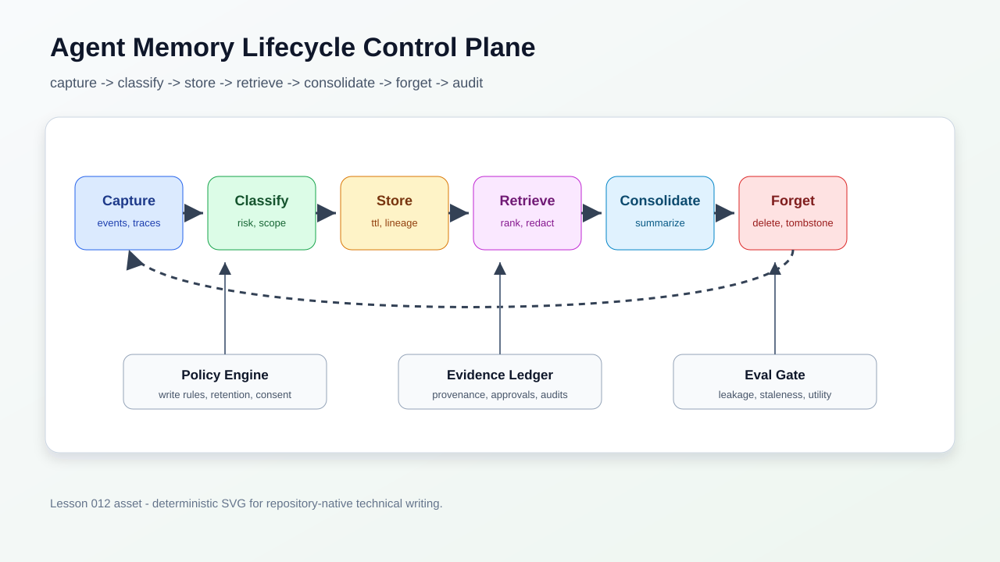
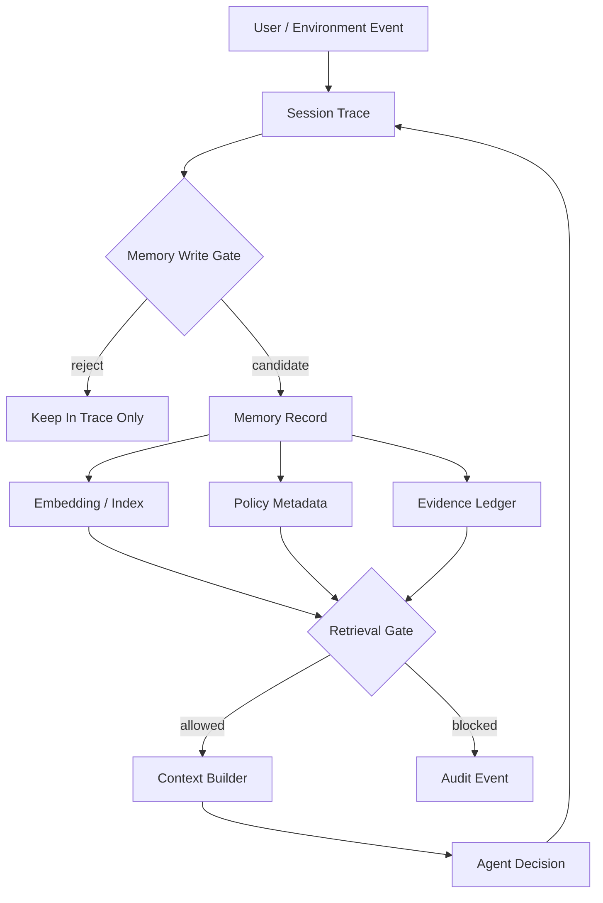
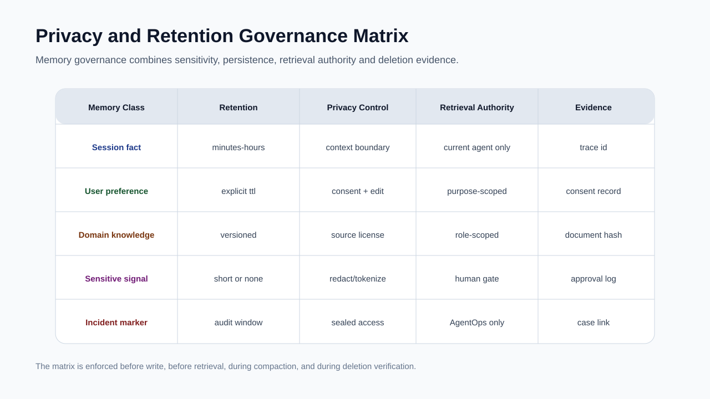
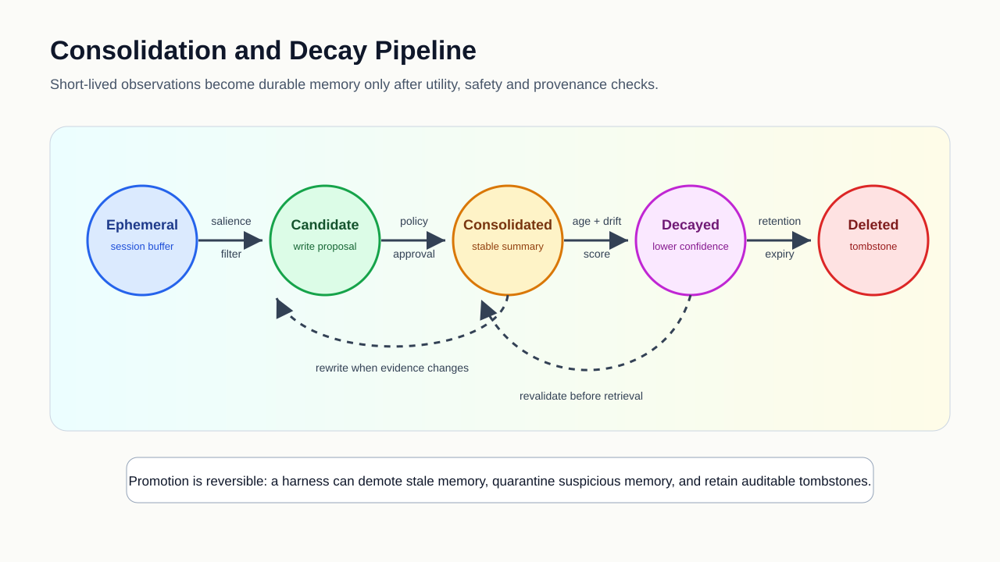
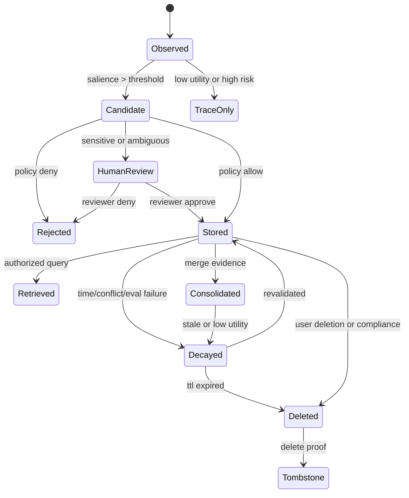
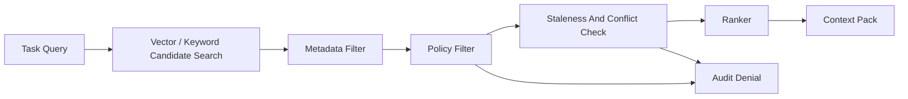
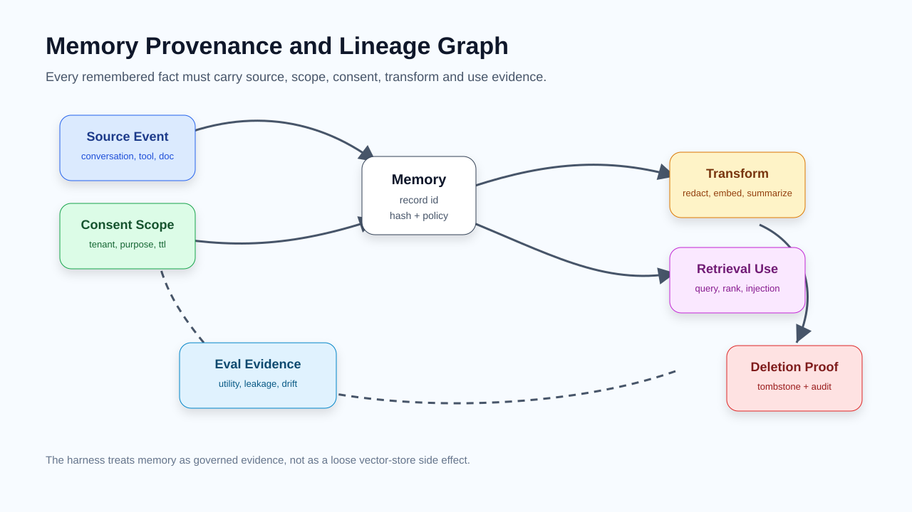
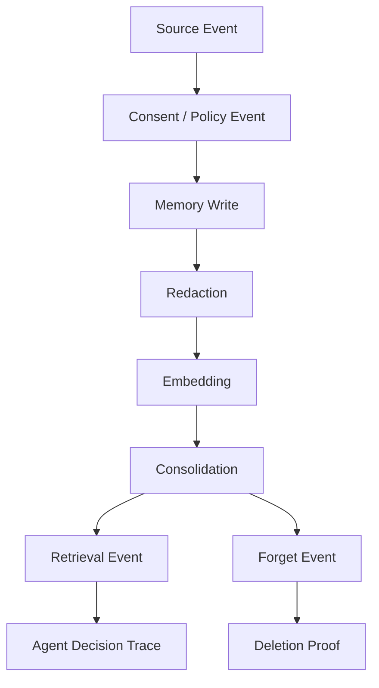
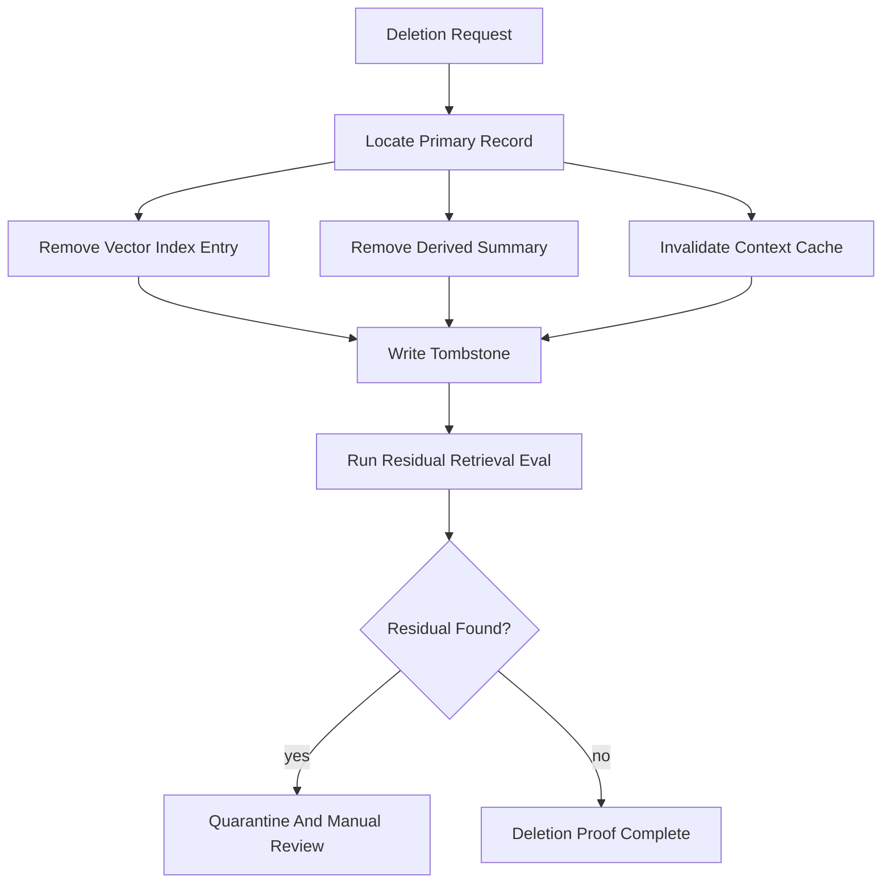
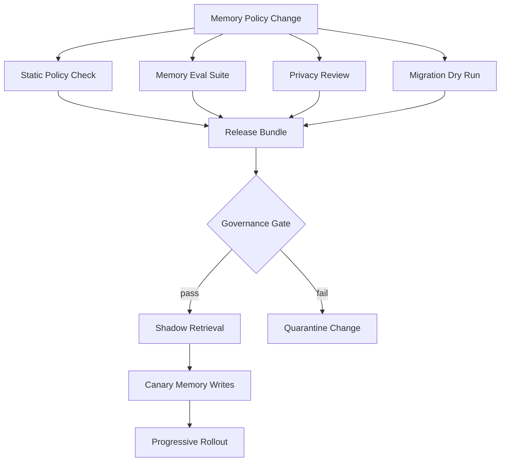

# 🧠 第十二课：Agent Memory Management：生命周期、来源谱系、衰减、隐私治理与可遗忘性

> 第十一课讨论了 Agent Release Governance：release bundle、证据门、安全论证、灰度发布、版本兼容与回滚就绪。第十二课继续深入一个更细但更危险的运行时对象：memory。对于 AI Agent Harness Engineering 而言，memory 不是“把历史对话塞进向量库”的工程小技巧，而是会持续改变 agent 行为边界的状态系统。它必须被当作可治理、可审计、可衰减、可删除、可评估的运行时资产。



## 🧷 目录

- [🧭 核心观点：Memory 是行为状态，不只是上下文缓存](#-核心观点memory-是行为状态不只是上下文缓存)
- [🗂️ Memory 分类：从 ephemeral context 到 governed long-term memory](#️-memory-分类从-ephemeral-context-到-governed-long-term-memory)
- [🧬 生命周期控制面：写入、检索、合并、衰减与遗忘](#-生命周期控制面写入检索合并衰减与遗忘)
- [🔎 来源谱系：每条记忆都必须能解释从何而来](#-来源谱系每条记忆都必须能解释从何而来)
- [🧪 Memory Eval：效用、泄漏、污染、陈旧性与行为漂移](#-memory-eval效用泄漏污染陈旧性与行为漂移)
- [🔐 隐私与保留治理：purpose、tenant、TTL 与删除证明](#-隐私与保留治理purposetenantttl-与删除证明)
- [🧰 工程实现示例](#-工程实现示例)
- [🚦 发布与运维：Memory Policy 也必须进入 Release Bundle](#-发布与运维memory-policy-也必须进入-release-bundle)
- [📚 官方资料](#-官方资料)

## 🧭 核心观点：Memory 是行为状态，不只是上下文缓存

在传统软件系统中，状态通常由数据库、缓存、消息队列或文件系统承载；状态迁移可以通过 schema migration、事务日志、备份恢复和权限模型进行治理。在 agent harness 中，memory 同样是状态，但它的影响路径更加隐蔽：一条被写入的偏好、事实、总结、失败案例或工具观察，可能在数天后通过 retrieval 进入 prompt，改变模型的推理路径、工具选择、风险判断和最终行动。

因此，Agent Memory Management 的基本命题是：**记忆不是附属于模型的便利功能，而是 agent harness 对未来行为施加影响的状态控制面**。一旦承认这一点，memory 就不能只由 embedding similarity 或最近使用时间驱动，而必须被 policy、provenance、privacy、eval 和 release governance 共同约束。

| 视角 | 非治理式记忆实现 | Agent Harness Memory Management |
|---|---|---|
| 写入条件 | 看到有用信息就保存 | 经过 salience、consent、scope、risk、source quality 与 retention policy 判定 |
| 检索条件 | 语义相似度最高即注入 | 语义相关性、授权范围、时效性、敏感级别、任务目的共同裁决 |
| 记忆形态 | 原始文本或向量 | typed record、source event、policy metadata、hash、版本、转换链 |
| 删除语义 | 从数据库删除一行 | 删除主记录、向量索引、缓存副本、衍生摘要，并保留 tombstone 证据 |
| 质量验证 | 主观感觉更“懂用户” | memory utility、leakage、staleness、poisoning、drift 的可重复 eval |
| 发布治理 | 更新代码后顺带调整 | memory schema、policy、retriever、compactor 与 eval dataset 进入 release bundle |

OpenAI Agents 与 AgentKit 文档把工具、知识、guardrails、trace、eval 和 workflow 作为构建 agent 的核心部件；OpenAI file search 与 retrieval 文档强调 vector store、metadata filtering 和检索结果可包含在响应中；Anthropic Claude Code memory 文档展示了企业、项目、用户等层级化 memory 位置。本文不把这些能力当作产品功能清单，而把它们抽象为 agent harness 中 memory control plane 的工程要求。



## 🗂️ Memory 分类：从 ephemeral context 到 governed long-term memory

Agent harness 需要避免把所有历史信息混入同一个“长期记忆池”。不同 memory class 的风险、保留时间、检索方式和删除语义不同。如果没有分类，系统会在两个方向同时失败：有用事实被过早丢弃，敏感事实被过久保存。

| Memory Class | 典型内容 | 生命周期 | 主要风险 | Harness 控制 |
|---|---|---:|---|---|
| Ephemeral session memory | 当前任务中的临时约束、用户刚刚给出的参数 | 单 session | 上下文溢出、任务串扰 | session boundary、context compaction、trace-only 保留 |
| User preference memory | 语言偏好、输出格式偏好、常用工作流 | 显式 TTL 或长期 | 过度个性化、跨目的使用 | consent、可编辑、purpose scope、retrieval audit |
| Domain knowledge memory | 项目架构、业务规则、产品术语 | 随版本更新 | 陈旧事实、文档来源不明 | source hash、doc version、revalidation gate |
| Procedural memory | 处理某类任务的步骤、工具链、经验性策略 | 中长期 | 把旧策略套入新场景 | eval-backed promotion、rollback、policy version |
| Incident memory | 失败案例、回滚原因、安全事件标记 | 审计窗口内 | 污名化、错误归因、过度保守 | sealed access、case link、review board |
| Sensitive signal | 身份信息、密钥线索、健康/财务/合规相关信息 | 默认不写或极短 | 隐私泄漏、越权检索 | redaction、tokenization、human gate、delete proof |



### 🧩 Typed Memory Record

成熟 harness 不应只存储 `text + embedding`。它应保存 typed memory record，并让每个字段都参与治理。

| 字段 | 作用 | 示例 |
|---|---|---|
| `memory_id` | 稳定标识，支持删除证明与审计 | `mem_01HX...` |
| `class` | 决定策略和默认保留期 | `user_preference` |
| `subject_scope` | 记忆作用对象 | `user:42`、`project:billing`、`tenant:acme` |
| `purpose_scope` | 允许使用的任务目的 | `coding_assistance`、`customer_support` |
| `source_event_id` | 连接原始 trace 或文档 | `trace_2026_05_27_001` |
| `source_quality` | 来源可信度与确认方式 | `explicit_user_statement` |
| `sensitivity` | 隐私与合规级别 | `low`、`moderate`、`restricted` |
| `ttl` | 自动过期时间 | `P90D` |
| `confidence` | 当前可信度 | `0.82` |
| `decay_policy` | 随时间或冲突下降的规则 | `half_life: 30d` |
| `transform_chain` | 摘要、脱敏、embedding 等转换记录 | `redact:v2 -> embed:v3` |
| `tombstone_of` | 删除或替换关系 | `mem_old_id` |

```json
{
  "memory_id": "mem_20260527_001",
  "class": "user_preference",
  "subject_scope": "user:terrence",
  "purpose_scope": ["technical_writing", "coding_assistance"],
  "content": "用户偏好中文长文技术说明，标题可使用贴纸风格 emoji。",
  "source_event_id": "trace_20260527_lesson_request",
  "source_quality": "explicit_user_instruction",
  "sensitivity": "low",
  "ttl": "P180D",
  "confidence": 0.93,
  "decay_policy": { "type": "time_and_conflict", "half_life_days": 90 },
  "transform_chain": ["normalize:v1", "classify:v2", "embed:text-embedding-policy-v1"],
  "created_at": "2026-05-27T00:00:00Z"
}
```

## 🧬 生命周期控制面：写入、检索、合并、衰减与遗忘

Memory lifecycle control plane 是 agent harness 的状态机器。它把“是否记住”“何时使用”“何时降权”“何时删除”从 prompt 习惯变成可执行系统。



| 阶段 | 输入 | 决策 | 输出 | 常见失败 |
|---|---|---|---|---|
| Capture | trace、tool output、user message、文档片段 | 是否进入候选区 | candidate memory | 把工具噪声误记为事实 |
| Classify | 候选内容、上下文、policy | class、sensitivity、scope | typed proposal | 敏感级别低估 |
| Write Gate | proposal、consent、risk、dedupe | 允许、拒绝、human review | memory record 或 rejection | 未经同意保存偏好 |
| Retrieve Gate | query、task purpose、agent role | 允许注入哪些记忆 | ranked memory pack | 旧事实压过新证据 |
| Consolidate | 多条相似记忆、冲突事件 | 合并、改写、保留冲突 | stable summary | 总结丢失关键限制 |
| Decay | 时间、冲突、低使用率、eval 失败 | 降低 confidence 或 demote | decayed memory | 永久相信过期事实 |
| Forget | TTL、用户请求、合规要求、事故 | 删除主记录与衍生物 | tombstone、audit proof | 删除向量但遗留摘要 |



### 🧯 写入门不是“保存按钮”

Memory write gate 至少需要四类信号：salience、permission、scope、risk。salience 只能说明信息可能有用，不能说明它应该被保存。permission 说明是否得到用户或组织策略允许；scope 说明它能影响哪些 agent、租户、项目和任务；risk 说明它是否可能造成隐私泄漏、偏见、错误归因或安全绕过。

| 写入信号 | 问题 | 通过条件 |
|---|---|---|
| Salience | 信息是否对未来任务有稳定价值 | 多次出现、用户显式声明、与核心任务强相关 |
| Permission | 是否允许保存 | 用户明确同意、企业策略允许、无敏感限制 |
| Scope | 保存后能在哪使用 | tenant、project、user、purpose 明确 |
| Risk | 保存是否带来不成比例风险 | 敏感度低或已有脱敏、人审、短 TTL |
| Evidence | 将来能否追溯来源 | source event、trace、doc hash 可用 |

### 🧲 检索门要晚于向量相似度

向量检索负责找到“可能相关”的候选，harness 检索门负责决定“是否允许注入”。二者不能合并。若只按相似度注入，系统会把历史偏好、陈旧文档、其他租户数据或 incident marker 误带入当前任务。



## 🔎 来源谱系：每条记忆都必须能解释从何而来

当 agent 输出某个结论时，harness 应能够回答：该结论是否由 memory 影响？影响它的 memory 来自哪个 source event？是否经过摘要、脱敏、embedding、合并或降权？是否仍在授权范围内？如果这些问题无法回答，memory 就会成为不可审计的行为暗物质。



| 谱系对象 | 需要记录什么 | 为什么重要 |
|---|---|---|
| Source event | 原始对话、工具调用、文档版本、时间戳 | 证明 memory 不是凭空生成 |
| Consent event | 用户授权、企业策略、人审决定 | 证明保存与使用有合法目的 |
| Transform event | redact、summarize、embed、merge、decay | 追踪信息是否被改写或弱化 |
| Retrieval event | query、rank、filter、注入位置 | 判断 agent 行为是否受该 memory 影响 |
| Deletion event | 删除请求、执行结果、衍生物清理 | 证明可遗忘性不是声明 |



## 🧪 Memory Eval：效用、泄漏、污染、陈旧性与行为漂移

Memory eval 不应只测试“检索是否命中”。Agent harness 需要同时测量 memory 是否提升任务质量，以及它是否引入新的风险。一个优秀 memory 系统可能在某些任务中故意少记、少取、少注入，因为更少的状态有时意味着更少的错误。

| Eval 维度 | 指标 | 测试方法 | 失败信号 |
|---|---|---|---|
| Utility | 任务成功率、步骤减少、用户修正减少 | A/B trace replay、offline eval | 有 memory 后答案更啰嗦但不更正确 |
| Leakage | 跨用户、跨租户、跨 purpose 的泄漏率 | adversarial retrieval cases | 当前任务出现其他用户信息 |
| Staleness | 旧事实被使用比例 | 时间切片数据集、版本冲突样本 | 旧 API 规则覆盖新文档 |
| Poisoning | 恶意或低质来源进入长期记忆 | injection fixtures、tool-output traps | 把网页提示词当成用户偏好 |
| Drift | 行为边界变化 | release baseline 对比 | agent 变得过度自信或过度保守 |
| Deletion | 删除后残留率 | delete-and-query suite | 主记录删除后摘要仍可检索 |

```yaml
memory_eval_suite:
  name: customer_support_memory_regression
  version: 2026-05-27
  datasets:
    - name: utility_replay
      traces: evals/memory/utility/*.jsonl
    - name: cross_tenant_leakage
      traces: evals/memory/leakage/*.jsonl
    - name: deletion_residual
      traces: evals/memory/deletion/*.jsonl
  gates:
    utility_delta_min: 0.03
    leakage_rate_max: 0.000
    stale_fact_rate_max: 0.010
    deletion_residual_rate_max: 0.000
    poisoning_acceptance_rate_max: 0.005
```

## 🔐 隐私与保留治理：purpose、tenant、TTL 与删除证明

Memory governance 的核心不是“能否加密数据库”这么简单，而是目的限制、租户隔离、保留时间、可编辑性、可删除性和证据化审计的组合。一个 memory record 即使没有显式个人身份信息，也可能通过偏好、工作流、项目细节或 incident history 形成可识别画像。

| 控制项 | 工程含义 | Harness 实现 |
|---|---|---|
| Purpose limitation | 记忆只能服务声明目的 | `purpose_scope` 与 task intent classifier 绑定 |
| Tenant isolation | 不同组织、项目、用户之间不可串扰 | namespace、encryption key、retrieval filter 三重隔离 |
| Data minimization | 只保存必要摘要 | 原文 trace 与长期 memory 分层，默认 summary + hash |
| Retention | 到期自动降权或删除 | TTL job、decay scheduler、tombstone ledger |
| Editability | 用户或管理员可修正 | memory review UI、patch event、版本链 |
| Delete proof | 删除不是静默动作 | 主存储、索引、缓存、摘要、备份策略的证据记录 |



## 🧰 工程实现示例

以下示例展示一个 harness 如何把 memory policy、写入门、检索门、衰减任务和 eval gate 组合起来。代码不是完整产品实现，而是说明可执行边界应如何表达。

### 🧾 Memory Policy YAML

```yaml
version: memory-policy.v1
classes:
  user_preference:
    default_ttl_days: 180
    require_explicit_consent: true
    allowed_purposes: [technical_writing, coding_assistance]
    max_sensitivity: low
    retrieval:
      max_items: 6
      require_subject_match: true
      staleness_days: 120
  domain_knowledge:
    default_ttl_days: 365
    require_source_hash: true
    allowed_purposes: [coding_assistance, incident_review]
    retrieval:
      require_document_version: true
      conflict_resolution: prefer_newer_source
  sensitive_signal:
    write_default: deny
    exceptions:
      - purpose: incident_review
        require_human_approval: true
        ttl_days: 14
```

### 🧮 SQL Schema

```sql
create table agent_memory_records (
  memory_id text primary key,
  memory_class text not null,
  subject_scope text not null,
  purpose_scope jsonb not null,
  content_redacted text not null,
  source_event_id text not null,
  source_hash text,
  sensitivity text not null,
  confidence numeric not null check (confidence >= 0 and confidence <= 1),
  expires_at timestamptz,
  policy_version text not null,
  transform_chain jsonb not null,
  tombstone_of text,
  created_at timestamptz not null default now(),
  updated_at timestamptz not null default now()
);

create index agent_memory_scope_idx
  on agent_memory_records (memory_class, subject_scope, sensitivity);
```

### 🧠 Python 写入门

```python
from dataclasses import dataclass
from datetime import datetime, timedelta, timezone
from typing import Literal

Sensitivity = Literal["low", "moderate", "restricted"]

@dataclass(frozen=True)
class MemoryProposal:
    memory_class: str
    subject_scope: str
    purpose_scope: list[str]
    content: str
    source_event_id: str
    source_quality: str
    sensitivity: Sensitivity
    salience: float
    explicit_consent: bool

@dataclass(frozen=True)
class WriteDecision:
    action: Literal["allow", "deny", "review"]
    reason: str
    ttl_days: int | None = None


def decide_memory_write(proposal: MemoryProposal, policy: dict) -> WriteDecision:
    class_policy = policy["classes"].get(proposal.memory_class)
    if class_policy is None:
        return WriteDecision("deny", "unknown_memory_class")

    if proposal.salience < 0.62:
        return WriteDecision("deny", "low_salience_trace_only")

    if class_policy.get("require_explicit_consent") and not proposal.explicit_consent:
        return WriteDecision("deny", "missing_explicit_consent")

    allowed = set(class_policy.get("allowed_purposes", []))
    if not set(proposal.purpose_scope).issubset(allowed):
        return WriteDecision("deny", "purpose_scope_not_allowed")

    if proposal.sensitivity == "restricted":
        return WriteDecision("review", "restricted_memory_requires_human_gate")

    ttl_days = class_policy.get("default_ttl_days")
    return WriteDecision("allow", "policy_allow", ttl_days=ttl_days)


def expires_at(decision: WriteDecision) -> datetime | None:
    if decision.ttl_days is None:
        return None
    return datetime.now(timezone.utc) + timedelta(days=decision.ttl_days)
```

### 🧲 Python 检索门

```python
@dataclass(frozen=True)
class RetrievalCandidate:
    memory_id: str
    memory_class: str
    subject_scope: str
    purpose_scope: list[str]
    sensitivity: Sensitivity
    confidence: float
    semantic_score: float
    expires_at: datetime | None


def authorize_retrieval(
    candidate: RetrievalCandidate,
    *,
    task_purpose: str,
    subject_scope: str,
    now: datetime,
) -> tuple[bool, str]:
    if candidate.subject_scope != subject_scope:
        return False, "subject_scope_mismatch"
    if task_purpose not in candidate.purpose_scope:
        return False, "purpose_scope_mismatch"
    if candidate.expires_at and candidate.expires_at <= now:
        return False, "expired_memory"
    if candidate.sensitivity == "restricted":
        return False, "restricted_memory_requires_explicit_review"
    if candidate.confidence < 0.45:
        return False, "low_confidence_after_decay"
    return True, "allowed"


def rank_memory(candidate: RetrievalCandidate) -> float:
    return (0.70 * candidate.semantic_score) + (0.30 * candidate.confidence)
```

### 🧰 Policy-as-Code 检查

```rego
package agent.memory

default allow_write := false

allow_write if {
  input.memory_class == "user_preference"
  input.explicit_consent == true
  input.sensitivity == "low"
  input.subject_scope == input.current_user_scope
  every purpose in input.purpose_scope {
    purpose == "technical_writing" or purpose == "coding_assistance"
  }
}

deny_reason contains "cross_tenant_memory_write" if {
  input.tenant_scope != input.current_tenant_scope
}

deny_reason contains "restricted_memory_without_review" if {
  input.sensitivity == "restricted"
  not input.human_approval_id
}
```

### 🧪 TypeScript Memory Eval Runner

```ts
type TraceCase = {
  id: string;
  taskPurpose: string;
  subjectScope: string;
  query: string;
  forbiddenMemoryIds: string[];
  expectedHelpfulMemoryIds: string[];
};

type RetrievalResult = {
  memoryId: string;
  injected: boolean;
  reason: string;
};

export function scoreMemoryRetrieval(
  testCase: TraceCase,
  results: RetrievalResult[],
) {
  const injected = new Set(results.filter(r => r.injected).map(r => r.memoryId));
  const forbiddenHits = testCase.forbiddenMemoryIds.filter(id => injected.has(id));
  const helpfulHits = testCase.expectedHelpfulMemoryIds.filter(id => injected.has(id));

  return {
    id: testCase.id,
    leakagePass: forbiddenHits.length === 0,
    utilityRecall: helpfulHits.length / Math.max(testCase.expectedHelpfulMemoryIds.length, 1),
    forbiddenHits,
    helpfulHits,
  };
}
```

## 🚦 发布与运维：Memory Policy 也必须进入 Release Bundle

上一课的 Release Governance 对 memory 尤其重要。memory schema、retention policy、retrieval ranker、compactor prompt、redaction logic、embedding model、vector-store metadata filter 和 deletion job 都会改变 agent 行为边界。它们不应在生产中“热修一下”。它们应作为 release bundle 的组成部分，附带 eval evidence 和 rollback plan。

| Release 变更 | 需要的证据 | 回滚策略 |
|---|---|---|
| 新增 memory class | policy review、privacy review、write gate eval | 禁用该 class 的写入与检索 |
| 调整 TTL | retention impact report、deletion residual eval | 恢复旧 TTL，重跑 expiry job |
| 更换 embedding model | retrieval regression、cross-tenant leakage eval | 保留旧索引，双写后切回 |
| 修改 compactor prompt | summary faithfulness eval、source citation check | 回滚 compactor version，重建摘要 |
| 放宽 retrieval filter | leakage suite、human approval audit | 恢复旧 filter，清空上下文缓存 |
| 新增 deletion path | residual retrieval eval、tombstone audit | 暂停删除自动化，进入人工队列 |



AgentOps 还需要持续观测 memory 系统本身，而不仅是最终回答质量。

| 运行时指标 | 解释 | 告警例子 |
|---|---|---|
| memory write acceptance rate | 候选记忆中被允许写入的比例 | 突然升高可能表示 prompt injection 被误存 |
| restricted write review rate | 触发人审的敏感记忆比例 | 持续升高说明产品流中出现敏感输入 |
| retrieval denial rate | 候选检索被 policy 拒绝比例 | 降低到 0 可能代表授权门失效 |
| stale memory injection rate | 过期或低 confidence 记忆注入比例 | 超阈值时停止相关 rollout |
| deletion residual rate | 删除后仍可检索的比例 | 必须为 0 或进入事故流程 |
| memory-influenced failure rate | 与 memory 注入相关的失败 trace 比例 | 触发 memory pack 回放和降级 |

## 📚 官方资料

- [OpenAI Agents 文档](https://platform.openai.com/docs/guides/agents/best-practices)：agent workflow、工具、guardrails、知识、监控与优化的官方说明。
- [OpenAI Agent evals 文档](https://platform.openai.com/docs/guides/agent-evals)：可重复 agent eval、trace grading 与 dataset 的官方说明。
- [OpenAI File search 文档](https://platform.openai.com/docs/guides/tools-file-search/)：Responses API 中 file search、vector store 与 metadata filtering 的官方说明。
- [OpenAI Retrieval 文档](https://platform.openai.com/docs/guides/retrieval)：vector store、文件索引、属性过滤与删除一致性注意事项的官方说明。
- [Anthropic Claude Code Memory 文档](https://docs.anthropic.com/en/docs/claude-code/memory)：企业、项目、用户等层级 memory 位置与加载方式的官方说明。
- [Model Context Protocol 官方规范](https://modelcontextprotocol.io/)：面向 LLM 应用上下文、工具与数据源连接的开放协议。

## 🧾 小结

Agent Memory Management 的目标不是让 agent “记得越多越好”，而是让 agent 在正确的目的、正确的范围、正确的时间、正确的证据约束下记住必要状态。它把 memory 从向量库实现细节提升为 harness control plane：写入要有门，检索要有授权，合并要有来源，衰减要有规则，删除要有证明，发布要有证据，运维要有指标。

当 memory 系统具备这些性质时，agent harness 才能在长期运行中保持可解释、可恢复、可治理。否则，长期记忆会成为一种缓慢积累的行为债务：它让 agent 看似更熟悉用户，却逐步失去边界、来源和责任链。

Terrence Shen  
Email: slamshenxin@gmail.com  
Located in China
