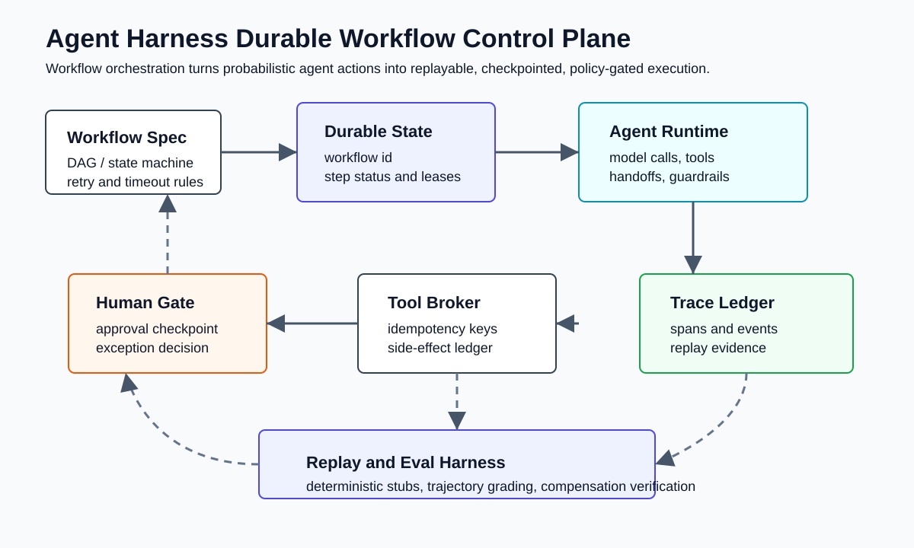
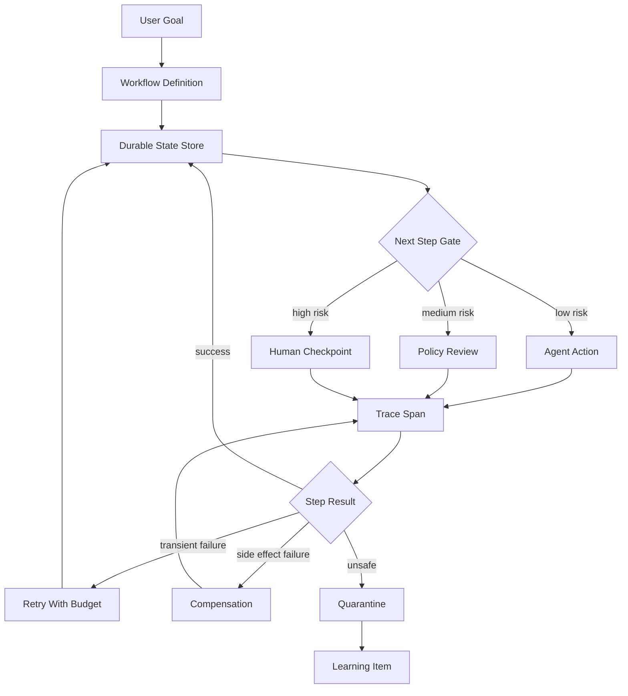
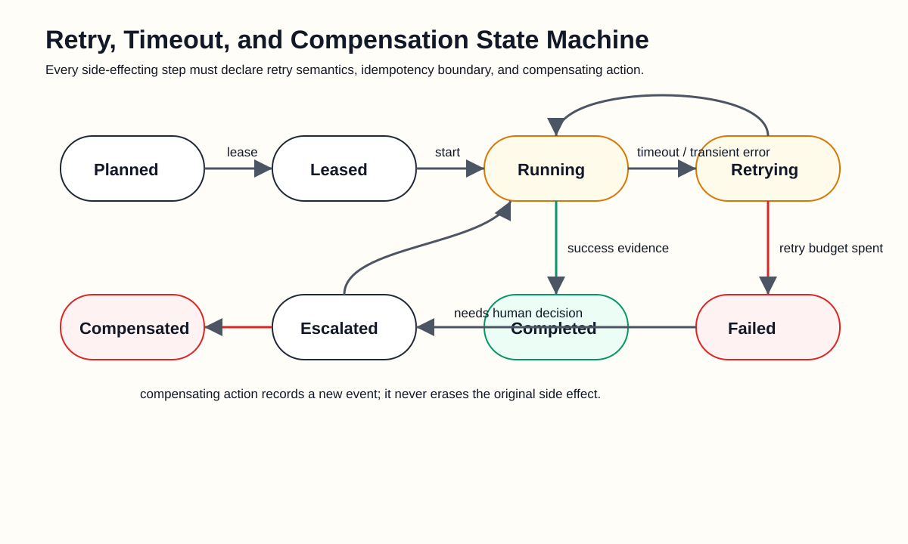
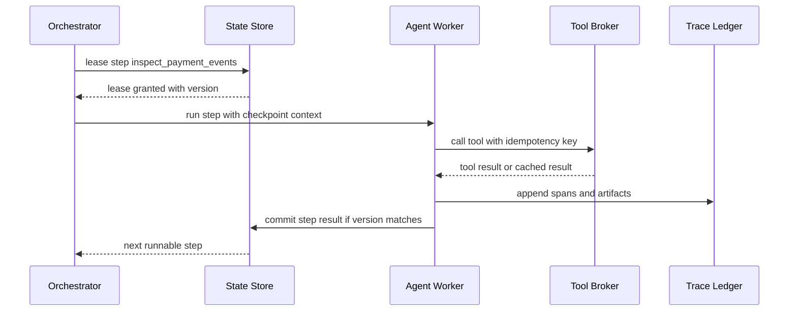
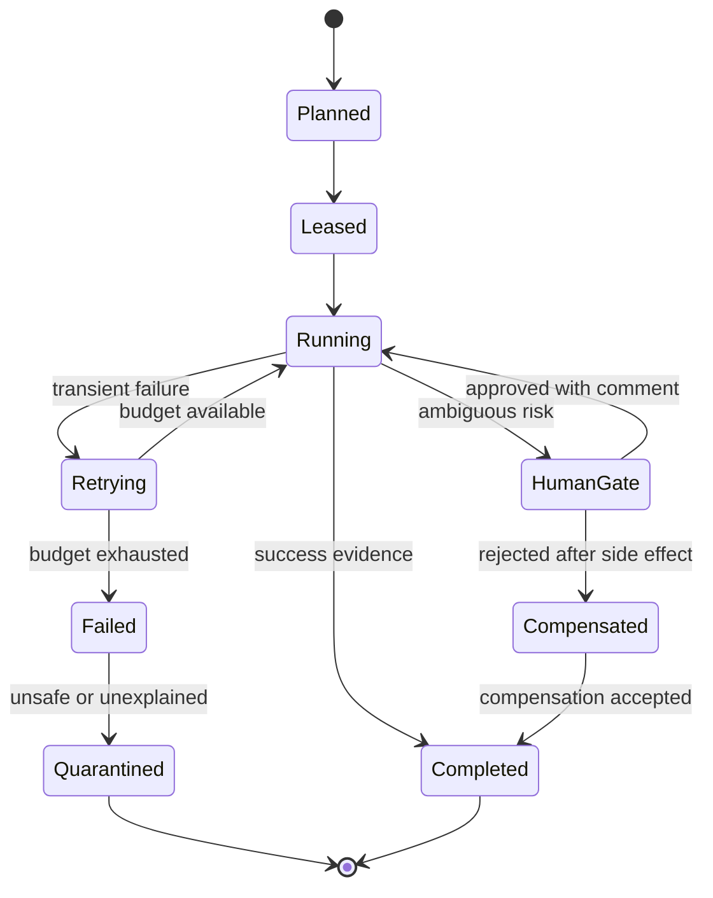
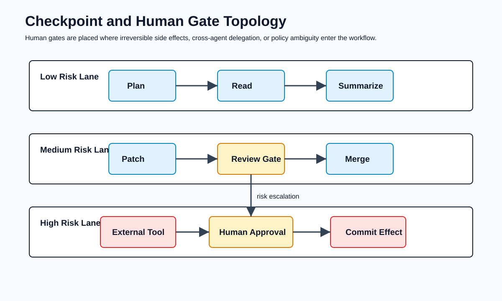
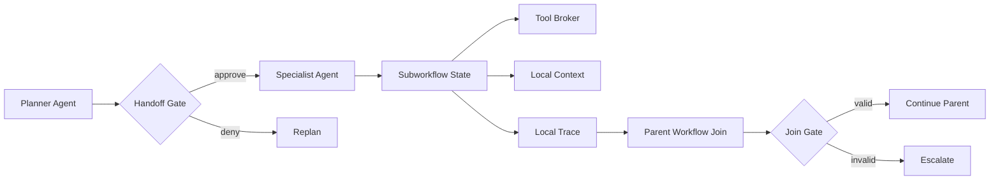
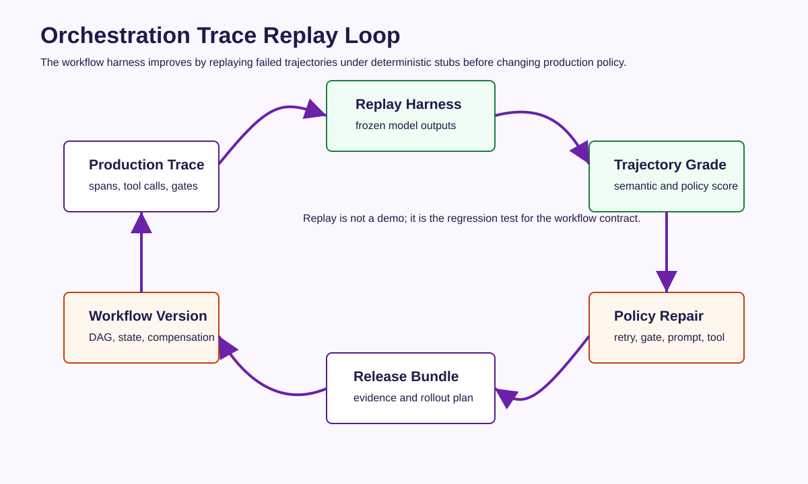
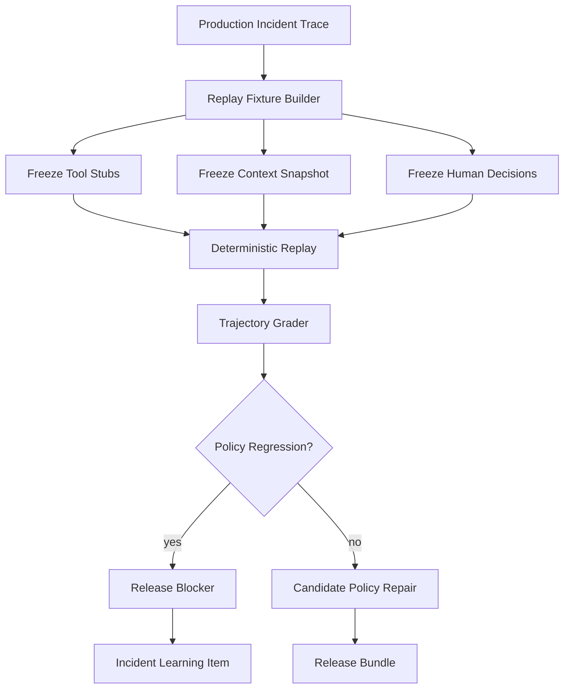
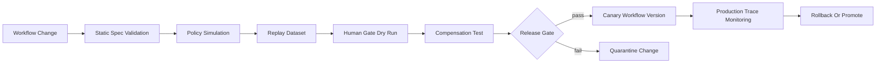

# 🧭 第十三课：Workflow Orchestration for Agent Harness：持久执行、重试、补偿、人类检查点与轨迹回放

> 第十二课讨论了 Agent Memory Management：生命周期、来源谱系、衰减、隐私治理与可遗忘性。第十三课继续进入一个更上层的运行时问题：当 agent 的任务跨越多个模型调用、多个工具、副作用系统、人工审批和多天执行窗口时，harness 如何证明“任务仍然在正确的轨道上”。Workflow Orchestration 并不是把 prompt 串成流程图，而是把 agent 的概率性行动约束在可持久化、可恢复、可重放、可补偿、可发布治理的执行协议中。



## 🧷 目录

- [🧭 核心观点：Agent Workflow 是状态合约，不只是任务列表](#-核心观点agent-workflow-是状态合约不只是任务列表)
- [🗺️ 编排对象：从 DAG 到带策略的状态机](#️-编排对象从-dag-到带策略的状态机)
- [🧱 持久执行：检查点、租约、幂等键与可恢复边界](#-持久执行检查点租约幂等键与可恢复边界)
- [🔁 重试与补偿：概率性失败不能只靠再试一次](#-重试与补偿概率性失败不能只靠再试一次)
- [🚦 人类检查点：把审批建模为一等执行状态](#-人类检查点把审批建模为一等执行状态)
- [🧬 多 Agent 与 Handoff：编排边界必须隔离上下文和权限](#-多-agent-与-handoff编排边界必须隔离上下文和权限)
- [📊 Trace Replay：工作流编排必须能被回放和评分](#-trace-replay工作流编排必须能被回放和评分)
- [🧰 工程实现示例](#-工程实现示例)
- [🛡️ 发布治理：Workflow Policy 也必须进入 Release Bundle](#️-发布治理workflow-policy-也必须进入-release-bundle)
- [📚 官方资料](#-官方资料)

## 🧭 核心观点：Agent Workflow 是状态合约，不只是任务列表

在传统自动化系统中，workflow 常被理解为“步骤 A 完成后执行步骤 B”。这种理解对确定性任务足够，但对 AI agent 不够。Agent 的每一步都可能包含自然语言推理、上下文检索、工具选择、权限判断、输出校验、外部副作用和人为干预。一个真实的 agent workflow 不是简单的控制流，而是一个持续变化的行为状态合约。

因此，Agent Harness 中的 Workflow Orchestration 必须回答五个问题：

| 问题 | 传统脚本式流程 | Agent Harness Workflow |
|---|---|---|
| 状态在哪里 | 进程内变量、日志、CI 任务状态 | durable workflow state、step ledger、trace span、artifact store |
| 失败如何处理 | 退出、重跑、人工排查 | retry budget、idempotency key、compensation、human gate、quarantine |
| 何时允许继续 | 上一步返回 0 | eval score、policy gate、risk tier、approval、observability signal |
| 如何恢复 | 从头重跑或手动修复 | 从 checkpoint 恢复，重放确定性输入，重新租约执行步骤 |
| 如何证明正确 | 看最终结果 | 看轨迹、证据、门禁、补偿记录和发布前 replay eval |

OpenAI Agents SDK 文档把 tracing 视为记录 agent run 中 LLM generation、tool call、handoff、guardrail 等事件的机制；Anthropic Claude Code 文档把 hooks、subagents、settings 和 memory 暴露为可配置的运行时边界；Temporal 官方文档强调 durable execution 对崩溃、网络失败和长期运行流程的恢复能力。本文把这些能力抽象为一个统一结论：**Agent workflow 必须被设计成可持久化的状态合约，而不是一次性 prompt 链**。



## 🗺️ 编排对象：从 DAG 到带策略的状态机

Agent workflow 可以从 DAG 开始建模，但不能停留在 DAG。DAG 只说明依赖顺序，不说明运行时状态、权限边界、重试语义、补偿动作、人工审批和上下文隔离。更合适的对象是“带策略的状态机”：每个节点既有输入输出，也有风险等级、超时、重试预算、幂等键、可恢复边界、证据要求和退出条件。

| 编排层 | 主要对象 | Agent Harness 关注点 | 典型错误 |
|---|---|---|---|
| DAG topology | step、edge、dependency | 是否存在循环、并行和 join 语义 | 只描述顺序，不描述失败 |
| State machine | planned、leased、running、waiting、completed、failed | 每个状态的合法迁移 | 允许隐式跳转，导致审计困难 |
| Policy layer | risk tier、permission、approval、guardrail | 是否允许 agent 自动进入下一步 | 把高风险步骤当普通函数调用 |
| Evidence layer | trace span、artifact、eval score、approval record | 如何证明某步骤满足继续条件 | 只保存最终文本输出 |
| Recovery layer | checkpoint、retry、compensation、resume token | 失败后从哪里恢复 | 重跑造成重复副作用 |

一个严肃的 workflow spec 至少需要表达如下字段：

```yaml
workflow:
  id: refund-investigation-v7
  owner: agentops-platform
  version: 7
  objective: "调查退款异常并提交可审计处理建议"
  default_timeout_seconds: 900
  state_store: "postgres://agent_workflow_state"
  trace_profile: "agentops-prod-trace-v3"

steps:
  - id: collect_case_context
    type: agent_task
    agent: case-context-reader
    risk_tier: low
    input_context:
      sources: ["ticket", "order", "policy_docs"]
      max_tokens: 12000
    output_schema: "schemas/case_context.v2.json"
    retry:
      max_attempts: 2
      backoff: "exponential"

  - id: inspect_payment_events
    type: tool_call
    tool: payment_ledger.read_events
    risk_tier: medium
    idempotency_key: "workflow_id + case_id + step_id"
    requires:
      - collect_case_context
    guardrails:
      - "no_secret_export"
      - "tenant_scope_match"

  - id: propose_remediation
    type: agent_task
    agent: refund-planner
    risk_tier: medium
    requires:
      - inspect_payment_events
    output_schema: "schemas/remediation_plan.v3.json"
    eval_gate:
      rubric: "rubrics/refund_plan_safety.v2.yaml"
      min_score: 0.86

  - id: approve_external_action
    type: human_gate
    risk_tier: high
    approvers:
      role: "refund-operations-lead"
      min_count: 1
    requires:
      - propose_remediation

  - id: execute_customer_update
    type: tool_call
    tool: crm.write_customer_note
    risk_tier: high
    requires:
      - approve_external_action
    compensation:
      tool: crm.append_correction_note
      reason_template: "workflow compensation for ${workflow_id}"
```

该 spec 的重点不是语法，而是它把 agent 行为从“模型自己决定下一步”提升为“模型在状态合约中执行下一步”。在高自治系统中，这种转变是可靠性的基础。

## 🧱 持久执行：检查点、租约、幂等键与可恢复边界

Agent workflow 的执行时间可能比单个 HTTP 请求、容器生命周期、IDE 会话或模型上下文窗口更长。没有持久执行，系统会在三个位置失效：进程崩溃后状态丢失，工具副作用重复执行，人工审批等待期间上下文过期。



持久执行不等于“把日志写进数据库”。它需要明确的恢复协议：

| 机制 | 定义 | Agent Harness 中的作用 | 不具备该机制的后果 |
|---|---|---|---|
| Checkpoint | 在步骤边界保存可恢复状态 | 支持从合法状态继续，而不是从头重跑 | 重复工具调用和上下文漂移 |
| Lease | 执行器对某一步的有时限占用 | 防止多个 worker 同时执行同一步 | 并发写入、双重审批、重复副作用 |
| Idempotency key | 对副作用操作的唯一语义键 | 使重试不会重复创建外部影响 | 多次发信、多次扣款、多次合并 |
| Resume token | 恢复执行所需的最小状态引用 | 使人工等待或进程重启后可继续 | 必须重新询问用户或重新推理 |
| Step ledger | 每个状态迁移的不可变记录 | 提供审计和 replay 输入 | 只能依赖自然语言摘要 |



### 🧩 Python 示例：最小持久工作流执行器

下面的示例不是生产框架，而是说明 durable workflow 的基本约束：步骤租约、版本检查、幂等键、重试预算和 trace 记录必须在 agent 外部形成控制面。

```python
from __future__ import annotations

from dataclasses import dataclass, field
from enum import Enum
from time import time
from typing import Callable, Dict, List, Optional


class StepStatus(str, Enum):
    PLANNED = "planned"
    LEASED = "leased"
    RUNNING = "running"
    WAITING_HUMAN = "waiting_human"
    COMPLETED = "completed"
    FAILED = "failed"
    COMPENSATED = "compensated"


@dataclass
class RetryPolicy:
    max_attempts: int = 2
    retryable_errors: tuple[str, ...] = ("timeout", "rate_limit", "transient")


@dataclass
class Step:
    id: str
    run: Callable[[dict], dict]
    risk_tier: str = "low"
    requires: list[str] = field(default_factory=list)
    retry: RetryPolicy = field(default_factory=RetryPolicy)
    compensation: Optional[Callable[[dict], dict]] = None


@dataclass
class StepRecord:
    status: StepStatus = StepStatus.PLANNED
    attempts: int = 0
    version: int = 0
    lease_until: float = 0.0
    output: Optional[dict] = None
    error: Optional[str] = None


class InMemoryWorkflowStore:
    def __init__(self) -> None:
        self.records: Dict[str, StepRecord] = {}
        self.trace: List[dict] = []

    def init_step(self, step_id: str) -> None:
        self.records.setdefault(step_id, StepRecord())

    def lease(self, step_id: str, ttl_seconds: int = 60) -> int:
        record = self.records[step_id]
        now = time()
        if record.status not in {StepStatus.PLANNED, StepStatus.FAILED}:
            raise RuntimeError(f"step {step_id} is not leasable: {record.status}")
        if record.lease_until > now:
            raise RuntimeError(f"step {step_id} already leased")
        record.status = StepStatus.LEASED
        record.lease_until = now + ttl_seconds
        record.version += 1
        return record.version

    def commit(self, step_id: str, version: int, output: dict) -> None:
        record = self.records[step_id]
        if record.version != version:
            raise RuntimeError("optimistic concurrency violation")
        record.status = StepStatus.COMPLETED
        record.output = output
        record.error = None
        record.version += 1

    def fail(self, step_id: str, version: int, error: str) -> None:
        record = self.records[step_id]
        if record.version != version:
            raise RuntimeError("optimistic concurrency violation")
        record.status = StepStatus.FAILED
        record.error = error
        record.attempts += 1
        record.version += 1

    def append_trace(self, event: dict) -> None:
        self.trace.append({"ts": time(), **event})


class AgentWorkflowRunner:
    def __init__(self, steps: list[Step], store: InMemoryWorkflowStore) -> None:
        self.steps = {step.id: step for step in steps}
        self.store = store
        for step in steps:
            store.init_step(step.id)

    def runnable(self, step: Step) -> bool:
        record = self.store.records[step.id]
        dependencies_done = all(
            self.store.records[dep].status == StepStatus.COMPLETED
            for dep in step.requires
        )
        return dependencies_done and record.status in {StepStatus.PLANNED, StepStatus.FAILED}

    def run_once(self, workflow_input: dict) -> None:
        for step in self.steps.values():
            if not self.runnable(step):
                continue
            record = self.store.records[step.id]
            if record.attempts >= step.retry.max_attempts:
                self.store.append_trace({"step": step.id, "event": "retry_budget_exhausted"})
                continue

            version = self.store.lease(step.id)
            self.store.append_trace({"step": step.id, "event": "leased", "version": version})
            try:
                context = {
                    "workflow_input": workflow_input,
                    "prior_outputs": {
                        dep: self.store.records[dep].output
                        for dep in step.requires
                    },
                    "idempotency_key": f"{workflow_input['workflow_id']}:{step.id}",
                }
                output = step.run(context)
                self.store.commit(step.id, version, output)
                self.store.append_trace({"step": step.id, "event": "completed", "output": output})
            except Exception as exc:
                self.store.fail(step.id, version, type(exc).__name__)
                self.store.append_trace({"step": step.id, "event": "failed", "error": str(exc)})
```

这个执行器刻意把 orchestration 状态放在模型外部。模型可以建议下一步、生成工具参数或解释失败原因，但不能隐式改写工作流状态，也不能绕过租约、幂等和审批。

## 🔁 重试与补偿：概率性失败不能只靠再试一次

Agent 系统的失败有多种来源：模型输出格式错误、上下文缺失、工具超时、权限拒绝、外部系统变更、业务规则冲突、评估门未通过、人工审批拒绝。把这些失败全部交给“retry”会制造新的风险。重试只能处理可证明为暂时性的失败；副作用失败需要补偿；语义失败需要重新规划；安全失败需要隔离。

| 失败类型 | 例子 | 是否适合重试 | 正确动作 |
|---|---|---:|---|
| Transient infrastructure | rate limit、网络闪断、worker 重启 | 是 | 指数退避、保留幂等键 |
| Model format error | JSON schema 不合法 | 有条件 | 限次修复，超过后进入 grader 或 human gate |
| Missing context | 关键文档未检索到 | 否 | 回到 context acquisition step |
| Policy violation | 试图读取越权资源 | 否 | 阻断、记录审计、触发策略修复 |
| Partial side effect | 外部系统写入成功但回执失败 | 否 | 查询幂等状态，必要时补偿 |
| Semantic regression | eval 分数低于发布门 | 否 | 进入 replay dataset 和 release governance |



### 🧮 SQL 示例：从 trace 中计算重试风险

```sql
with step_failures as (
  select
    workflow_name,
    workflow_version,
    step_id,
    count(*) filter (where event_name = 'step_failed') as failures,
    count(*) filter (where event_name = 'retry_scheduled') as retries,
    count(*) filter (where event_name = 'human_gate_opened') as human_gates,
    count(*) filter (where event_name = 'compensation_started') as compensations
  from agent_workflow_trace
  where created_at >= now() - interval '7 days'
  group by workflow_name, workflow_version, step_id
)
select
  workflow_name,
  workflow_version,
  step_id,
  failures,
  retries,
  human_gates,
  compensations,
  case
    when compensations > 0 then 'requires release review'
    when retries::float / greatest(failures, 1) > 0.8 then 'retry masking likely'
    when human_gates > 20 then 'policy ambiguity likely'
    else 'normal'
  end as orchestration_signal
from step_failures
order by compensations desc, retries desc;
```

当某一步的重试率过高时，系统可能不是“更稳健”，而是在掩盖错误的状态边界。优秀的 harness 会把这种信号送入 release governance，而不是简单增加 `max_attempts`。

## 🚦 人类检查点：把审批建模为一等执行状态

人类检查点不是“agent 卡住时给人发消息”。它是 workflow 的一等状态，必须拥有输入材料、审批权限、超时策略、拒绝路径、审计记录和恢复语义。尤其在 agent 能调用写操作工具、触发外部通知、修改用户数据或跨系统发布时，human gate 是 harness 对不可逆副作用的关键约束。



| 检查点位置 | 触发条件 | 审批材料 | 通过后动作 | 拒绝后动作 |
|---|---|---|---|---|
| 计划审批 | 高风险目标、跨系统目标 | 目标、约束、工具清单、风险等级 | 进入执行租约 | 重新规划或终止 |
| 工具前审批 | 写操作、外部发送、权限升级 | 工具参数、来源证据、影响范围 | 发放一次性 capability lease | 阻断并记录策略事件 |
| Handoff 审批 | 委派给高权限 subagent | 子任务描述、上下文包、工具权限 | 创建子工作流 | 降级为人工处理 |
| 记忆写入审批 | 敏感偏好、长期事实、事故结论 | 来源事件、TTL、purpose scope | 写入 memory store | 保留 trace-only |
| 发布审批 | workflow policy 或 guardrail 变更 | eval 报告、replay 差异、回滚计划 | 灰度 rollout | quarantine |

### 🧾 TypeScript 示例：人类检查点的结构化输出

```ts
type RiskTier = "low" | "medium" | "high" | "critical";

type HumanGateRequest = {
  workflowId: string;
  stepId: string;
  riskTier: RiskTier;
  requestedByAgent: string;
  decisionDeadline: string;
  evidence: Array<{
    kind: "trace" | "artifact" | "eval" | "policy" | "tool-preview";
    uri: string;
    sha256?: string;
  }>;
  proposedAction: {
    tool?: string;
    arguments?: Record<string, unknown>;
    expectedSideEffects: string[];
    compensation?: string;
  };
};

type HumanGateDecision =
  | { decision: "approve"; approver: string; comment: string; capabilityLeaseSeconds: number }
  | { decision: "reject"; approver: string; reason: string; nextStep: "replan" | "terminate" }
  | { decision: "escalate"; approver: string; targetRole: string; reason: string };

function validateGateDecision(
  request: HumanGateRequest,
  decision: HumanGateDecision,
): void {
  if (request.riskTier === "critical" && decision.decision === "approve") {
    if (decision.capabilityLeaseSeconds > 900) {
      throw new Error("critical approval leases must expire within 15 minutes");
    }
  }

  if (decision.decision === "approve" && request.evidence.length < 2) {
    throw new Error("approval requires at least two independent evidence items");
  }

  if (decision.decision === "reject" && decision.reason.length < 20) {
    throw new Error("rejection reason must be auditable");
  }
}
```

该示例强调：审批的对象不是一句自然语言“可以执行吗”，而是一个带证据、影响范围和能力租约的结构化请求。审批通过后也不应发放永久权限，只应发放短时、单用途、可追踪的 capability lease。

## 🧬 多 Agent 与 Handoff：编排边界必须隔离上下文和权限

多 Agent 系统把 workflow orchestration 的复杂度提升到新的层级。一个 agent 把任务交给另一个 agent 时，实际发生的是上下文、权限、目标、评估标准和责任边界的迁移。Anthropic Claude Code 的 subagents 文档强调子代理拥有独立上下文窗口和可配置工具权限；OpenAI Agents SDK 的 handoffs 文档把 handoff 建模为 agent 间控制转移。Harness 工程视角下，handoff 不是“让另一个 agent 帮忙”，而是一个必须被编排和审计的状态迁移。



| Handoff 控制点 | 必须检查的内容 | 原因 |
|---|---|---|
| Task contract | 子任务是否可独立验证 | 防止子 agent 接收模糊目标 |
| Context package | 是否只包含最小必要上下文 | 防止上下文污染和隐私泄漏 |
| Tool scope | 子 agent 是否只拥有任务必要工具 | 防止权限继承过宽 |
| Join condition | 子 agent 输出如何回到父工作流 | 防止自然语言结果直接驱动副作用 |
| Trace linkage | 子工作流 trace 如何关联父 trace | 支持跨 agent replay 和责任归因 |

### 🧪 JSON 示例：Handoff Contract

```json
{
  "handoff_id": "handoff_refund_case_to_policy_specialist",
  "parent_workflow_id": "wf_20260528_001",
  "from_agent": "refund-planner",
  "to_agent": "policy-specialist",
  "task_contract": {
    "objective": "判断该退款场景是否满足区域政策例外条款",
    "input_refs": ["artifact://case-context/sha256:9b1c", "doc://refund-policy/v4"],
    "output_schema": "schemas/policy_exception_opinion.v2.json",
    "success_criteria": [
      "must cite policy clause",
      "must declare uncertainty",
      "must not call write tools"
    ]
  },
  "tool_scope": {
    "allow": ["policy_docs.search", "case_artifacts.read"],
    "deny": ["crm.write_customer_note", "payment.issue_refund"]
  },
  "join_gate": {
    "grader": "graders/policy_opinion_trace_grader.py",
    "min_score": 0.9,
    "on_fail": "human_gate"
  }
}
```

## 📊 Trace Replay：工作流编排必须能被回放和评分

没有 replay 的 workflow 只能被观察，不能被验证。Agent harness 需要把生产 trace、工具 stub、模型输出快照、上下文快照、审批记录和策略版本组合成可重放样本。Replay 的目标不是复现模型的所有随机性，而是复现 workflow 合约面对相同证据时的状态迁移。



| Replay 输入 | 来源 | 用途 |
|---|---|---|
| Workflow version | release bundle | 确定状态机和策略 |
| Step trace spans | production trace | 重建执行路径 |
| Tool request/response | tool broker ledger | 构造 deterministic stub |
| Context snapshot | context builder artifact | 检查输入证据是否一致 |
| Human decisions | approval ledger | 重放等待和分支 |
| Eval scores | grader output | 验证 release gate |
| Compensation events | side-effect ledger | 验证失败恢复是否正确 |



### 🧰 Python 示例：轨迹评分器的最小形态

```python
from dataclasses import dataclass
from typing import Iterable


@dataclass(frozen=True)
class Span:
    name: str
    step_id: str
    attributes: dict


def grade_workflow_trace(spans: Iterable[Span]) -> dict:
    spans = list(spans)
    score = 1.0
    findings: list[str] = []

    high_risk_tools = {
        span.attributes.get("tool")
        for span in spans
        if span.attributes.get("risk_tier") in {"high", "critical"}
    }
    approvals = {
        span.attributes.get("approved_tool")
        for span in spans
        if span.name == "human_gate.approved"
    }

    for tool in high_risk_tools:
        if tool and tool not in approvals:
            score -= 0.35
            findings.append(f"high-risk tool {tool} executed without approval")

    retry_counts: dict[str, int] = {}
    for span in spans:
        if span.name == "retry.scheduled":
            retry_counts[span.step_id] = retry_counts.get(span.step_id, 0) + 1

    for step_id, retries in retry_counts.items():
        if retries > 3:
            score -= 0.15
            findings.append(f"step {step_id} retried {retries} times")

    compensation_started = any(span.name == "compensation.started" for span in spans)
    compensation_completed = any(span.name == "compensation.completed" for span in spans)
    if compensation_started and not compensation_completed:
        score -= 0.25
        findings.append("compensation started but did not complete")

    return {
        "score": max(score, 0.0),
        "pass": score >= 0.85,
        "findings": findings,
    }
```

## 🧰 工程实现示例

### 🧾 Workflow Spec 的静态校验

```python
def validate_workflow_spec(spec: dict) -> list[str]:
    errors: list[str] = []
    steps = {step["id"]: step for step in spec["steps"]}

    for step in spec["steps"]:
        for dep in step.get("requires", []):
            if dep not in steps:
                errors.append(f"{step['id']} depends on unknown step {dep}")

        if step.get("risk_tier") in {"high", "critical"}:
            has_gate = step.get("type") == "human_gate" or step.get("requires_human_gate")
            has_compensation = "compensation" in step or step.get("read_only") is True
            if not has_gate:
                errors.append(f"{step['id']} is high risk but has no human gate")
            if not has_compensation:
                errors.append(f"{step['id']} is high risk but has no compensation or read_only proof")

        if step.get("type") == "tool_call" and not step.get("idempotency_key"):
            errors.append(f"{step['id']} calls a tool without an idempotency key")

    return errors
```

### 🔐 OPA/Rego 示例：禁止无证据的高风险步骤自动运行

```rego
package agent.workflow

default allow = false

allow {
  input.step.risk_tier == "low"
  input.step.type != "tool_call" or input.step.read_only == true
}

allow {
  input.step.risk_tier == "medium"
  count(input.evidence.trace_refs) >= 1
  input.policy.eval_score >= 0.82
}

allow {
  input.step.risk_tier == "high"
  input.human_gate.decision == "approve"
  input.human_gate.capability_lease_seconds <= 900
  count(input.evidence.artifacts) >= 2
  input.step.compensation.tool != ""
}

deny_reason[msg] {
  input.step.risk_tier == "high"
  not input.human_gate.decision
  msg := sprintf("step %s requires human approval", [input.step.id])
}
```

### 🧪 CI 示例：发布前执行 workflow replay

```yaml
name: agent-workflow-replay

on:
  pull_request:
    paths:
      - "workflows/**/*.yaml"
      - "agents/**/*.md"
      - "policies/**/*.rego"
      - "graders/**/*.py"

jobs:
  replay:
    runs-on: ubuntu-latest
    steps:
      - uses: actions/checkout@v4
      - uses: actions/setup-python@v5
        with:
          python-version: "3.12"
      - name: Validate workflow specs
        run: python tools/validate_workflows.py workflows/
      - name: Run deterministic replay fixtures
        run: python tools/replay_agent_workflows.py fixtures/workflow-replay/
      - name: Enforce release gates
        run: python tools/check_agent_workflow_gates.py reports/replay-summary.json
```

## 🛡️ 发布治理：Workflow Policy 也必须进入 Release Bundle

Workflow orchestration 的变更会改变 agent 的行为边界，因此必须进入 release bundle。新增重试、放宽审批、调整 handoff、修改补偿动作、扩大子 agent 工具权限，都可能比 prompt 修改更危险。发布前必须提供证据：静态校验通过、replay dataset 不回归、事故样本已覆盖、人工 gate 仍然有效、回滚策略明确。

| Release Bundle 项 | 证据 | Gate |
|---|---|---|
| Workflow spec diff | DAG/state machine 差异、风险等级变化 | 高风险步骤必须有人审 |
| Policy diff | Rego/规则变更、权限扩大说明 | 禁止静默扩大写权限 |
| Replay report | 关键轨迹重放结果、分数分布 | P95 分数不得下降超过阈值 |
| Human gate audit | 审批字段、超时、拒绝路径 | 不允许无恢复路径等待 |
| Compensation test | 副作用模拟、补偿动作验证 | 高风险写操作必须有补偿或只读证明 |
| Rollback plan | 旧 workflow version、状态兼容矩阵 | 可冻结新 workflow 并完成旧 workflow |



## 📚 官方资料

- OpenAI Agents SDK Tracing: <https://openai.github.io/openai-agents-python/tracing/>
- OpenAI Agents SDK Handoffs: <https://openai.github.io/openai-agents-python/handoffs/>
- OpenAI Agents SDK Guardrails: <https://openai.github.io/openai-agents-js/guides/guardrails>
- OpenAI Agents SDK Sessions: <https://openai.github.io/openai-agents-python/sessions/>
- Anthropic Claude Code Hooks: <https://docs.anthropic.com/en/docs/claude-code/hooks>
- Anthropic Claude Code Subagents: <https://docs.anthropic.com/en/docs/claude-code/sub-agents>
- Anthropic Claude Code Settings: <https://docs.anthropic.com/en/docs/claude-code/settings>
- Temporal Platform Documentation: <https://docs.temporal.io/>
- LangGraph Persistence Documentation: <https://docs.langchain.com/oss/javascript/langgraph/persistence>

Terrence Shen  
Email: slamshenxin@gmail.com  
Located in China
