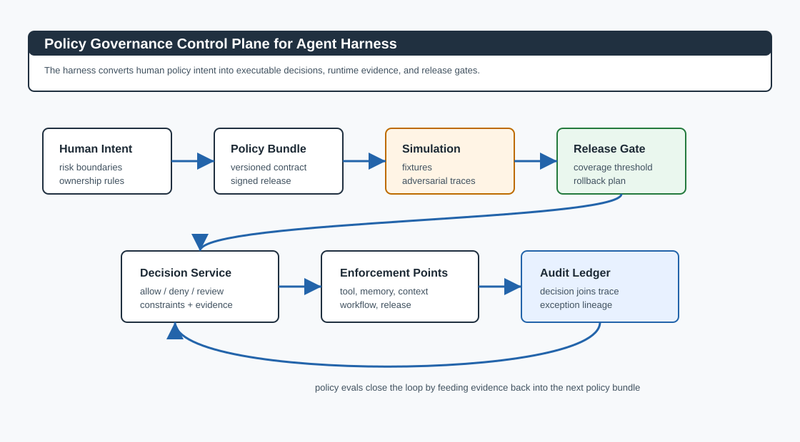
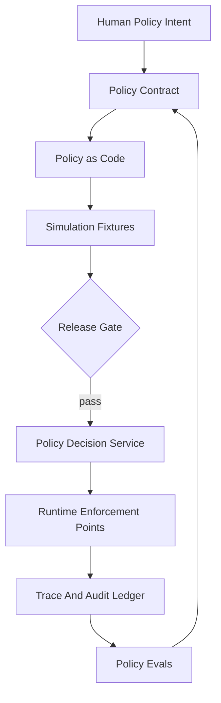
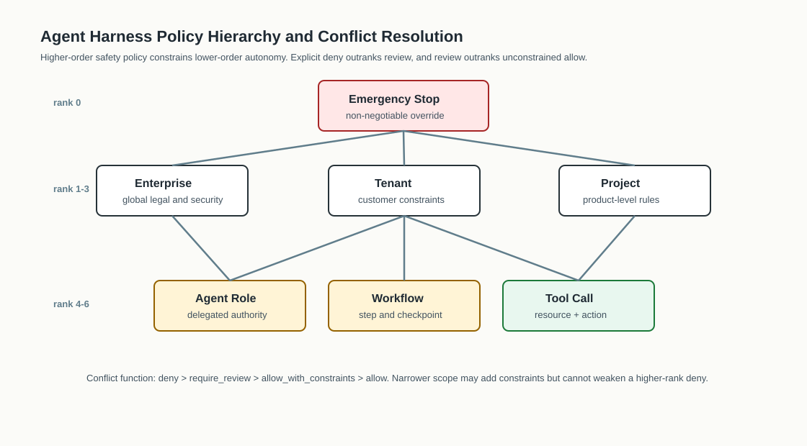
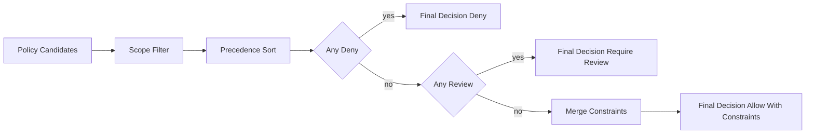
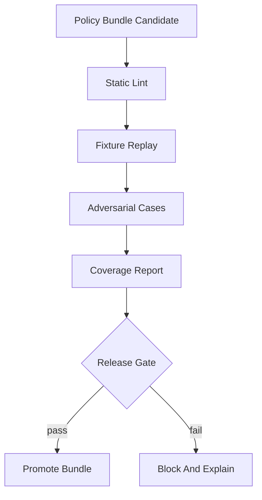

# 🏛️ 第十四课：Agent Policy Governance：策略层级、例外处理、审计证据与跨团队所有权

> 第十三课讨论了 Workflow Orchestration：持久执行、检查点、租约、重试、补偿、人类检查点与 trace replay。第十四课进入更高一层的治理问题：当 agent harness 已经拥有工具、记忆、多 agent、工作流、发布门与回滚能力之后，谁来定义允许什么，谁来解释为什么允许，谁来处理例外，谁来审计一次 autonomous 行为是否符合组织策略。



## 📚 目录

- [🧠 核心观点：Policy 是 Agent Harness 的行为宪法](#-核心观点policy-是-agent-harness-的行为宪法)
- [🧾 策略对象模型：从自然语言规则到可执行决策](#-策略对象模型从自然语言规则到可执行决策)
- [🏗️ 策略层级：企业、租户、项目、Agent、工具与应急停止](#️-策略层级企业租户项目agent工具与应急停止)
- [⚖️ 冲突解析：Deny、Require Review、Allow 的优先级](#️-冲突解析denyrequire-reviewallow-的优先级)
- [🚦 执行点：工具、记忆、上下文、工作流与发布门](#-执行点工具记忆上下文工作流与发布门)
- [🪪 例外处理：例外不是口头授权，而是带边界的对象](#-例外处理例外不是口头授权而是带边界的对象)
- [📒 审计证据：把每次策略判断变成可追责 Ledger](#-审计证据把每次策略判断变成可追责-ledger)
- [🧪 Policy Evals：策略变更也必须回归测试](#-policy-evals策略变更也必须回归测试)
- [💻 工程实现示例](#-工程实现示例)
- [🔭 结论：Policy Governance 让自治能力进入组织秩序](#-结论policy-governance-让自治能力进入组织秩序)
- [📚 官方资料](#-官方资料)

## 🧠 核心观点：Policy 是 Agent Harness 的行为宪法

AI agent 的风险不只来自模型输出是否正确，也来自它能访问什么、能调用什么、能记住什么、能委派给谁、能在无人确认时推进到哪一步。Agent Policy Governance 的任务，是把组织对这些边界的意图转换为可执行、可观察、可审计、可发布的策略系统。

如果策略只写在文档里，runtime 无法稳定执行；如果策略只写在代码里，业务、合规、安全与产品团队无法审查；如果策略只存在于审批聊天记录里，事故发生后无法复盘。因此，agent harness 中的 policy 应被视为四类对象的组合：自然语言意图、机器可读规则、运行时决策、审计证据。

| 治理问题 | 传统做法 | Agent Harness 做法 |
|---|---|---|
| 谁定义边界 | 安全文档与工程约定 | signed policy bundle + owner + review board |
| 谁执行边界 | 人工 code review | policy decision service + enforcement points |
| 谁处理例外 | 临时口头批准 | expiring exception object + evidence + rollback |
| 谁审计行为 | 事故后查日志 | decision ledger joined with trace spans |
| 谁验证变更 | 看 diff | policy simulation + adversarial fixtures + release gate |



在这一模型中，policy 不等于简单的 allow list。它是一种组织控制平面：它把 agent 的 autonomy 限定在可解释、可签名、可回滚、可复盘的范围内。OpenAI Agents SDK 的 agents、tools、guardrails、tracing 与 evals 文档展示了 agent 系统需要可组合的运行时控制；Anthropic Claude Code 的 settings 与 hooks 文档展示了权限配置和事件钩子对工程 agent 的约束意义；Open Policy Agent 则提供了通用 policy-as-code 的语言参考。这些来源共同指向一个结论：真正的 harness governance 必须把策略提升为一等工程对象。

## 🧾 策略对象模型：从自然语言规则到可执行决策

严肃的 agent policy 不应只包含 allow 或 deny。它至少应包含适用范围、主体、资源、动作、决策语义、证据要求、例外规则、所有权、版本与回滚信息。

| 策略字段 | 作用 | 示例 |
|---|---|---|
| `policy_id` | 稳定身份 | `tool.external_write.v4` |
| `owner` | 责任团队 | `security-platform` |
| `scope` | 作用范围 | tenant、project、agent、workflow step |
| `subject` | 请求主体 | agent role、human approver、service identity |
| `resource` | 被访问对象 | tool、memory、document、workflow state |
| `action` | 行为 | read、write、submit、handoff、remember |
| `decision` | 决策类型 | allow、deny、require_review、allow_with_constraints |
| `constraints` | 约束条件 | max rows、network deny、redaction required |
| `evidence_required` | 证据 | trace span、eval report、approval id |
| `exception_policy` | 例外处理 | TTL、scope、owner、revocation condition |
| `version` | 发布与回滚 | semantic version 或 bundle hash |

一个机器可读策略可以采用 YAML、JSON、Rego 或内部 DSL。关键不在格式，而在可验证语义。

```yaml
policy_id: tool.external_write.v4
owner: security-platform
version: 4.2.0
scope:
  tenants: [all]
  projects: [customer-support]
subjects:
  agent_roles: [refund_planner, support_copilot]
resource:
  kind: tool
  name: crm.update_customer_record
actions: [write]
decision: require_review
constraints:
  max_records_per_call: 1
  redact_fields: [payment_token, national_id]
evidence_required:
  - trace_span_id
  - user_request_hash
  - human_approval_id
exception_policy:
  max_ttl_minutes: 60
  approvers: [security-platform, product-owner]
  revocation_on: [policy_bundle_change, anomaly_score_high]
```

策略对象的科学性来自两个属性。第一，它把自然语言规则变成可组合的谓词；第二，它把运行时决策变成可查询的事实。没有事实模型，policy 就无法被 eval；没有 eval，policy 变更就无法进入 release governance。

## 🏗️ 策略层级：企业、租户、项目、Agent、工具与应急停止

agent harness 中的 policy 必须分层，因为不同组织层面对风险的理解不同。企业安全团队定义不可突破的红线；租户或客户定义数据边界；项目团队定义产品风险；agent owner 定义角色能力；工具 owner 定义副作用边界；workflow owner 定义推进条件；应急停止策略覆盖所有层级。



| 层级 | 典型 owner | 控制内容 | 是否可被下级放宽 |
|---|---|---|---|
| Emergency stop | SRE / Security | 禁止某类高危行为 | 不可放宽 |
| Enterprise | Legal / Security | 数据、身份、合规、地域 | 不可放宽 |
| Tenant | Customer admin | 租户数据和业务权限 | 不可突破企业红线 |
| Project | Product owner | 功能范围、发布阶段 | 只能收紧 |
| Agent role | Agent owner | 可用工具、记忆范围、委派范围 | 只能在项目范围内调整 |
| Workflow step | Workflow owner | 当前步骤可推进条件 | 只能在角色范围内调整 |
| Tool resource | Tool owner | 参数、速率、副作用 | 只能在上级许可内执行 |

层级的实际形态更像 lattice，而不是树。一次 tool call 可能同时被 enterprise policy、tenant policy、agent-role policy、workflow-step policy 和 tool-owner policy 约束。harness 的职责是把这些规则合并成一个单一决策，并保留冲突解释。

## ⚖️ 冲突解析：Deny、Require Review、Allow 的优先级

策略冲突是治理系统的常态。一个项目策略可能允许 agent 写入 CRM，而企业策略可能禁止 agent 写入敏感字段；一个 workflow step 可能允许自动提交退款，而 tenant policy 可能要求人工批准。冲突解析必须是确定性的，否则同一条 trace 在不同节点上会得到不同结论。

| 决策 | 语义 | 优先级 | 运行时动作 |
|---|---|---:|---|
| `deny` | 明确禁止 | 100 | 阻断并记录原因 |
| `require_review` | 需要人工或系统 gate | 80 | 暂停 workflow，生成审批任务 |
| `allow_with_constraints` | 允许但带约束 | 60 | 执行前注入约束和 redaction |
| `allow` | 无额外约束允许 | 40 | 执行并记录证据 |
| `abstain` | 当前 policy 不适用 | 0 | 交给其他策略判断 |



科学的冲突解析至少应满足三条不变量。

| 不变量 | 解释 | 失败后果 |
|---|---|---|
| 高层 deny 不可被低层 allow 覆盖 | 安全边界不依赖局部配置 | 合规红线被项目配置绕过 |
| 更窄 scope 可以添加约束，但不能删除上级约束 | 下级策略只能收紧 | 租户隔离被 agent role 放松 |
| 每个最终决策必须能解释输入策略集合 | 审计需要因果链 | 事故后无法复盘为什么允许 |

## 🚦 执行点：工具、记忆、上下文、工作流与发布门

Policy Governance 只有落到 enforcement point 才能成为 harness 能力。agent harness 至少应在五类执行点调用 policy decision service。

| 执行点 | 请求对象 | 策略关注点 | 失败模式 |
|---|---|---|---|
| Tool broker | tool call | 参数、身份、权限、副作用 | agent 调用未授权写工具 |
| Memory gateway | memory read/write | provenance、retention、privacy | agent 记住不该记住的数据 |
| Context builder | prompt context | 数据分类、最小必要上下文 | 敏感片段进入模型上下文 |
| Workflow engine | state transition | gate、checkpoint、lease、compensation | 自动推进到高风险步骤 |
| Release gate | policy bundle deploy | eval 覆盖率、rollback readiness | 未验证策略进入生产 |

每个执行点都应把请求转换为统一的 policy input。这样，策略系统不用理解所有业务细节，只需要理解主体、资源、动作、上下文和证据。

```python
from dataclasses import dataclass, field
from typing import Any

@dataclass(frozen=True)
class PolicyInput:
    subject: dict[str, Any]
    resource: dict[str, Any]
    action: str
    context: dict[str, Any]
    evidence: dict[str, Any] = field(default_factory=dict)

def build_tool_policy_input(agent, tool_call, workflow_state):
    return PolicyInput(
        subject={
            'agent_id': agent.id,
            'agent_role': agent.role,
            'tenant': agent.tenant,
        },
        resource={
            'kind': 'tool',
            'name': tool_call.name,
            'risk_tier': tool_call.risk_tier,
        },
        action=tool_call.action,
        context={
            'workflow_id': workflow_state.workflow_id,
            'step': workflow_state.step,
            'autonomy_level': workflow_state.autonomy_level,
        },
        evidence={
            'trace_span_id': tool_call.span_id,
            'request_hash': tool_call.request_hash,
        },
    )
```

执行点不应把 policy decision 当成布尔值。它应该读取 constraints，并把约束真正注入执行路径。

```python
def enforce_tool_decision(decision, tool_call):
    if decision.kind == 'deny':
        raise PermissionError(decision.explanation)

    if decision.kind == 'require_review':
        return create_human_gate(
            reason=decision.explanation,
            evidence=decision.evidence_required,
            pending_call=tool_call,
        )

    constrained_call = tool_call.copy()
    for field in decision.constraints.get('redact_fields', []):
        constrained_call.args.pop(field, None)

    max_records = decision.constraints.get('max_records_per_call')
    if max_records is not None:
        constrained_call.args['limit'] = min(constrained_call.args.get('limit', max_records), max_records)

    return execute_tool(constrained_call)
```

## 🪪 例外处理：例外不是口头授权，而是带边界的对象

例外是 policy governance 中最容易腐化的部分。如果例外没有 TTL，它会变成永久后门；如果例外没有 scope，它会变成通用通行证；如果例外没有证据，它会变成不可复盘的口头风险接受。


| 例外字段 | 必要性 | 示例 |
|---|---|---|
| `exception_id` | 可引用身份 | `exc_20260530_001` |
| `base_policy_id` | 例外针对哪条策略 | `tool.external_write.v4` |
| `scope` | 比原策略更窄的范围 | single tenant、single workflow、single tool |
| `reason` | 风险接受理由 | production incident remediation |
| `evidence` | 审批所需材料 | trace、incident ticket、eval report |
| `approvers` | 双人或多方审批 | security + product |
| `expires_at` | 自动失效时间 | 60 minutes later |
| `revocation_condition` | 撤销条件 | anomaly、bundle change、manual revoke |

```yaml
exception_id: exc_support_refund_20260530_001
base_policy_id: tool.external_write.v4
scope:
  tenant: acme
  workflow_id: wf_93a
  tool: crm.update_customer_record
  action: write
reason: production incident remediation
approvers:
  - security-platform:oncall-a
  - support-product:owner-b
expires_at: 2026-05-30T10:30:00Z
constraints:
  max_records_per_call: 1
  require_post_review: true
revocation_condition:
  - anomaly_score_high
  - policy_bundle_released
```

例外的验证逻辑应被视为策略系统本身的一部分。

```python
def exception_applies(exception, request, now):
    if now >= exception.expires_at:
        return False
    if exception.revoked_at is not None:
        return False
    if not scope_is_narrower(exception.scope, exception.base_policy.scope):
        return False
    return request_matches_scope(request, exception.scope)
```

## 📒 审计证据：把每次策略判断变成可追责 Ledger

审计系统不是日志聚合。日志回答发生了什么；audit ledger 还要回答：为什么允许、依据哪条策略、用了哪个 policy bundle、是否存在例外、谁批准、证据是否完整、执行结果是否符合约束。


| Ledger 表 | 主键 | 关键字段 | 用途 |
|---|---|---|---|
| `trace_span` | span_id | agent_id、tool_call_id、input_hash | 连接 agent 行为 |
| `policy_decision` | decision_id | policy_bundle_hash、decision、constraints | 解释 runtime 判断 |
| `policy_rule_hit` | rule_hit_id | policy_id、rank、matched_scope | 解释策略来源 |
| `exception_record` | exception_id | scope、expires_at、revoked_at | 解释例外授权 |
| `approval_record` | approval_id | approver、signature、risk_acceptance | 证明人工 gate |
| `eval_result` | eval_id | fixture、expected_decision、actual_decision | 证明策略变更已测试 |

```sql
select
  d.decision_id,
  d.decision,
  d.policy_bundle_hash,
  e.exception_id,
  a.approver,
  t.agent_id,
  t.tool_call_id
from policy_decision d
left join exception_record e on d.exception_id = e.exception_id
left join approval_record a on e.approval_id = a.approval_id
join trace_span t on d.trace_span_id = t.span_id
where t.workflow_id = :workflow_id
order by t.started_at asc;
```

这一 ledger 支持三类关键查询。

| 查询 | 问题 | 价值 |
|---|---|---|
| 决策解释 | 某次 tool call 为什么被允许 | 用户投诉、事故复盘 |
| 例外审计 | 哪些 deny 被例外放行 | 风险接受治理 |
| 发布证明 | 新 policy bundle 是否通过 eval | release governance |

## 🧪 Policy Evals：策略变更也必须回归测试

Agent policy 的变更会改变系统行为，因此必须像代码一样测试。Policy evals 不评估语言流畅度，而评估决策是否符合治理意图。一个 eval fixture 应包含主体、资源、动作、上下文、预期决策、预期约束、解释标签和风险类别。

| Fixture 字段 | 示例 | 说明 |
|---|---|---|
| `case_id` | `policy_eval_001` | 稳定测试身份 |
| `subject` | `agent_role: refund_planner` | 请求主体 |
| `resource` | `tool: crm.update_customer_record` | 请求资源 |
| `action` | `write` | 请求动作 |
| `context` | `autonomy_level: 3` | 当前运行上下文 |
| `expected_decision` | `require_review` | 预期结果 |
| `expected_constraints` | `redact_fields` | 约束断言 |
| `risk_label` | `external_side_effect` | 统计维度 |

```yaml
case_id: policy_eval_external_write_requires_review
subject:
  agent_role: refund_planner
  tenant: acme
resource:
  kind: tool
  name: crm.update_customer_record
  risk_tier: high
action: write
context:
  workflow_step: propose_refund
  autonomy_level: 3
expected_decision: require_review
expected_constraints:
  - max_records_per_call
  - redact_fields
risk_label: external_side_effect
```



Policy evals 应覆盖正常路径、拒绝路径、例外路径、冲突路径和回滚路径。

| Eval 类型 | 目标 | 典型断言 |
|---|---|---|
| happy path | 合法行为不被误伤 | expected allow |
| deny path | 红线行为被阻断 | expected deny + reason |
| review path | 高风险行为进入 gate | expected require_review |
| exception path | 例外只在 TTL 和 scope 内生效 | exception expires correctly |
| conflict path | 多策略冲突可解释 | deny outranks allow |
| rollback path | 旧 bundle 可恢复 | previous decision restored |

## 💻 工程实现示例

一个最小 policy decision service 可以采用纯函数核心和可替换存储。核心函数负责匹配、排序、合并；外层负责加载 bundle、写 ledger、暴露 API。

```python
from dataclasses import dataclass
from enum import IntEnum

class Rank(IntEnum):
    ABSTAIN = 0
    ALLOW = 40
    ALLOW_WITH_CONSTRAINTS = 60
    REQUIRE_REVIEW = 80
    DENY = 100

@dataclass(frozen=True)
class Decision:
    kind: str
    rank: Rank
    constraints: dict
    explanation: str
    matched_policy_ids: list[str]

def merge_decisions(decisions):
    applicable = [d for d in decisions if d.rank > Rank.ABSTAIN]
    if not applicable:
        return Decision('deny', Rank.DENY, {}, 'no applicable policy', [])

    winner = max(applicable, key=lambda d: d.rank)
    if winner.rank in (Rank.DENY, Rank.REQUIRE_REVIEW):
        return winner

    constraints = {}
    ids = []
    for decision in applicable:
        constraints.update(decision.constraints)
        ids.extend(decision.matched_policy_ids)

    return Decision('allow_with_constraints', Rank.ALLOW_WITH_CONSTRAINTS, constraints, 'merged constraints', ids)
```

策略发布应产出 bundle manifest。该 manifest 是 release governance 与 audit ledger 之间的桥梁。

```yaml
bundle_id: policy_bundle_2026_05_30_014
version: 14.0.0
created_by: policy-platform
source_commit: main@pending
policies:
  - tool.external_write.v4
  - memory.privacy_retention.v2
  - workflow.high_risk_gate.v3
eval_report:
  total_cases: 128
  passed: 128
  adversarial_cases: 24
  coverage_by_risk:
    external_side_effect: 100
    sensitive_memory: 100
    cross_tenant_access: 100
rollback:
  previous_bundle_id: policy_bundle_2026_05_24_013
  compatible: true
signatures:
  - security-platform
  - agent-runtime-owner
```

最后，CI gate 应把 policy eval 作为发布条件，而不是文档检查。

```python
def release_gate(report):
    required_risks = {'external_side_effect', 'sensitive_memory', 'cross_tenant_access'}
    if report.failed_cases:
        return False, 'policy eval failed'
    if set(report.coverage_by_risk) < required_risks:
        return False, 'missing risk coverage'
    if report.adversarial_pass_rate < 1.0:
        return False, 'adversarial cases are not fully passing'
    if not report.rollback_compatible:
        return False, 'rollback compatibility missing'
    return True, 'policy bundle may be promoted'
```

## 🔭 结论：Policy Governance 让自治能力进入组织秩序

Agent harness 的目标不是让 agent 无限自由，而是让 agent 在可解释、可控制、可审计的范围内发挥自治能力。Tool architecture、memory management、workflow orchestration 和 release governance 都需要 policy governance 作为上层秩序。

当 policy 被建模为版本化对象、被执行点强制应用、被 ledger 记录、被 evals 回归验证、被 release gate 管理时，组织才能回答四个问题：agent 被允许做什么，为什么允许，谁承担风险，事故后如何复盘和回滚。

下一课自然进入 Agent Sandboxing and Capability Isolation：当 policy 已经定义了边界，harness 还必须在文件系统、网络、身份、密钥、工具租约与执行环境中把这些边界物理化。

## 📚 官方资料

- [OpenAI Agents SDK](https://developers.openai.com/api/docs/guides/agents)
- [OpenAI Agents SDK Guardrails](https://openai.github.io/openai-agents-js/guides/guardrails/)
- [OpenAI Agents SDK Tracing](https://openai.github.io/openai-agents-python/tracing/)
- [Anthropic Claude Code settings](https://code.claude.com/docs/en/settings)
- [Anthropic Claude Code hooks](https://code.claude.com/docs/en/hooks)
- [Open Policy Agent policy language](https://www.openpolicyagent.org/docs/policy-language)
- [Open Policy Agent policy reference](https://www.openpolicyagent.org/docs/policy-reference)

Terrence Shen  
Email: slamshenxin@gmail.com  
Located in China
