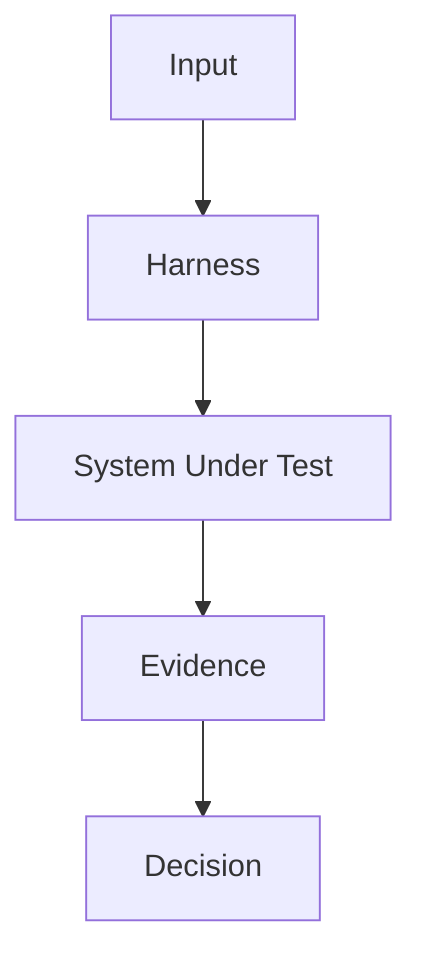

# 🧩 Title Here

> This article is written as a long-form technical note. It favors rigorous definitions, engineering trade-offs, diagrams, and executable examples.

## 🧭 Abstract

Write the problem statement, scope, and core argument.

## 🧱 Conceptual Model

Define the central concept and distinguish it from adjacent terms.

## 🗺️ Architecture

Add Mermaid diagrams and asset references.



## 🧪 Example

```python
# Add runnable or near-runnable code examples.
```

## 📊 Evaluation

Use tables for dimensions, risks, and operational metrics.

## 🔐 Reliability And Governance

Discuss reproducibility, security, compliance, traceability, and operational boundaries.

## 🧾 Conclusion

Summarize the practical conclusion.

## 📬 Contact

Terrence Shen  
Email: slamshenxin@gmail.com  
Located in China
